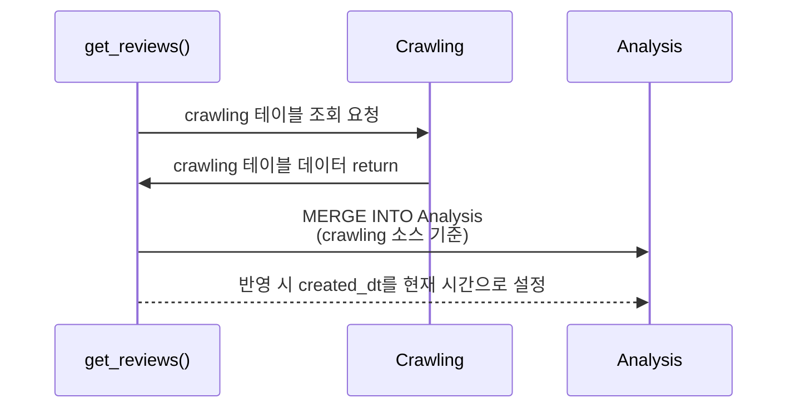
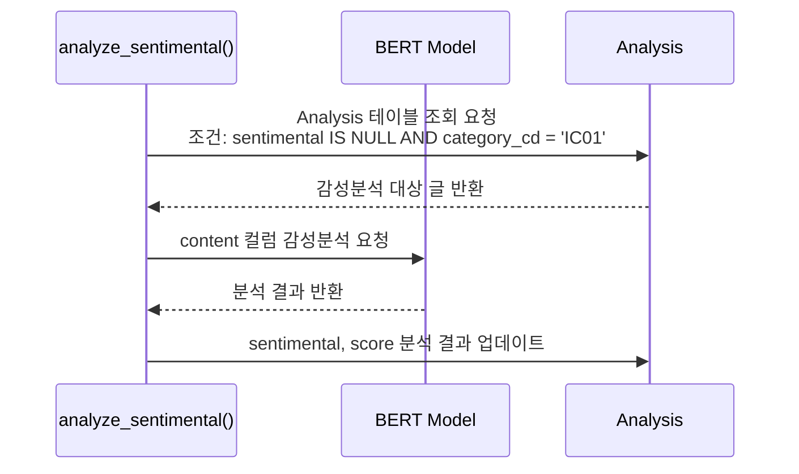
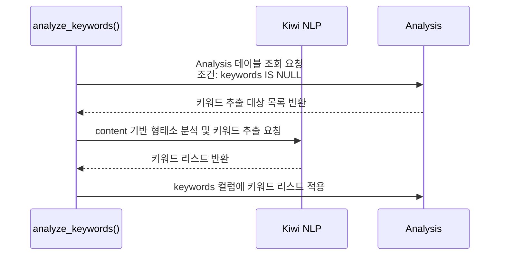
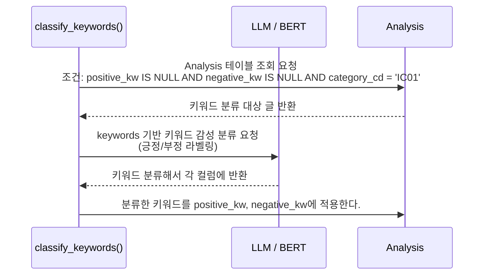

 # Analysis 테이블 
 - 리뷰/블로그 글들을 분석한 내용을 가져와서 분석하기 위한 별도 테이블 
 - 테이블은 다음 컬럼값을 가진다. 

| 컬럼명        | 타입            | 값                                      |
|---------------|-----------------|------------------------------------------|
| crawling_id   | int             | crawling.crawling_id                     |
| category_cd   | codetable       | crawling.category_cd (IC01)              |
| title         | str             | crawling.title                           |
| content       | str             | crawling.content                         |
| map_id        | int             | crawling.map_id                          |
| shop_id       | int             | shop.map_id                              |
| created_dt    | datetime        | 2016-04-25 15:55:02                      |
| sentimental   | enum            | positive / negative                      |
| score         | float           | 0.3356                                   |
| keywords         | list[str] | ["keyword1", "keyword2", ...]                                    |
| positive_kw   | list[str]       | ["keyword1", "keyword2", ...]            |
| negative_kw   | list[str]       | ["keyword3", "keyword4", ...]            |

# get_reviews()
 - crawling 테이블에서 Analysis 테이블로 컬럼 값을 가져오고 가져온 시간을 created_dt 컬럼에 기록함
 1) crawling 테이블에서 Analysis 테이블로 데이터를 MERGE 한다. 
 2) created_dt 컬럼값은 가져온 시점의 시간으로 결정한다. 

 # analyze_sentimental()
 - 감성분석이 가능한 데이터들에 대해 감성분석 적용한다. 
 - enum으로 만들되 메서드로 해서 감성분석 가능한 컬럼 리스트를 구하는 함수 만들어 처리하는걸로 검토
 - Analysis 테이블에서 감성분석이 되지 않은 글들을 가져와 감성분석 적용한다. 
 1) sentimental IS NULL인 글 SELECT해서 가져온다. (감성분석이 가능한 글 중 아직 값이 없는 것들 )
 2) 가져온 글들을 BERT 모델을 사용해서 감성분석 진행한다. 
 3) 감성분석 후 나온 결과를 sentimental, score 컬럼에 적용한다. 

 # analyze_keywords()
 1) keywords IS NULL인 글 SELECT 한다.  
 2) 가져온 글들을 kiwi를 사용해서 형태소 분석 / 키워드 추출 진행한다. 
 3) 추출된 키워드 리스트 keywords에 등록한다. 

# classify_keywords()
 - Analysis 테이블에서 키워드 추출이 완료된 IC01인 글을 가져와 키워드 분류 한다.
 1) positive_kw IS NULL AND negative_kw IS NULL인 글 SELECT
 2) LLM 또는 Bert모델에게 keywords 기반 키워드 분류를 요청한다. (긍정/부정 라벨링 작업)
 3) 키워드를 분류해서 긍정 키워드는 positive_kw, 부정 키워드는 negative_kw에 분류한다. 
 4) 분류한 데이터를 다시 Analysis 테이블에 적용한다. 

