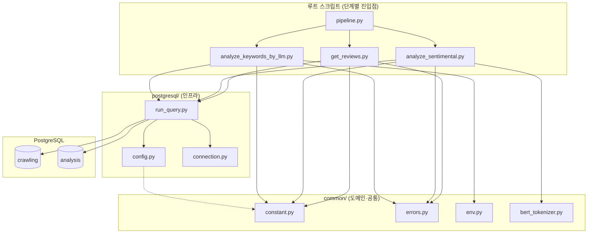
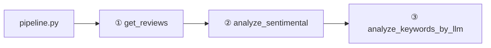
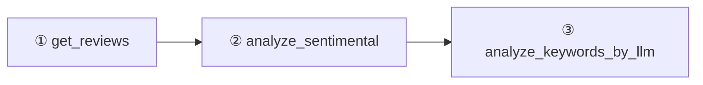
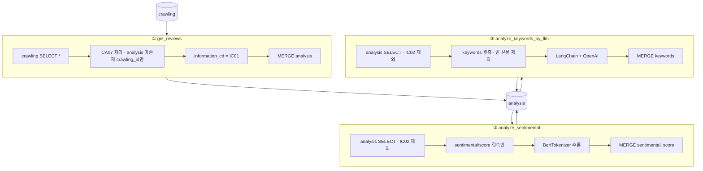
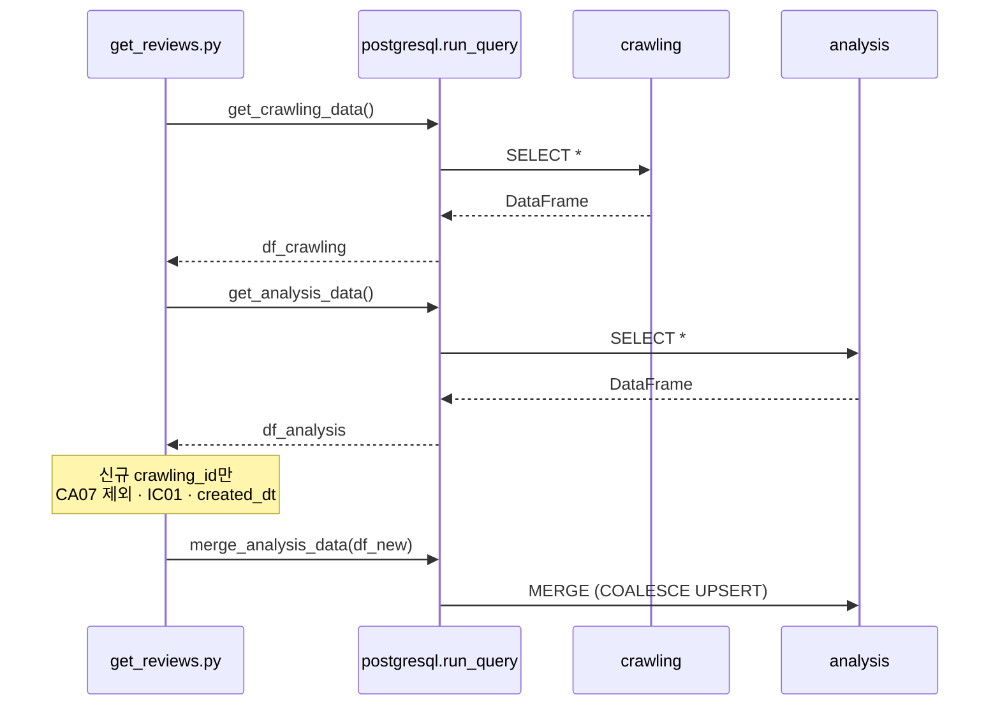
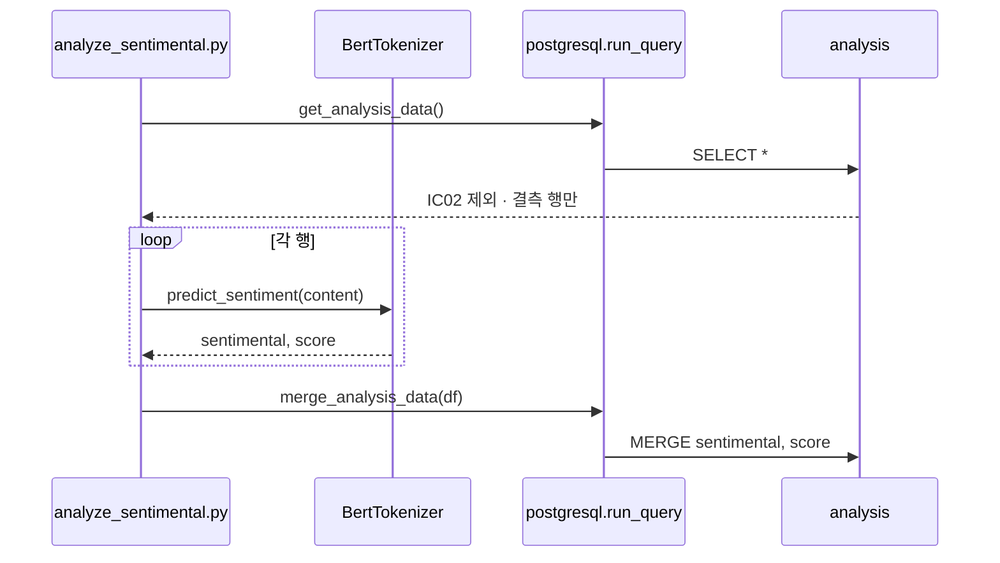
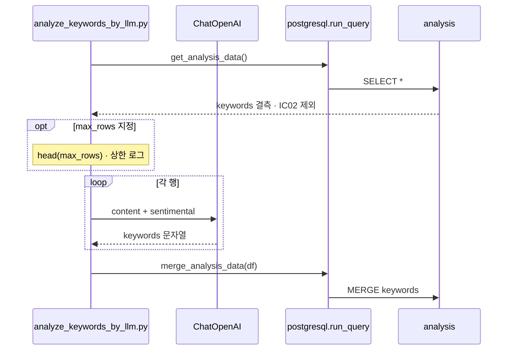

# post_analysis 설계

`crawling` 테이블의 리뷰·블로그 글을 읽어 `analysis` 테이블에 적재하고, BERT 감성 분석과 LLM 키워드 추출까지 수행하는 **배치 파이프라인**이다.

오케스트레이션은 **`pipeline.py`**(전체 실행) 또는 **루트 스크립트 3개**를 외부 스케줄러(Airflow 등)에서 단계별로 호출한다.

---

## 프로젝트 구조

```
post_analysis/
├── pipeline.py                 # 전체 오케스트레이션 (get_reviews → … → LLM)
├── get_reviews.py              # 1단계: crawling → analysis 적재
├── analyze_sentimental.py      # 2단계: BERT 감성 분석
├── analyze_keywords_by_llm.py  # 3단계: LLM 키워드 추출
├── common/                     # 도메인·공통 (DB 비의존)
│   ├── constant.py             # 컬럼명·코드·배치 설정
│   ├── errors.py               # PostAnalysisErrors
│   ├── env.py                  # load_dotenv 일원화
│   ├── bert_tokenizer.py       # BERT 감성 추론
│   └── singleton.py
├── postgresql/                 # 인프라 (DB 연결·쿼리·MERGE)
│   ├── config.py               # 테이블명·환경변수 키·MERGE SQL
│   ├── connection.py
│   ├── run_query.py            # get_* / merge_analysis_data
│   └── __main__.py             # 연결·샘플 쿼리 검증
├── docs/
│   ├── design.md               # 본 문서
│   └── refactoring-post-analysis.md
└── requirements.txt
```

### 레이어·의존 방향

sk-connect-etl-standards Part A/B와 동일하게 **common ↔ postgresql**을 분리한다.

| 패키지 | 역할 |
|--------|------|
| `common/` | 컬럼·코드 Enum, BERT, 에러 메시지, `.env` 로드 — **postgresql을 import하지 않음** |
| `postgresql/` | 연결, SELECT, MERGE SQL, DB 전용 상수(`config.py`) |
| `pipeline.py` | 3단계 순차 실행·단계 실패 로그 (`PostAnalysisErrors.Pipeline`) |
| 루트 `*.py` | 단계별 배치 로직. `common` + `postgresql.run_query`만 사용 |



- DB URL·테이블명·MERGE SQL → `postgresql/config.py`에만 정의
- 사용자·로그·`raise` 문구 → `common/errors.py`의 `PostAnalysisErrors`
- OpenAI·DB 환경변수 → `common/env.py` (`import common.env`로 일괄 로드)

---

## 운영 파이프라인 (확정)

**전체 실행**은 `pipeline.py`, **단계별·스케줄 분리**는 루트 스크립트 3개를 사용한다.



외부 스케줄러에서 단계별로 나눌 때는 아래 순서로 호출한다.



| 순서 | 스크립트 | 입력 조건 | 출력 컬럼 |
|------|----------|-----------|-----------|
| 1 | `get_reviews.py` | `crawling`에만 있는 신규 행, **CA07 제외** | `title`, `content`, …, `information_cd=IC01`, `created_dt` |
| 2 | `analyze_sentimental.py` | `information_cd ≠ IC02`, `sentimental` 또는 `score` 결측 | `sentimental`, `score` |
| 3 | `analyze_keywords_by_llm.py` | `information_cd ≠ IC02`, `keywords` 결측, 본문·감성 유효 | `keywords` (`#` 구분) |

```bash
# 작업 디렉터리: post_analysis/

# 전체 파이프라인
python pipeline.py
python pipeline.py --max-rows 10   # LLM 3단계만 상한 (테스트·청크)

# 단계별 (개발·스케줄 분리)
python get_reviews.py
python analyze_sentimental.py
python analyze_keywords_by_llm.py

# DB 연결·샘플 쿼리 검증
python -m postgresql
```

### 전체 데이터 흐름



### 공통 필터·MERGE 규칙

| 규칙 | 내용 |
|------|------|
| IT 정보 제외 | ②③ 단계에서 `information_cd = IC02` 행은 처리하지 않음 |
| IT 크롤 제외 | ① 단계에서 `category_cd = CA07` 행은 적재하지 않음 |
| 부분 MERGE | `WHEN MATCHED` UPDATE는 `COALESCE(x.col, a.col)` — 단계별로 일부 컬럼만 MERGE해도 기존 값이 NULL로 덮이지 않음 |
| shop 매칭 | ① `shop.map_id` 기준 **1:1**일 때만 `shop_id`·`shop_cd` 적재. 0건·2건 이상·`map_id` 결측 → `logger.warning` 후 **행 드랍** |
| 키 | `crawling_id` 기준 UPSERT |

---

## Analysis 테이블

아래는 **연결 DB `public.analysis` 실측 스키마** (`database/init.sql` 기준, 2026-05 확인)이다.

| 컬럼명 | DB 타입 | 파이프라인 | 설명 |
|--------|---------|------------|------|
| crawling_id | bigint PK | ① MERGE 키 | `crawling.crawling_id` |
| title | varchar(200) | ① | `crawling.title` |
| content | text | ① | `crawling.content` |
| article_url | varchar(500) | ① | `crawling.article_url` |
| map_id | bigint | ① | `crawling.map_id` |
| shop_id | bigint | ① | `shop` 테이블에서 `map_id` 1:1 매칭 시 `shop.shop_id` |
| category_cd | varchar(6) | ① | 카테고리 축. IT 크롤 **CA07** (`CodeTable.CATEGORY_ETC`) |
| information_cd | varchar(6) | ① | 정보 축. 식당 리뷰 **IC01**, IT 정보 **IC02** |
| shop_cd | varchar(6) | ① | 1:1 매칭 시 `shop.shop_cd` (업종 코드 SC**) |
| created_dt | timestamp | ① | analysis 적재 시각 |
| sentimental | varchar(16) | ② | `positive` / `negative` |
| score | float | ② | 감성 신뢰도 |
| keywords | text | ③ | LLM 추출 주요 표현 (`#` 구분 문자열) |

> **참고:** `positive_kw`·`negative_kw` 컬럼은 **DB에 없음**. 과거 `classify_keywords` 설계 잔재였으며 MERGE SQL에서도 제거했다.

---

## 1. get_reviews()

`crawling`에만 있는 신규 행을 `analysis`로 MERGE한다.

1. `crawling`, `analysis`, `shop` SELECT
2. `analysis`에 이미 있는 `crawling_id` 제외
3. **`category_cd = CA07`(IT 크롤) 제외** — 식당 리뷰 파이프라인 우선
4. **`shop.map_id` 1:1 매칭** — `shop_id`, `shop_cd` 부여. 미매칭·다중 매칭 행은 `PostAnalysisErrors.GetReviews.Warn` 후 드랍
5. `information_cd = IC01`, `created_dt = now` 설정 후 MERGE



---

## 2. analyze_sentimental()

NSMC 학습 BERT(`BertTokenizer`, Singleton)로 본문 감성을 분석한다.

1. `analysis` 조회 — `information_cd ≠ IC02`, `sentimental` **또는** `score` 결측
2. `content`별 `predict_sentiment` 추론
3. `sentimental`, `score` MERGE



---

## 3. analyze_keywords_by_llm()

감성 분석 결과와 본문을 LLM에 넘겨, **감정 방향과 일치하는 주요 표현**을 `keywords`에 저장한다.

1. `analysis` 조회 — `information_cd ≠ IC02`, `keywords` 결측, `content`·`sentimental` 유효
2. LangChain + OpenAI(`AnalyzeKeywordsByLlmConfig.OPENAI_MODEL`)로 `#` 연결 문자열 생성
3. `keywords` MERGE

**`max_rows` 인자**

| 값 | 동작 |
|----|------|
| `None` (기본) | 필터 후 전량 처리 |
| 양의 정수 | 상위 N건만 LLM 호출 (테스트·batch 청크) |



---

## 에러·환경

### PostAnalysisErrors (`common/errors.py`)

| 중첩 클래스 | 용도 |
|-------------|------|
| `GetReviews` | crawling/analysis 컬럼 누락 (`ValueError`), shop 매칭 후 0건 (`info`) |
| `GetReviews.Warn` | shop 미매칭·1:N (`logger.warning`, 행 드랍) |
| `Sentiment` | 감성 분석 컬럼 누락, 처리 대상 0건 |
| `LlmKeywords` | LLM 키워드 컬럼 누락, 처리 대상 0건, 행별 실패 로그 |
| `Pipeline` | 단계 시작/실패/완료 로그, `max_rows` 검증 |
| `Db` | `python -m postgresql` 연결 성공/실패 메시지 |

### 환경변수

| 키 (`PostgresEnvKey`) | 용도 |
|-----------------------|------|
| `PGUSER`, `PGPASSWORD`, `PGHOST`, `PGPORT`, `PGDATABASE` | PostgreSQL 연결 |
| OpenAI API 키 | LangChain (`OPENAI_API_KEY` 등, langchain-openai 규격) |

`.env`는 `common/env.py`에서 `load_dotenv()`로 로드한다. LLM 단계 진입 시 `import common.env`로 보장한다.

---

## 제거된 단계 (참고)

| 스크립트 | 사유 |
|----------|------|
| `analyze_keywords.py` (Kiwi) | LLM 키워드 추출(`analyze_keywords_by_llm`)로 대체 |
| `classify_keywords.py` | 긍·부정 키워드 분리 — DB에도 `positive_kw`/`negative_kw` 컬럼 없음 |

필요 시 Git 이력에서 스크립트 복구 가능. DB 스키마 변경(`ALTER TABLE`) 없이는 긍·부정 컬럼 분리는 지원하지 않는다.

---

## 관련 문서

- 리팩토링 이력: [refactoring-post-analysis.md](refactoring-post-analysis.md)
- 코드 무결성·테스트 기준: [integrity-and-testing-standards.md](integrity-and-testing-standards.md)
- 코딩 기준: sk-connect-etl-standards Skill (Part A 범용 + Part B it_news ETL 패턴)
