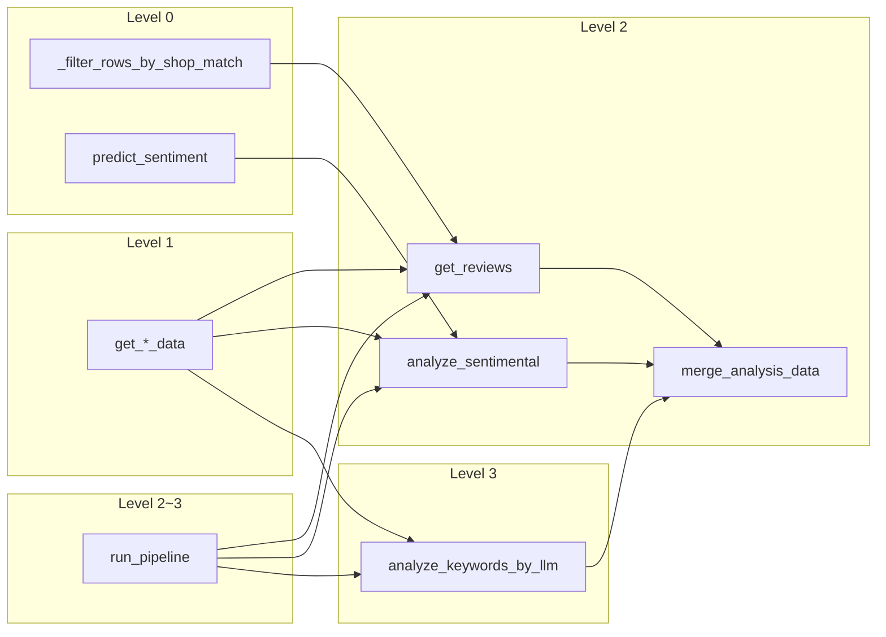

# 함수 인벤토리 및 분류

[integrity-and-testing-standards.md](integrity-and-testing-standards.md) 기준으로 **post_analysis** 대상 모듈의 구현 함수를 inventorize하고, **함수 유형(A~F)**·**안전성 등급(Level 0~4)**을 부여한 문서이다.

- 각 함수 docstring의 `Note:` 절에 동일 분류가 반영되어 있다.
- 다음 단계: 본 표를 바탕으로 함수 계약(§3)·테스트 케이스(§8)를 함수별로 확장한다.

---

## 분류 기준 요약

### 함수 유형

| 코드 | 명칭 | 설명 |
|------|------|------|
| A | 순수 계산 | 입력만으로 결과, 외부 상태 미변경 |
| B | 데이터 변환 | 구조·포맷 변환, 메시지 생성 |
| C | 검증 | 유효성 판단 |
| D | 저장/조회 | DB·저장소 I/O |
| E | 외부 연동 | API·HF Hub·크롤링 등 |
| F | 오케스트레이션 | 다단계 실행 제어 |

### 안전성 등급

| 등급 | 테스트 시 주의 |
|------|----------------|
| 0 | 단위 테스트 자유, mock 불필요 |
| 1 | fixture·테스트 DB 읽기, 운영 직접 조회 지양 |
| 2 | 테스트 DB·rollback, 운영 MERGE 주의 |
| 3 | mock/fake 필수, dry-run·`max_rows` 상한 |
| 4 | sandbox만 (본 프로젝트 해당 함수 없음) |

---

## 요약 통계

| 모듈 | 함수·메서드 수 | Level 0 | Level 1 | Level 2 | Level 3 |
|------|----------------|---------|---------|---------|---------|
| `common/` | 28 | 26 | 1 | 0 | 0 |
| `postgresql/` | 11 | 0 | 8 | 3 | 0 |
| 루트 스크립트 | 6 | 2 | 0 | 3 | 1 |
| **합계** | **45** | **28** | **9** | **6** | **1** |

> `PostAnalysisErrors` 메시지 팩토리 18개는 Level 0·유형 B로 일괄 분류한다.

---

## common/

### constant.py

| 심볼 | 유형 | 안전성 | 책임 |
|------|------|--------|------|
| `CrawlingColumn` | — | — | crawling DataFrame 컬럼 Enum |
| `CrawlingColumn.allowed_crawling_columns` | A | 0 | INSERT 허용 컬럼 집합 |
| `ShopColumn` | — | — | shop 컬럼 Enum |
| `AnalysisColumn` | — | — | analysis 컬럼 Enum |
| `AnalysisColumn.allowed_analysis_columns` | A | 0 | MERGE 대응 컬럼 집합 |
| `CodeTable` | — | — | CA07/IC01/IC02 코드 |
| `SentimentLabel` | — | — | positive/negative 라벨 |
| `SentimentResultKey` | — | — | BERT 결과 dict 키 |
| `AnalyzeKeywordsByLlmConfig` | — | — | LLM 모델·dtype 설정 |
| `AnalyzeSentimentalConfig` | — | — | BERT 모델·시퀀스 설정 |
| `GetReviewsConfig` | — | — | ISO 시간 형식 설정 |

### errors.py

| 심볼 | 유형 | 안전성 | 책임 |
|------|------|--------|------|
| `_missing_columns_message` | B | 0 | 컬럼 누락 메시지 포맷 |
| `PostAnalysisErrors.Db.connection_successful` | B | 0 | 연결 성공 문자열 |
| `PostAnalysisErrors.Db.connection_failed` | B | 0 | 연결 실패 문자열 |
| `PostAnalysisErrors.Sentiment.missing_columns` | B | 0 | 감성 단계 컬럼 오류 |
| `PostAnalysisErrors.Sentiment.no_pending_rows` | B | 0 | 감성 처리 0건 info |
| `PostAnalysisErrors.LlmKeywords.missing_columns` | B | 0 | LLM 단계 컬럼 오류 |
| `PostAnalysisErrors.LlmKeywords.no_pending_rows` | B | 0 | LLM 처리 0건 info |
| `PostAnalysisErrors.LlmKeywords.row_processing_failed` | B | 0 | 행별 LLM 실패 로그 포맷 |
| `PostAnalysisErrors.GetReviews.missing_crawling_columns` | B | 0 | crawling 컬럼 오류 |
| `PostAnalysisErrors.GetReviews.missing_analysis_columns` | B | 0 | analysis 컬럼 오류 |
| `PostAnalysisErrors.GetReviews.no_rows_after_shop_resolve` | B | 0 | shop 후 0건 info |
| `PostAnalysisErrors.GetReviews.Warn.shop_not_found` | B | 0 | shop 미매칭 warning |
| `PostAnalysisErrors.GetReviews.Warn.ambiguous_shop` | B | 0 | shop N:1 warning |
| `PostAnalysisErrors.Pipeline.step_start` | B | 0 | 단계 시작 로그 |
| `PostAnalysisErrors.Pipeline.step_failed` | B | 0 | 단계 실패 로그 |
| `PostAnalysisErrors.Pipeline.completed` | B | 0 | 파이프라인 완료 로그 |
| `PostAnalysisErrors.Pipeline.invalid_max_rows` | B | 0 | max_rows 검증 오류 |

### env.py

| 심볼 | 유형 | 안전성 | 책임 |
|------|------|--------|------|
| 모듈 import 시 `load_dotenv()` | E | 1 | `.env` → 프로세스 환경변수 (읽기·설정) |

함수가 아니나, `import common.env` 시 **Level 1** 부작용이 있다. 테스트 시 env 격리·`monkeypatch` 고려.

### bert_tokenizer.py

| 심볼 | 유형 | 안전성 | 책임 |
|------|------|--------|------|
| `BertTokenizer.__init__` | E | 1 | HF Hub에서 모델·토크나이저 로드 |
| `BertTokenizer.tokenize` | A | 0 | 문장 → 입력 텐서 |
| `BertTokenizer.decode` | A | 0 | 토큰 id → 문자열 |
| `BertTokenizer.predict_sentiment` | A | 0 | 문장 → 감성 dict |

### singleton.py

| 심볼 | 유형 | 안전성 | 책임 |
|------|------|--------|------|
| `Singleton.__call__` | A | 0 | 클래스별 단일 인스턴스 보장 |

---

## postgresql/

### config.py

| 심볼 | 유형 | 안전성 | 책임 |
|------|------|--------|------|
| `PostgreSqlTable` | — | — | 테이블명 Enum |
| `PostgresEnvKey` | — | — | PG* 환경변수 키 |
| `MergeAnalysisConfig` | — | — | MERGE SQL·bigint·날짜 포맷 |

(함수 없음 — 상수만)

### connection.py

| 심볼 | 유형 | 안전성 | 책임 |
|------|------|--------|------|
| `PostgreDB.__init__` | D | 2 | psycopg autocommit 연결 |
| `PostgreDB.get_conn` | D | 1 | 커넥션 객체 반환 |
| `PostgreDB.run_query` | D | 1~2 | 명명 파라미터 SQL |
| `PostgreDB.run_query_lst` | D | 1~2 | 위치 파라미터 SQL |
| `PostgreDB.test_conn` | D | 1 | SELECT 1 연결 검증 |

### run_query.py

| 심볼 | 유형 | 안전성 | 책임 |
|------|------|--------|------|
| `_read_table` | D | 1 | SELECT * 공통 조회 |
| `get_crawling_data` | D | 1 | crawling 전체 조회 |
| `get_shop_data` | D | 1 | shop 전체 조회 |
| `get_analysis_data` | D | 1 | analysis 전체 조회 |
| `merge_analysis_data` | D | 2 | analysis JSONB UPSERT |

### __main__.py

| 심볼 | 유형 | 안전성 | 책임 |
|------|------|--------|------|
| `main` | F | 1 | 연결·crawling LIMIT 5 진단 |

---

## 루트 스크립트

### get_reviews.py

| 심볼 | 유형 | 안전성 | 책임 | 불변·실패 요약 |
|------|------|--------|------|----------------|
| `_filter_rows_by_shop_match` | A+B+C | 0 | shop 1:1 매칭 필터 | 0건·N건 드랍, warning |
| `get_reviews` | B+D+F | 2 | crawling→analysis 적재 | CA07 제외, IC01, 신규 id만 |

### analyze_sentimental.py

| 심볼 | 유형 | 안전성 | 책임 | 불변·실패 요약 |
|------|------|--------|------|----------------|
| `analyze_sentimental` | A+D+F | 2 | BERT 감성·점수 MERGE | IC02 제외, NULL만 처리 |

### analyze_keywords_by_llm.py

| 심볼 | 유형 | 안전성 | 책임 | 불변·실패 요약 |
|------|------|--------|------|----------------|
| `Keywords` (Pydantic) | B | 0 | LLM 출력 스키마 | `#` 구분 키워드 문자열 |
| `analyze_keywords_by_llm` | E+D+F | 3 | OpenAI 키워드 MERGE | IC02·빈 content·기존 kw 제외 |

### pipeline.py

| 심볼 | 유형 | 안전성 | 책임 | 불변·실패 요약 |
|------|------|--------|------|----------------|
| `run_pipeline` | F | 2~3 | 3단계 순차 실행 | 단계 실패 시 raise |
| `_parse_args` | C | 0 | CLI `--max-rows` 파싱 | — |

---

## 파이프라인 흐름과 위험도

---

## 테스트 우선순위 (권장)

| 우선순위 | 대상 | 이유 |
|----------|------|------|
| 1 | `_filter_rows_by_shop_match` | Level 0, shop 규칙 핵심, DB 불필요 |
| 2 | `predict_sentiment` | Level 0, 감성 불변 규칙 |
| 3 | `merge_analysis_data` | Level 2, COALESCE·UPSERT 회귀 위험 |
| 4 | `get_reviews` | Level 2, 적재·코드 매핑 |
| 5 | `analyze_sentimental` | Level 2, IC02·NULL 스킵 |
| 6 | `analyze_keywords_by_llm` | Level 3, OpenAI mock 필수 |
| 7 | `run_pipeline` | F, 단계 순서·실패 전파 |

---

## 공개 API vs 내부 함수

| 공개 (외부·스크립트에서 호출) | 내부 (모듈 private) |
|------------------------------|---------------------|
| `get_reviews`, `analyze_sentimental`, `analyze_keywords_by_llm`, `run_pipeline` | `_filter_rows_by_shop_match`, `_read_table`, `_missing_columns_message`, `_parse_args` |
| `get_crawling_data`, `get_shop_data`, `get_analysis_data`, `merge_analysis_data` | — |
| `BertTokenizer`, `PostgreDB` | `Singleton.__call__` |

계약 문서·테스트는 **공개 API와 Level ≥ 2** 함수를 우선 작성한다.

---

## 변경 이력

| 날짜 | 내용 |
|------|------|
| 2026-05-20 | 최초 작성 — common/postgresql/루트 스크립트 전 함수 분류 및 docstring 반영 |

---

## 관련 문서

- [integrity-and-testing-standards.md](integrity-and-testing-standards.md)
- [design.md](design.md)
