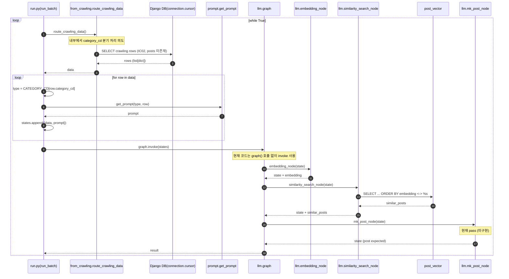

# Postmake Pipeline Sequence Diagram

```mermaid
sequenceDiagram
    autonumber
    participant Run as run.py(run_batch)
    participant Crawl as from_crawling.route_crawling_data
    participant DB as Django DB(connection.cursor)
    participant Prompt as prompt.get_prompt
    participant Graph as llm.graph
    participant Embed as llm.embedding_node
    participant Similar as llm.similarity_search_node
    participant Vec as post_vector
    participant MkPost as llm.mk_post_node

    loop while True
        Run->>Crawl: route_crawling_data()
        Note over Crawl: 내부에서 category_cd 분기 처리 의도
        Crawl->>DB: SELECT crawling rows (IC02, posts 미존재)
        DB-->>Crawl: rows (list[dict])
        Crawl-->>Run: data

        loop for row in data
            Run->>Run: type = CATEGORY_CD[row.category_cd]
            Run->>Prompt: get_prompt(type, row)
            Prompt-->>Run: prompt
            Run->>Run: states.append({data, prompt})
        end

        Run->>Graph: graph.invoke(states)
        Note over Graph: 현재 코드는 graph() 호출 없이 invoke 사용

        Graph->>Embed: embedding_node(state)
        Embed-->>Graph: state + embedding

        Graph->>Similar: similarity_search_node(state)
        Similar->>Vec: SELECT ... ORDER BY embedding <-> %s
        Vec-->>Similar: similar_posts
        Similar-->>Graph: state + similar_posts

        Graph->>MkPost: mk_post_node(state)
        Note over MkPost: 현재 pass (미구현)
        MkPost-->>Graph: state (post expected)

        Graph-->>Run: result
    end
```

