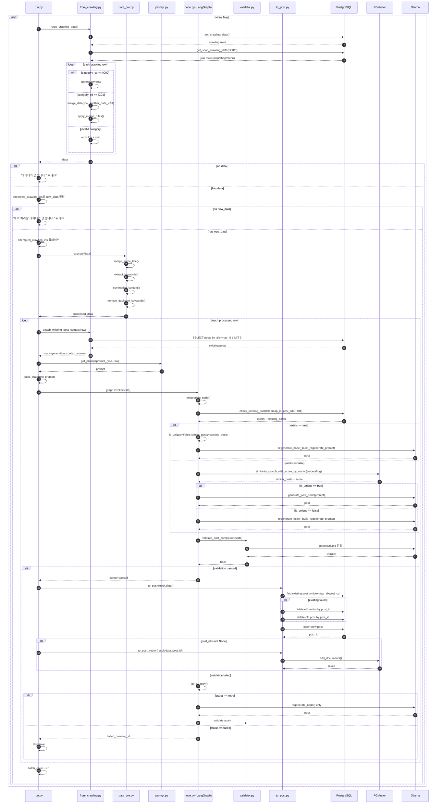

# Postmake Pipeline Sequence Diagram (Latest)

```mermaid
sequenceDiagram
    autonumber
    participant RUN as run.py
    participant FC as from_crawling.py
    participant PRE as data_pre.py
    participant PR as prompt.py
    participant G as node.py (LangGraph)
    participant VAL as validator.py
    participant SAVE as to_post.py
    participant DB as PostgreSQL
    participant VDB as PGVector
    participant LLM as Ollama

    loop while True
        RUN->>FC: route_crawling_data()
        FC->>DB: get_crawling_data()
        DB-->>FC: crawling rows
        FC->>DB: get_shop_crawling_data("IC01")
        DB-->>FC: join rows (map/shop/menu)

        loop each crawling row
            alt category_cd == IC02
                FC-->>FC: append raw row
            else category_cd == IC01
                FC->>FC: merge_data(row, another_data_ic01)
                FC->>FC: apply_merge_rules()
            else invalid category
                FC-->>FC: error log + skip
            end
        end
        FC-->>RUN: data

        alt no data
            RUN-->>RUN: "데이터가 없습니다." 후 종료
        else has data
            RUN->>RUN: attempted_crawling_ids로 new_data 필터
            alt no new_data
                RUN-->>RUN: "새로 처리할 데이터가 없습니다." 후 종료
            else has new_data
                RUN->>RUN: attempted_crawling_ids 업데이트
                RUN->>PRE: execute(data)
                PRE->>PRE: merge_same_title()
                PRE->>PRE: extract_keywords()
                PRE->>PRE: summarize_content()
                PRE->>PRE: remove_duplicate_keywords()
                PRE-->>RUN: processed_data

                loop each processed row
                    RUN->>FC: attach_existing_post_context(row)
                    FC->>DB: SELECT posts by title+map_id LIMIT 3
                    DB-->>FC: existing posts
                    FC-->>RUN: row + generation_context_content

                    RUN->>PR: get_prompt(prompt_type, row)
                    PR-->>RUN: prompt
                    RUN->>RUN: _build_state(row, prompt)
                    RUN->>G: graph.invoke(state)

                    G->>G: embedding_node()
                    G->>DB: check_existing_post(title+map_id, post_cd=PT01)
                    DB-->>G: exists + existing_posts

                    alt exists == true
                        G->>G: is_unique=False, similar_posts=existing_posts
                        G->>LLM: regenerate_node(_build_regenerate_prompt)
                        LLM-->>G: post
                    else exists == false
                        G->>VDB: similarity_search_with_score_by_vector(embedding)
                        VDB-->>G: similar_posts + score
                        alt is_unique == true
                            G->>LLM: generate_post_node(prompt)
                            LLM-->>G: post
                        else is_unique == false
                            G->>LLM: regenerate_node(_build_regenerate_prompt)
                            LLM-->>G: post
                        end
                    end

                    G->>VAL: validate_post_completion(state)
                    VAL->>LLM: passed/failed 판정
                    LLM-->>VAL: verdict
                    VAL-->>G: bool

                    alt validation passed
                        G-->>RUN: status=passed
                        RUN->>SAVE: to_post(result.data)
                        SAVE->>DB: find existing post by title+map_id+post_cd
                        alt existing found
                            SAVE->>DB: delete old vector by post_id
                            SAVE->>DB: delete old post by post_id
                        end
                        SAVE->>DB: insert new post
                        DB-->>SAVE: post_id
                        alt post_id is not None
                            RUN->>SAVE: to_post_vector(result.data, post_id)
                            SAVE->>VDB: add_documents()
                            VDB-->>SAVE: saved
                        end
                    else validation failed
                        G->>G: _fail_or_retry()
                        alt status == retry
                            G->>LLM: regenerate_node() only
                            LLM-->>G: post
                            G->>VAL: validate again
                        else status == failed
                            G-->>RUN: failed_crawling_id
                            RUN-->>RUN: skip save
                        end
                    end
                end

                RUN-->>RUN: batch_count += 1
            end
        end
    end
```

