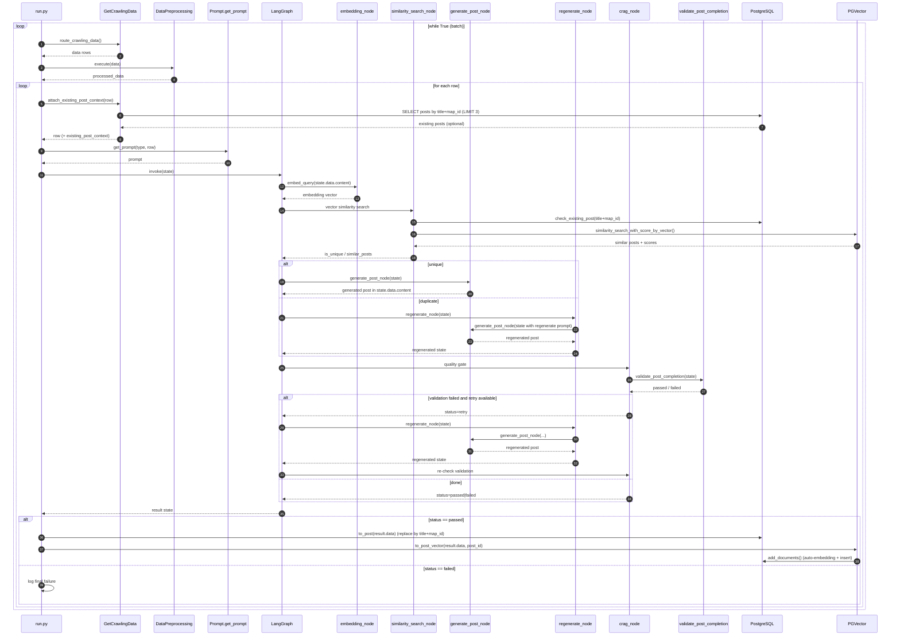

# Postmake Pipeline Sequence Diagram (Current)

```mermaid
sequenceDiagram
    autonumber
    participant Run as run.py
    participant Crawl as GetCrawlingData
    participant Pre as DataPreprocessing
    participant Prompt as Prompt.get_prompt
    participant Graph as LangGraph
    participant Embed as embedding_node
    participant Similar as similarity_search_node
    participant Gen as generate_post_node
    participant Regen as regenerate_node
    participant Crag as crag_node
    participant Validator as validate_post_completion
    participant DB as PostgreSQL
    participant Vec as PGVector

    loop while True (batch)
        Run->>Crawl: route_crawling_data()
        Crawl-->>Run: data rows
        Run->>Pre: execute(data)
        Pre-->>Run: processed_data

        loop for each row
            Run->>Crawl: attach_existing_post_context(row)
            Crawl->>DB: SELECT posts by title+map_id (LIMIT 3)
            DB-->>Crawl: existing posts (optional)
            Crawl-->>Run: row (+ existing_post_context)

            Run->>Prompt: get_prompt(type, row)
            Prompt-->>Run: prompt
            Run->>Graph: invoke(state)

            Graph->>Embed: embed_query(state.data.content)
            Embed-->>Graph: embedding vector

            Graph->>Similar: vector similarity search
            Similar->>DB: check_existing_post(title+map_id)
            Similar->>Vec: similarity_search_with_score_by_vector()
            Vec-->>Similar: similar posts + scores
            Similar-->>Graph: is_unique / similar_posts

            alt unique
                Graph->>Gen: generate_post_node(state)
                Gen-->>Graph: generated post in state.data.content
            else duplicate
                Graph->>Regen: regenerate_node(state)
                Regen->>Gen: generate_post_node(state with regenerate prompt)
                Gen-->>Regen: regenerated post
                Regen-->>Graph: regenerated state
            end

            Graph->>Crag: quality gate
            Crag->>Validator: validate_post_completion(state)
            Validator-->>Crag: passed / failed

            alt validation failed and retry available
                Crag-->>Graph: status=retry
                Graph->>Regen: regenerate_node(state)
                Regen->>Gen: generate_post_node(...)
                Gen-->>Regen: regenerated post
                Regen-->>Graph: regenerated state
                Graph->>Crag: re-check validation
            else done
                Crag-->>Graph: status=passed|failed
            end

            Graph-->>Run: result state

            alt status == passed
                Run->>DB: to_post(result.data) (replace by title+map_id)
                Run->>Vec: to_post_vector(result.data, post_id)
                Vec->>DB: add_documents() (auto-embedding + insert)
            else status == failed
                Run->>Run: log final failure
            end
        end
    end
```

