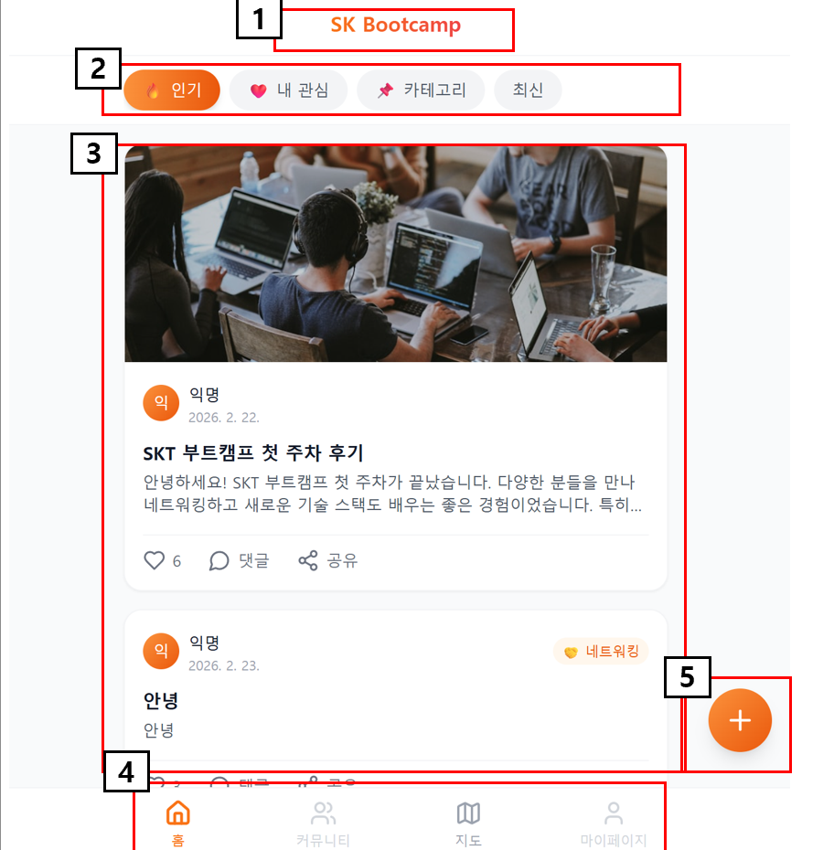

<!----------------- 1페이지 ----------------------->

<table class="meta">
  <tr>
    <th class="label">버전(ver)</th><td class="val">1.0</td>
    <th class="label">페이지코드</th><td class="val">1</td>
    <th class="label">페이지명</th><td class="wide">board</td>
    <th class="label">이용자</th><td class="small">PC</td>
    <th class="descH">Description</th>
  </tr>
  <tr>
    <th class="label">작성인</th><td class="val">김경수</td>
    <th class="label">작성일</th><td class="val">2026.02.24</td>
    <th class="label">페이지 경로</th><td class="wide">-</td>
    <th class="label">페이지</th><td class="small">1</td>
    <td class="descH"> </td>
  </tr>
</table>

  

    <!-- 
▼ 이어서 ▼
 -->
    

      

        
      

    

  

  

    
화면 설명

  

  

    

      
1

      

        ■ 게시글 title  
        □ 설명
        <ul>
          <li>화면 중앙정렬 / 상단에 제목 표시 </li>
        </ul>
      

    

  

  

    

      
2

      

        ■ 게시글 - 카테고리  
        □ 설명
        <ul>
          <li>카테고리에 따라 게시글을 필터해서 보여준다. 
            1. 카테고리 중에 하나만 선택 가능. 
            2. 다른 카테고리가 선택되면 이전 선택은 해제. 
            3. 카테고리 클릭 시 카테고리에 따라 게시글 목록 표시. 
          </li>
        </ul>
      

    

  

  

    

      
3

      

        ■ 게시글 리스트  
        □ 설명
        <ul>
          <li>데이터에 따라 게시글들을 카드 형식으로 표시한다. </li>
          <li>게시들 글은 세로방향 스크롤로 표시된다. </li>
          <li>세로 스크롤에 최대 제한을 둘건지 확인 필요!! </li>
          <li>스크롤 바는 표시하지 않는다. </li>
          <li>화면 상/하 드래그 시 화면 스크롤 이동. </li>
          <li>post카드의 버튼 이외의 영역 클릭 시 해당 포스트로 이동 </li>
        </ul>
      

    

  

  

    

      
4

      

        ■ 메뉴 플로터(공용)  
        □ 설명
        <ul>
          <li>모든 화면에서 표시 </li>
          <li>표시하는 페이지 이동 (홈 = 게시글) </li>
          <li>홈 화면이 default (로그인 된 상태일때) </li>
        </ul>
      

    

  

  

    

      
5

      

        ■ 신규 작성 플로터(공용)  
        □ 설명
        <ul>
          <li>팝업 창으로 새로운 글 작성창을 띄움 </li>
          <li>표시 화면에 따라 게시판 / 커뮤니티 추가로 변경됨 </li>
          <li>지도 / 마이페이지 에서는 해당 버튼 표시 안함 </li>
           
        </ul>
      

    

  

  

---
<!----------------- 2페이지 ----------------------->

<table class="meta">
  <tr>
    <th class="label">버전(ver)</th><td class="val">1.0</td>
    <th class="label">페이지코드</th><td class="val">2</td>
    <th class="label">페이지명</th><td class="wide">post_card</td>
    <th class="label">이용자</th><td class="small">PC</td>
    <th class="descH">Description</th>
  </tr>
  <tr>
    <th class="label">작성인</th><td class="val">김경수</td>
    <th class="label">작성일</th><td class="val">2026.02.24</td>
    <th class="label">페이지 경로</th><td class="wide">-</td>
    <th class="label">페이지</th><td class="small">1</td>
    <td class="descH"> </td>
  </tr>
</table>

  

    
▼ 이어서 ▼

    

      

        
      

    

  

  

    
화면 설명

  

  

    

      
1

      

        ■ post img  
        □ 설명
        <ul>
          <li>post 카드 이미지 </li>
          <li>url 경로 텍스트 저장하고 UI 그릴때 해당 경로의 이미지 불러와 표시한다. </li>
          <li>이미지url 없을 경우 표시하지 않음 </li>
        </ul>
      

    

  

  

    

      
2

      

        ■ post 정보  
        □ 설명
        <ul>
          <li>해당 post에 대한 정보를 표시한다.  
            1. 포스트 작성자 이미지 or 아이콘 표시  
            2. 포스트 작성자 이름 표시  
            3. 포스트 최초 작성일 표시  
          </li>
        </ul>
      

    

  

  

    

      
3

      

        ■ post 카테고리  
        □ 설명
        <ul>
          <li>해당 포스트가 가지는 카테고리 표시한다. </li>
        </ul>
      

    

  

  

    

      
4

      

        ■ post 제목/내용  
        □ 설명
        <ul>
          <li>post 제목은 bold로 강조 </li>
          <li>제목은 최대 20자 까지 표시 20자 넘어가면 뒷부분 ... 으로 적는다. </li>
          <li>post 내용은 2줄까지 표시 </li>
          <li>내용 표시글자 1줄에 최대 20자 까지 표시 </li>
          <li>2줄 넘어가면 나머지 텍스트는 ... 으로 표시 </li>
        </ul>
      

    

  

  

    

      
5

      

        ■ post interaction 버튼  
        □ 설명
        <ul>
          1. 좋아요 버튼 - 클릭 시 좋아요 count 변경 
          2. 댓글 버튼 - (결정 필요) 댓글만 입력할 인터페이스 제공할지 여부  
          3. 공유 버튼 - 팝업 창으로 공유 인터페이스 제공  
        </ul>
      

    

  

  

---
<!----------------- 3페이지 ----------------------->

<table class="meta">
  <tr>
    <th class="label">버전(ver)</th><td class="val">1.0</td>
    <th class="label">페이지코드</th><td class="val">2</td>
    <th class="label">페이지명</th><td class="wide">post_btn</td>
    <th class="label">이용자</th><td class="small">PC</td>
    <th class="descH">Description</th>
  </tr>
  <tr>
    <th class="label">작성인</th><td class="val">김경수</td>
    <th class="label">작성일</th><td class="val">2026.02.24</td>
    <th class="label">페이지 경로</th><td class="wide">-</td>
    <th class="label">페이지</th><td class="small">1</td>
    <td class="descH"> </td>
  </tr>
</table>

  

    
▼ 이어서 ▼

    

      

        
      

    

  

  

    
화면 설명

  

  

    

      
1

      

        ■ post_btn_Hover  
        □ 설명
        <ul>
          <li>post 카드의 버튼에 커서 Hover 시 10% 크기 키움 </li>
          <li>입력 가능한 버튼에 커서 위치하고 있는거 시인용 </li>
        </ul>
      

    

  

  

    

      
2

      

        ■ post_btn_like  
        □ 설명
        <ul>
          <li>default는 색상 없는 상태 </li>
          <li>사용자 별로 is_like 상태 관리 / 값이 True면 하트에 색상 표시됨 </li>
          <li>post의 is_like 값이 변경될 때 마다 숫자 증감 </li>
          <li>post의 is_like 값은 사용자 별로 1번씩만 변경 가능능 </li>
        </ul>
      

    

  

  

    

      
3

      

        ■ post_btn_reply  
        □ 설명
        <ul>
          <li>(검토)버튼 클릭 시 해당 포스트 화면으로 이동 </li>
          <li>포스트 이동과 겹쳐서 댓글만 달 수 있는 숏컷 제공할지 고려해야 함 </li>
        </ul>
      

    

  

  

    

      
4

      

        ■ post_btn_linkshare  
        □ 설명
        <ul>
          <li>클릭 시 공유창 호출 </li>
          <li>공유창은 해당 포스트의 URL 링크를 전달한다. </li>
          <li>전달 타겟은 공유창에서 선택 </li>
          <li>공유창은 화면 위에 올라가는 모달로 만든다.(공유창 닫기 전에는 다른 창 조작 불가) </li>
          <li>x 버튼이나 공유창 밖 영역 클릭 시 공유창 닫음 </li>
        </ul>
      

    

  

  

