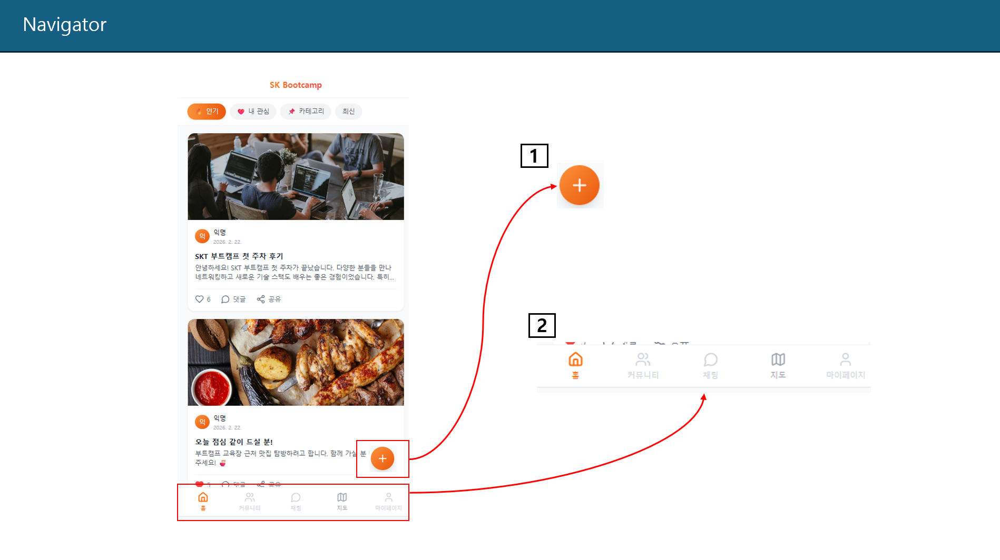
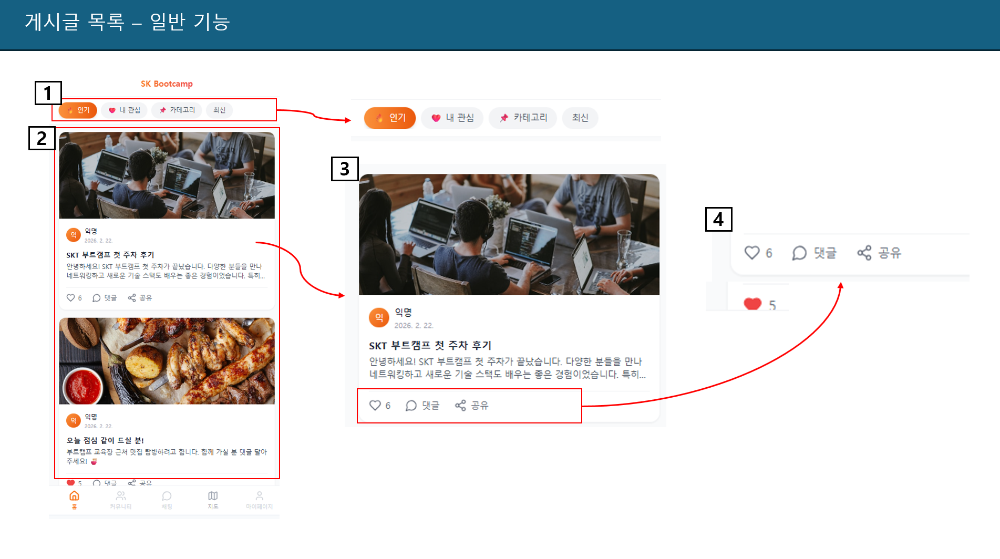
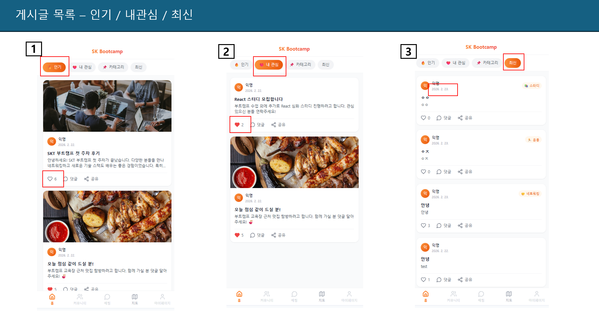
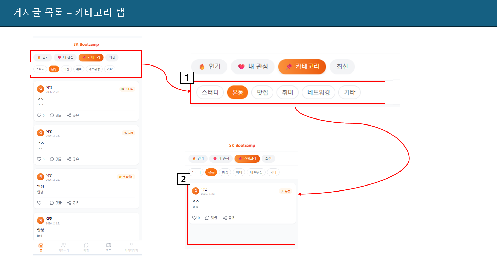
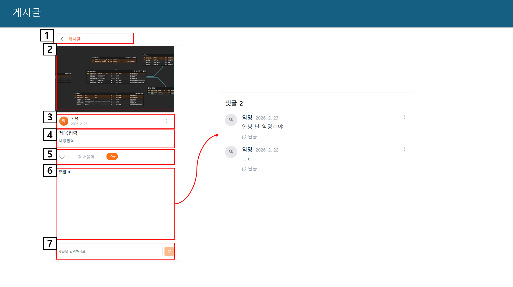
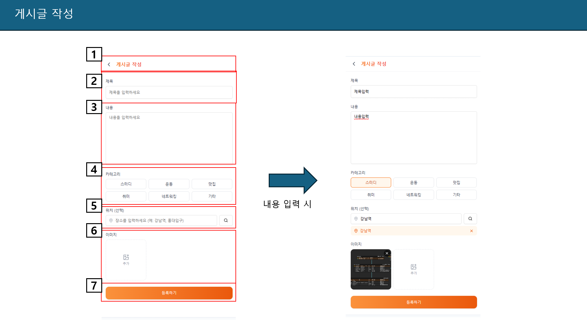
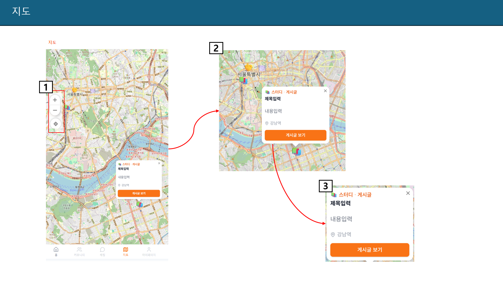

<!--------------------- 1페이지 ------------------------->

<table class="meta">
  <tr>
    <th class="label">버전(ver)</th><td class="val">2.0</td>
    <th class="label">페이지코드</th><td class="val">1</td>
    <th class="label">페이지명</th><td class="wide">게시글목록</td>
    <th class="label">이용자</th><td class="small">Mobile</td>
    <th class="descH">Description</th>
  </tr>
  <tr>
    <th class="label">작성인</th><td class="val">김경수</td>
    <th class="label">작성일</th><td class="val">2026.02.28</td>
    <th class="label">페이지 경로</th><td class="wide">-</td>
    <th class="label">페이지</th><td class="small">1</td>
    <td class="descH"> </td>
  </tr>
</table>

  

    <!-- 
▼ 이어서 ▼
 -->
    

      

        
      

    

  

  

    
화면 설명

  

  

    

      
1

      

        ■ 게시글 title  
        □ 설명
        <ul>
          <li>화면 중앙정렬 / 상단에 제목 표시 </li>
        </ul>
      

    

  

  

---
<!--------------------- 2페이지 ------------------------->

<table class="meta">
  <tr>
    <th class="label">버전(ver)</th><td class="val">2.0</td>
    <th class="label">페이지코드</th><td class="val">2</td>
    <th class="label">페이지명</th><td class="wide">게시글목록_일반</td>
    <th class="label">이용자</th><td class="small">Mobile</td>
    <th class="descH">Description</th>
  </tr>
  <tr>
    <th class="label">작성인</th><td class="val">김경수</td>
    <th class="label">작성일</th><td class="val">2026.02.28</td>
    <th class="label">페이지 경로</th><td class="wide">-</td>
    <th class="label">페이지</th><td class="small">1</td>
    <td class="descH"> </td>
  </tr>
</table>

  

    <!-- 
▼ 이어서 ▼
 -->
    

      

        
      

    

  

  

    
화면 설명

  

  

    

      
1

      

        ■ 게시글 title  
        □ 설명
        <ul>
          <li>화면 중앙정렬 / 상단에 제목 표시 </li>
        </ul>
      

    

  

  

---
<!--------------------- 3페이지 ------------------------->

<table class="meta">
  <tr>
    <th class="label">버전(ver)</th><td class="val">2.0</td>
    <th class="label">페이지코드</th><td class="val">3</td>
    <th class="label">페이지명</th><td class="wide">게시글목록_인기,관심,최신</td>
    <th class="label">이용자</th><td class="small">Mobile</td>
    <th class="descH">Description</th>
  </tr>
  <tr>
    <th class="label">작성인</th><td class="val">김경수</td>
    <th class="label">작성일</th><td class="val">2026.02.28</td>
    <th class="label">페이지 경로</th><td class="wide">-</td>
    <th class="label">페이지</th><td class="small">1</td>
    <td class="descH"> </td>
  </tr>
</table>

  

    <!-- 
▼ 이어서 ▼
 -->
    

      

        
      

    

  

  

    
화면 설명

  

  

    

      
1

      

        ■ 게시글 title  
        □ 설명
        <ul>
          <li>화면 중앙정렬 / 상단에 제목 표시 </li>
        </ul>
      

    

  

  

---
<!--------------------- 4페이지 ------------------------->

<table class="meta">
  <tr>
    <th class="label">버전(ver)</th><td class="val">2.0</td>
    <th class="label">페이지코드</th><td class="val">4</td>
    <th class="label">페이지명</th><td class="wide">게시글목록_카테고리</td>
    <th class="label">이용자</th><td class="small">Mobile</td>
    <th class="descH">Description</th>
  </tr>
  <tr>
    <th class="label">작성인</th><td class="val">김경수</td>
    <th class="label">작성일</th><td class="val">2026.02.28</td>
    <th class="label">페이지 경로</th><td class="wide">-</td>
    <th class="label">페이지</th><td class="small">1</td>
    <td class="descH"> </td>
  </tr>
</table>

  

    <!-- 
▼ 이어서 ▼
 -->
    

      

        
      

    

  

  

    
화면 설명

  

  

    

      
1

      

        ■ 게시글 title  
        □ 설명
        <ul>
          <li>화면 중앙정렬 / 상단에 제목 표시 </li>
        </ul>
      

    

  

  

---
<!--------------------- 5페이지 ------------------------->

<table class="meta">
  <tr>
    <th class="label">버전(ver)</th><td class="val">2.0</td>
    <th class="label">페이지코드</th><td class="val">5</td>
    <th class="label">페이지명</th><td class="wide">게시글</td>
    <th class="label">이용자</th><td class="small">Mobile</td>
    <th class="descH">Description</th>
  </tr>
  <tr>
    <th class="label">작성인</th><td class="val">김경수</td>
    <th class="label">작성일</th><td class="val">2026.02.28</td>
    <th class="label">페이지 경로</th><td class="wide">-</td>
    <th class="label">페이지</th><td class="small">1</td>
    <td class="descH"> </td>
  </tr>
</table>

  

    <!-- 
▼ 이어서 ▼
 -->
    

      

        
      

    

  

  

    
화면 설명

  

  

    

      
1

      

        ■ 게시글 title  
        □ 설명
        <ul>
          <li>화면 중앙정렬 / 상단에 제목 표시 </li>
        </ul>
      

    

  

  

---
<!--------------------- 6페이지 ------------------------->

<table class="meta">
  <tr>
    <th class="label">버전(ver)</th><td class="val">2.0</td>
    <th class="label">페이지코드</th><td class="val">6</td>
    <th class="label">페이지명</th><td class="wide">게시글작성</td>
    <th class="label">이용자</th><td class="small">Mobile</td>
    <th class="descH">Description</th>
  </tr>
  <tr>
    <th class="label">작성인</th><td class="val">김경수</td>
    <th class="label">작성일</th><td class="val">2026.02.28</td>
    <th class="label">페이지 경로</th><td class="wide">-</td>
    <th class="label">페이지</th><td class="small">1</td>
    <td class="descH"> </td>
  </tr>
</table>

  

    <!-- 
▼ 이어서 ▼
 -->
    

      

        
      

    

  

  

    
화면 설명

  

  

    

      
1

      

        ■ 게시글 title  
        □ 설명
        <ul>
          <li>화면 중앙정렬 / 상단에 제목 표시 </li>
        </ul>
      

    

  

  

---
<!--------------------- 7페이지 ------------------------->

<table class="meta">
  <tr>
    <th class="label">버전(ver)</th><td class="val">2.0</td>
    <th class="label">페이지코드</th><td class="val">7</td>
    <th class="label">페이지명</th><td class="wide">지도</td>
    <th class="label">이용자</th><td class="small">Mobile</td>
    <th class="descH">Description</th>
  </tr>
  <tr>
    <th class="label">작성인</th><td class="val">김경수</td>
    <th class="label">작성일</th><td class="val">2026.02.28</td>
    <th class="label">페이지 경로</th><td class="wide">-</td>
    <th class="label">페이지</th><td class="small">1</td>
    <td class="descH"> </td>
  </tr>
</table>

  

    <!-- 
▼ 이어서 ▼
 -->
    

      

        
      

    

  

  

    
화면 설명

  

  

    

      
1

      

        ■ 게시글 title  
        □ 설명
        <ul>
          <li>화면 중앙정렬 / 상단에 제목 표시 </li>
        </ul>
      

    

  

  

