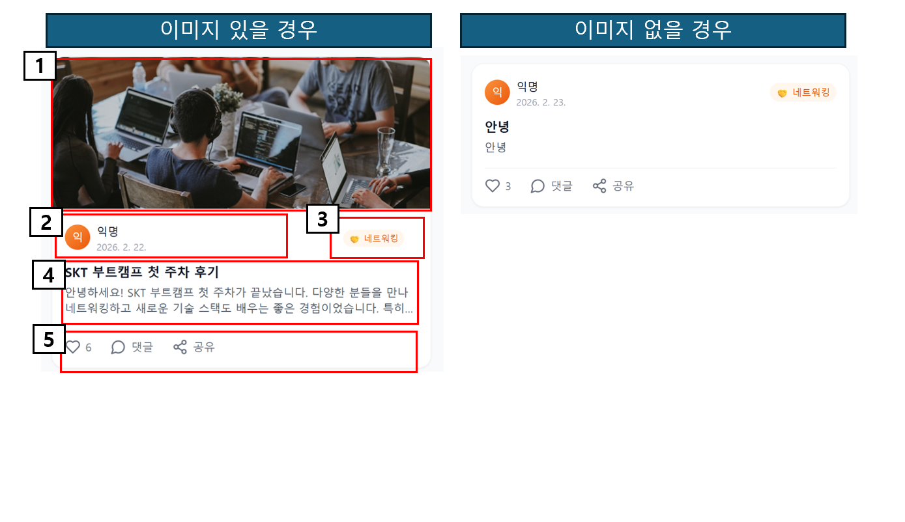
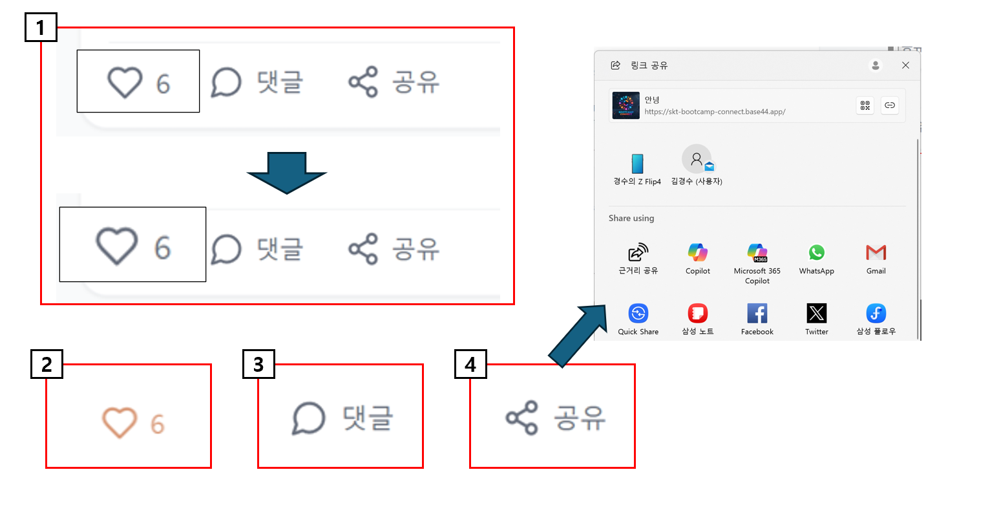
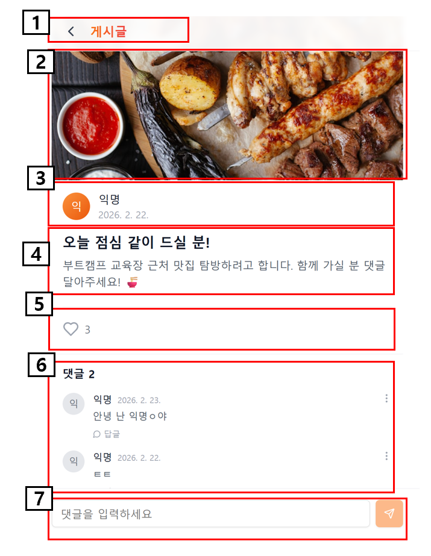
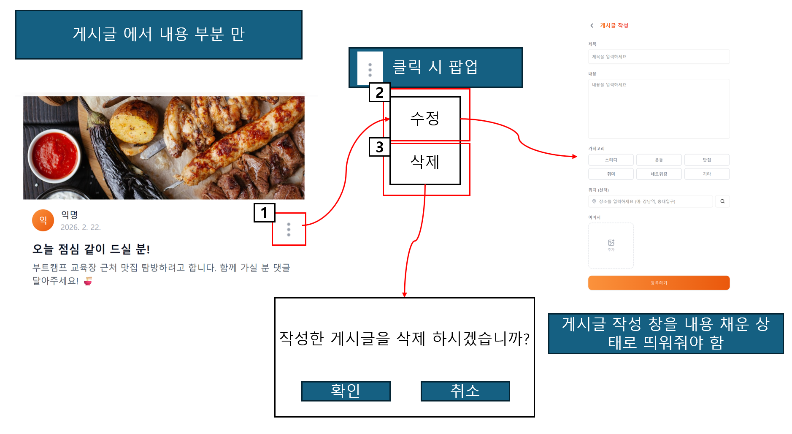
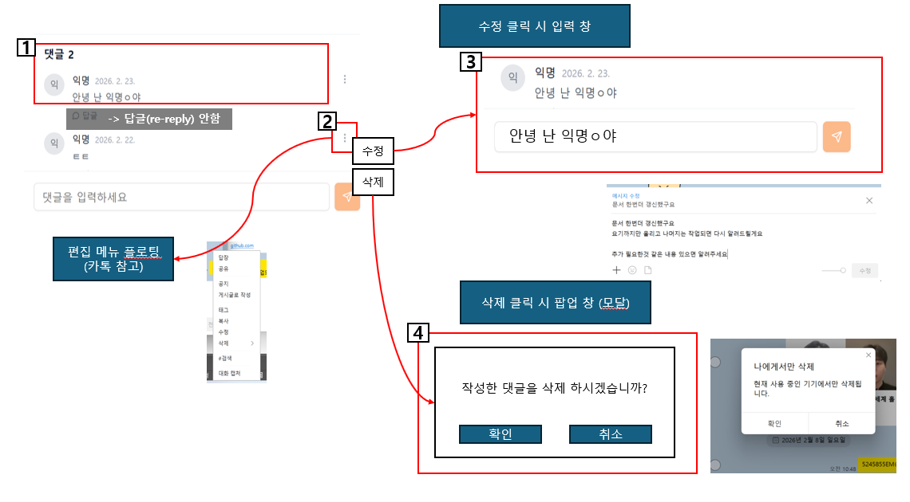
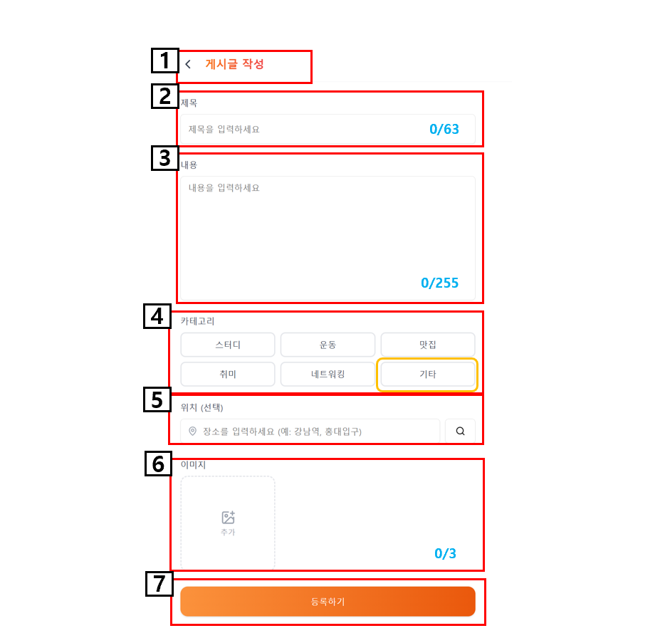
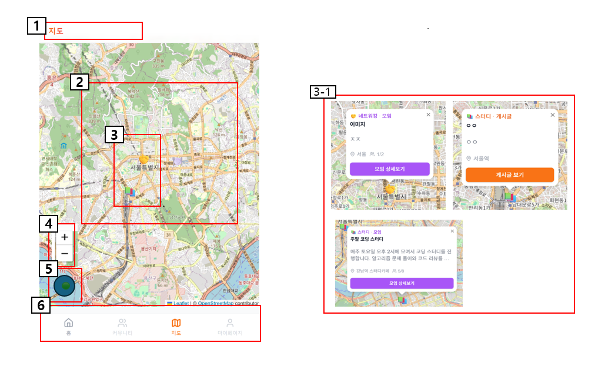

## 1페이지 · board

<table class="meta">
  <tr>
    <th class="label">버전(ver)</th><td class="val">1.0</td>
    <th class="label">페이지코드</th><td class="val">1</td>
    <th class="label">페이지명</th><td class="wide">board</td>
    <th class="label">이용자</th><td class="small">PC</td>
    <th class="descH">Description</th>
  </tr>
  <tr>
    <th class="label">작성인</th><td class="val">김경수</td>
    <th class="label">작성일</th><td class="val">2026.02.24</td>
    <th class="label">페이지 경로</th><td class="wide">-</td>
    <th class="label">페이지</th><td class="small">1</td>
    <td class="descH"> </td>
  </tr>
</table>

  

    <!-- 
▼ 이어서 ▼
 -->
    

      

        
      

    

  

  

    
화면 설명

  

  

    

      
1

      

        ■ 게시글 title  
        □ 설명
        <ul>
          <li>화면 중앙정렬 / 상단에 제목 표시 </li>
        </ul>
      

    

  

  

    

      
2

      

        ■ 게시글 - 카테고리  
        □ 설명
        <ul>
          <li>카테고리에 따라 게시글을 필터해서 보여준다. 
            1. 카테고리 중에 하나만 선택 가능. 
            2. 다른 카테고리가 선택되면 이전 선택은 해제. 
            3. 카테고리 클릭 시 카테고리에 따라 게시글 목록 표시. 
          </li>
        </ul>
      

    

  

  

    

      
3

      

        ■ 게시글 리스트  
        □ 설명
        <ul>
          <li>데이터에 따라 게시글들을 카드 형식으로 표시한다. </li>
          <li>게시들 글은 세로방향 스크롤로 표시된다. </li>
          <li>세로 스크롤에 최대 제한을 둘건지 확인 필요!! </li>
          <li>스크롤 바는 표시하지 않는다. </li>
          <li>화면 상/하 드래그 시 화면 스크롤 이동. </li>
          <li>post카드의 버튼 이외의 영역 클릭 시 해당 포스트로 이동 </li>
        </ul>
      

    

  

  

    

      
4

      

        ■ 메뉴 플로터(공용)  
        □ 설명
        <ul>
          <li>모든 화면에서 표시 </li>
          <li>표시하는 페이지 이동 (홈 = 게시글) </li>
          <li>홈 화면이 default (로그인 된 상태일때) </li>
        </ul>
      

    

  

  

    

      
5

      

        ■ 신규 작성 플로터(공용)  
        □ 설명
        <ul>
          <li>팝업 창으로 새로운 글 작성창을 띄움 </li>
          <li>표시 화면에 따라 게시판 / 커뮤니티 추가로 변경됨 </li>
          <li>지도 / 마이페이지 에서는 해당 버튼 표시 안함 </li>
           
        </ul>
      

    

  

  

---
## 2페이지 · board

<table class="meta">
  <tr>
    <th class="label">버전(ver)</th><td class="val">1.0</td>
    <th class="label">페이지코드</th><td class="val">2</td>
    <th class="label">페이지명</th><td class="wide">post_card</td>
    <th class="label">이용자</th><td class="small">PC</td>
    <th class="descH">Description</th>
  </tr>
  <tr>
    <th class="label">작성인</th><td class="val">김경수</td>
    <th class="label">작성일</th><td class="val">2026.02.24</td>
    <th class="label">페이지 경로</th><td class="wide">-</td>
    <th class="label">페이지</th><td class="small">1</td>
    <td class="descH"> </td>
  </tr>
</table>

  

    <!-- 
▼ 이어서 ▼
 -->
    

      

        
      

    

  

  

    
화면 설명

  

  

    

      
1

      

        ■ post img  
        □ 설명
        <ul>
          <li>post 카드 이미지 </li>
          <li>url 경로 텍스트 저장하고 UI 그릴때 해당 경로의 이미지 불러와 표시한다. </li>
          <li>이미지url 없을 경우 표시하지 않음 </li>
        </ul>
      

    

  

  

    

      
2

      

        ■ post 정보  
        □ 설명
        <ul>
          <li>해당 post에 대한 정보를 표시한다.  
            1. 포스트 작성자 이미지 or 아이콘 표시  
            2. 포스트 작성자 이름 표시  
            3. 포스트 마지막 갱신 일 표시  
          </li>
        </ul>
      

    

  

  

    

      
3

      

        ■ post 카테고리  
        □ 설명
        <ul>
          <li>해당 포스트가 가지는 카테고리 표시한다. </li>
        </ul>
      

    

  

  

    

      
4

      

        ■ post 제목/내용  
        □ 설명
        <ul>
          <li>post 제목은 bold로 강조 </li>
          <li>제목은 최대 20자 까지 표시 20자 넘어가면 뒷부분 ... 으로 적는다. </li>
          <li>post 내용은 2줄까지 표시 </li>
          <li>내용 표시글자 1줄에 최대 20자 까지 표시 </li>
          <li>2줄 넘어가면 나머지 텍스트는 ... 으로 표시 </li>
        </ul>
      

    

  

  

    

      
5

      

        ■ post interaction 버튼  
        □ 설명
        <ul>
          1. 좋아요 버튼 - 클릭 시 좋아요 count 변경 
          2. 댓글 버튼 - (결정 필요) 댓글만 입력할 인터페이스 제공할지 여부  
          3. 공유 버튼 - 팝업 창으로 공유 인터페이스 제공  
        </ul>
      

    

  

  

---
## 3페이지 · board

<table class="meta">
  <tr>
    <th class="label">버전(ver)</th><td class="val">1.0</td>
    <th class="label">페이지코드</th><td class="val">3</td>
    <th class="label">페이지명</th><td class="wide">post_btn</td>
    <th class="label">이용자</th><td class="small">PC</td>
    <th class="descH">Description</th>
  </tr>
  <tr>
    <th class="label">작성인</th><td class="val">김경수</td>
    <th class="label">작성일</th><td class="val">2026.02.24</td>
    <th class="label">페이지 경로</th><td class="wide">-</td>
    <th class="label">페이지</th><td class="small">1</td>
    <td class="descH"> </td>
  </tr>
</table>

  

    
▼ 이어서 ▼

    

      

        
      

    

  

  

    
화면 설명

  

  

    

      
1

      

        ■ post_btn_Hover  
        □ 설명
        <ul>
          <li>post 카드의 버튼에 커서 Hover 시 10% 크기 키움 </li>
          <li>입력 가능한 버튼에 커서 위치하고 있는거 시인용 </li>
        </ul>
      

    

  

  

    

      
2

      

        ■ post_btn_like  
        □ 설명
        <ul>
          <li>default는 색상 없는 상태 </li>
          <li>사용자 별로 is_like 상태 관리 / 값이 True면 하트에 색상 표시됨 </li>
          <li>post의 is_like 값이 변경될 때 마다 숫자 증감 </li>
          <li>post의 is_like 값은 사용자 별로 1번씩만 변경 가능 </li>
        </ul>
      

    

  

  

    

      
3

      

        ■ post_btn_reply  
        □ 설명
        <ul>
          <li>(검토)버튼 클릭 시 해당 포스트 화면으로 이동 </li>
          <li>포스트 이동과 겹쳐서 댓글만 달 수 있는 숏컷 제공할지 고려해야 함 </li>
        </ul>
      

    

  

  

    

      
4

      

        ■ post_btn_linkshare  
        □ 설명
        <ul>
          <li>클릭 시 공유창 호출 </li>
          <li>공유창은 해당 포스트의 URL 링크를 전달한다. </li>
          <li>전달 타겟은 공유창에서 선택 </li>
          <li>공유창은 화면 위에 올라가는 모달로 만든다.(공유창 닫기 전에는 다른 창 조작 불가) </li>
          <li>x 버튼이나 공유창 밖 영역 클릭 시 공유창 닫음 </li>
        </ul>
      

    

  

  

---
## 4페이지 · board

<table class="meta">
  <tr>
    <th class="label">버전(ver)</th><td class="val">1.0</td>
    <th class="label">페이지코드</th><td class="val">4</td>
    <th class="label">페이지명</th><td class="wide">post_detail</td>
    <th class="label">이용자</th><td class="small">PC</td>
    <th class="descH">Description</th>
  </tr>
  <tr>
    <th class="label">작성인</th><td class="val">김경수</td>
    <th class="label">작성일</th><td class="val">2026.02.24</td>
    <th class="label">페이지 경로</th><td class="wide">-</td>
    <th class="label">페이지</th><td class="small">1</td>
    <td class="descH"> </td>
  </tr>
</table>

  

    <!-- 
▼ 이어서 ▼
 -->
    

      

        
      

    

  

  

    
화면 설명

  

  

    

      
1

      

        ■ post_detail_title  
        □ 설명
        <ul>
          <li>포스트 제목 : "게시글" 고정 표시 </li>
          <li>해당 영역 클릭 시 홈(board) 화면 다시 표시되야 함 </li>
          <li>표시 중이던 post_detail 창은 닫음 </li>
        </ul>
      

    

  

  

    

      
2

      

        ■ post_detail_image  
        □ 설명
        <ul>
          <li>포스트 이미지 표시 부분 </li>
          <li>이미지 데이터 없으면 해당 부분 표시 안함 </li>
        </ul>
      

    

  

  

    

      
3

      

        ■ post_detail_info  
        □ 설명
        <ul>
          <li>포스트 등록 시 정보를 표시한다. (다음 내용 표시) </li>
          1. 등록자 아이콘 or 이미지 
          2. 등록자 이름  
          3. post 최초 등록일  
        </ul>
      

    

  

  

    

      
4

      

        ■ post_detail_text  
        □ 설명
        <ul>
          <li> 해당 포스트의 제목과 내용 표시 </li>
          <li> post 제목 : bold로 굵은 글자 사용, 내용보다 font 약간 더 크게 </li>
          <li> post 내용 : 포스트 내용 전부 표시  
          (post_card에서는 20자 2줄까지 표시 -> detail에서는 전부 표시) </li>
        </ul>
      

    

  

  

---
## 5페이지 · board

<table class="meta">
  <tr>
    <th class="label">버전(ver)</th><td class="val">1.0</td>
    <th class="label">페이지코드</th><td class="val">5</td>
    <th class="label">페이지명</th><td class="wide">post_detail</td>
    <th class="label">이용자</th><td class="small">PC</td>
    <th class="descH">Description</th>
  </tr>
  <tr>
    <th class="label">작성인</th><td class="val">김경수</td>
    <th class="label">작성일</th><td class="val">2026.02.24</td>
    <th class="label">페이지 경로</th><td class="wide">-</td>
    <th class="label">페이지</th><td class="small">1</td>
    <td class="descH"> </td>
  </tr>
</table>

  

    
▼ 이어서 ▼

    

      

        
      

    

  

  

    
화면 설명

  

  

    

      
5

      

        ■ post_detail_like  
        □ 설명
        <ul>
          <li>해당 포스트의 좋아요 표시 </li>
          <li>post_btn의 like와 동일한 기능을 가져야 함  
           1) 기본 상태는 False  
           2) 사용자 별로 1번만 누를 수 있어야 함(is_like = True로 상태 관리) 
           3) True일 때 버튼 색상 변경 
           4) 버튼 뒤에 현재 like 숫자 표시 
           (count 업데이트 받아야 하는데 실시간일 필요 까지는 없어 보임 -> 검토필요)</li>
        </ul>
      

    

  

  

    

      
6

      

        ■ post_detail_reply  
        □ 설명
        <ul>
          <li>포스트 뎃글 header에는 현재 등록된 댓글 숫자 표시 </li>
          <li>아래는 해당 post에 등록된 댓글을 표시  
            1) 댓글 작성자 아이콘 or 이미지  
            2) 댓글 작성자 이름  
            3) 댓글 내용 갱신 날짜  
            4) 댓글 상세메뉴 (아래에서 다시 설명) </li>
        </ul>
      

    

  

  

    

      
7

      

        ■ post_detail_reply_input  
        □ 설명
        <ul>
          <li>댓글 입력용 인풋 UI </li>
          <li>입력된 내용 없을 시 "댓글을 입력하세요" 표시 </li>
          <li>텍스트 입력되면 입력된 텍스트를 표시한다.  </li>
          <li>택스트 입력 최대 글자 수 (있으면 정해야 함, 있는게 좋음) </li>
          <li>텍스트 입력값이 있으면 입력 버튼 활성화로 표시  
            (입력 없으면 해당 버튼 비활성화 표시 - 색상 옅게, 클릭불가/입력불가) </li>
          <li>입력버튼 값이 True면 뎃글 입력하고 표시 댓글 내용 갱신 </li>
          <li>(검토 필요)내가 보고있는 post 정보가 바꼈을 때 (ex - 댓글추가, 내용변경 등)  
            어떻게 / 어떤 이밴트로 업데이트 받아서 갱신할지 검토 필요 </li>
        </ul>
      

    

  

  

---
## 6페이지 · board

<table class="meta">
  <tr>
    <th class="label">버전(ver)</th><td class="val">1.0</td>
    <th class="label">페이지코드</th><td class="val">6</td>
    <th class="label">페이지명</th><td class="wide">post_detail_edit</td>
    <th class="label">이용자</th><td class="small">PC</td>
    <th class="descH">Description</th>
  </tr>
  <tr>
    <th class="label">작성인</th><td class="val">김경수</td>
    <th class="label">작성일</th><td class="val">2026.02.24</td>
    <th class="label">페이지 경로</th><td class="wide">-</td>
    <th class="label">페이지</th><td class="small">1</td>
    <td class="descH"> </td>
  </tr>
</table>

  

    <!-- 
▼ 이어서 ▼
 -->
    

      

        
      

    

  

  

    
화면 설명

  

  

    

      
1

      

        ■ post_detail_edit  
        □ 설명
        <ul>
          <li>게시글 상세 정보 수정 할 수 있도록 메뉴 제공되어야 함(1.수정 2.삭제 ) </li>
          <li> (...) 버튼 클릭되면 클릭 위치에서 작은 메뉴 박스 하나 플로팅 됨 </li>
          <li> 플로팅 박스에서 수정 / 삭제 클릭하면 각각 동작 </li>
          <li> 플로팅 박스는 박스 밖 영역 클릭되면 닫혀야 함 </li>
        </ul>
      

    

  

  

    

      
2

      

        ■ post_detail_fix  
        □ 설명
        <ul>
          <li>게시글 수정 시 인터페이스 </li>
          <li>플로팅 박스에서 "수정" 버튼 클릭 시 게시글 작성 창 호출 (상세 내용은 이후에 있는 post_new 참조) </li>
          <li>수정모드에서는 게시글 작성 창에 현재 게시글의 정보가 채워진 상태로 호출함 </li>
          <li>내용 수정 후 입력 버튼 누르면 게시글의 정보를 입력된 값 들로 오버라이트 해야 한다. </li>
        </ul>
      

    

  

  

    

      
3

      

        ■ post_detail_delete  
        □ 설명
        <ul>
          <li>게시글 삭제 시 인터페이스 </li>
          <li>"삭제" 버튼 클릭하면 모달리스 창으로 경고 팝업 호출 </li>
          <li>확인 누르면 해당 게시글 삭제 / 취소 누르면 팝업창 닫는다. </li>
        </ul>
      

    

  

  

    

      
4

      

        ■ post_detail_auth  
        □ 설명
        <ul>
          <li>게시글 편집 권한은 게시글 작성자에게만 줘야 함 </li>
          <li>수정 권한이 없는 사람은 게시글 편집 버튼 비활성화 (클릭불가) 처리해야 함 </li>
          <li>정보 수정이므로 만약 권한이 없는 사람이 요청했을 때 검증 로직이 필요할 수 있음 </li>
        </ul>
      

    

  

  
  

    

      
5

      

        ■ post_detail_etc  
        □ 설명
        <ul>
          <li>이 외에 게시글에 대한 추가 기능 있으면 메뉴 추가해야 함 </li>
        </ul>
      

    

  

  

---
## 7페이지 · board

<table class="meta">
  <tr>
    <th class="label">버전(ver)</th><td class="val">1.0</td>
    <th class="label">페이지코드</th><td class="val">7</td>
    <th class="label">페이지명</th><td class="wide">post_detail_replyedit</td>
    <th class="label">이용자</th><td class="small">PC</td>
    <th class="descH">Description</th>
  </tr>
  <tr>
    <th class="label">작성인</th><td class="val">김경수</td>
    <th class="label">작성일</th><td class="val">2026.02.24</td>
    <th class="label">페이지 경로</th><td class="wide">-</td>
    <th class="label">페이지</th><td class="small">1</td>
    <td class="descH"> </td>
  </tr>
</table>

  

    <!-- 
▼ 이어서 ▼
 -->
    

      

        
      

    

  

  

    
화면 설명

  

  

    

      
1

      

        ■ post_detail_reply  
        □ 설명
        <ul>
          <li>현재 포스트에 달린 댓글 개수 표시 </li>
          <li>각 댓글에 작성자 아이콘, 이름 표시 </li>
          <li>해당 댓글 가장 마지막 수정된 날짜 표시 </li>
          <li>댓글은 최초 등록 날짜 기준으로 내림차 순 정렬 </li>
        </ul>
      

    

  

  

    

      
2

      

        ■ post_detail_replyedit  
        □ 설명
        <ul>
          <li>댓글 편집 인터페이스 </li>
          <li>(...) 버튼 클릭 시 플로팅 창으로 메뉴 목록 띄워줘야 함 </li>
          <li>메뉴 밖을 클릭하면 플로팅 창은 닫아줘야 함  </li>
          <li>수정 / 삭제 클릭하면 플로팅 닫히고 각 메뉴 동작 처리 </li>
        </ul>
      

    

  

  

    

      
3

      

        ■ post_detail_replyfix  
        □ 설명
        <ul>
          <li>댓글 수정 시 댓글 입력 메뉴 위에 수정하려는 댓글 내용을 표시해줌 </li>
          <li>수정 상태에서는 이전에 작성한 댓글을 입력창 바로 위에 띄워서 보여줌 (비교해서 볼 수 있도록) </li>
          <li>이전에 작성한 내용을 댓글 input에 그대로 넣어준다. </li>
          <li>수정이 발생하지 않았을 경우 string 비교해서 "입력" 버튼 클릭 불가 (구현할지 검토) </li>
          <li>( X ) 버튼 같은걸 넣어서 수정 모드를 바로 취소할 수 있도록 처리 필요 </li>
          <li>입력되면 현재 표시하고 있던 게시글 다시 띄움 </li>
        </ul>
      

    

  

  

    

      
4

      

        ■ post_detail_replydelete  
        □ 설명
        <ul>
          <li>댓글 삭제 시 모달로 경고창 표시 </li>
          <li>경고 창에서 확인 누르면 해당 댓글 삭제하고 게시글 갱신 </li>
          <li>취소하면 다시 원래 창으로 되돌아옴 </li>
        </ul>
      

    

  

  

    

      
5

      

        ■ post_detail_replyauth  
        □ 설명
        <ul>
          <li>댓글 편집 권한 </li>
          <li>댓글 작성자만 해당 댓글에 대한 편집 권한이 존재함 </li>
          <li>작성자 이외의 유저는 해당 버튼이 클릭 불가능해야 함 </li>
        </ul>
      

    

  

  

---

## 8페이지 · board

<table class="meta">
  <tr>
    <th class="label">버전(ver)</th><td class="val">1.0</td>
    <th class="label">페이지코드</th><td class="val">8</td>
    <th class="label">페이지명</th><td class="wide">post_new</td>
    <th class="label">이용자</th><td class="small">PC</td>
    <th class="descH">Description</th>
  </tr>
  <tr>
    <th class="label">작성인</th><td class="val">김경수</td>
    <th class="label">작성일</th><td class="val">2026.02.24</td>
    <th class="label">페이지 경로</th><td class="wide">-</td>
    <th class="label">페이지</th><td class="small">1</td>
    <td class="descH"> </td>
  </tr>
</table>

  

    <!-- 
▼ 이어서 ▼
 -->
    

      

        
      

    

  

  

    
화면 설명

  

  

    

      
1

      

        ■ post_new_header  
        □ 설명
        <ul>
          <li>게시글 작성 창 상단 </li>
          <li>< 표시를 포함해 해당 영역 클릭되면 작성창을 나가서 원래 게시글 화면으로 돌아옴 </li>
          <li>새 게시글 작성 버튼이 공용 플로트 버튼이라 마지막으로 보고 있던 창으로 되돌아 가는지 여부는 이야기해서 정해야 함 </li>
          <li>게시글 수정 시에도 해당 창을 같이 사용 -> 이 때는 "게시글 수정" 으로 글자가 떠야 함 </li>
        </ul>
      

    

  

  

    

      
2

      

        ■ post_new_title  
        □ 설명
        <ul>
          <li>포스트 제목 입력 </li>
          <li>필수 입력 사항 / 데이터 없으면 등록 불가 </li>
          <li>최대 글자 수 존재 </li>
          <li>현재 입력 된 글자수 / 최대 글자 수 표시 (input 창 우측 정렬) </li>
        </ul>
      

    

  

  

    

      
3

      

        ■ post_new_text  
        □ 설명
        <ul>
          <li>포스트 내용 입력 </li>
          <li>필수 입력 사항 / 데이터 없으면 등록 불가 </li>
          <li>최대 글자 수 존재 </li>
          <li>현재 입력 된 글자수 / 최대 글자 수 표시 (input 창 우측 정렬) </li>
        </ul>
      

    

  

  

    

      
4

      

        ■ post_new_category  
        □ 설명
        <ul>
          <li>포스트 카테고리 선택 </li>
          <li>필수 입력사항 & 입력창 제공 시 기본 선택 제공(default) </li>
        </ul>
      

    

  

  

---

## 9페이지 · board

<table class="meta">
  <tr>
    <th class="label">버전(ver)</th><td class="val">1.0</td>
    <th class="label">페이지코드</th><td class="val">9</td>
    <th class="label">페이지명</th><td class="wide">post_new</td>
    <th class="label">이용자</th><td class="small">PC</td>
    <th class="descH">Description</th>
  </tr>
  <tr>
    <th class="label">작성인</th><td class="val">김경수</td>
    <th class="label">작성일</th><td class="val">2026.02.24</td>
    <th class="label">페이지 경로</th><td class="wide">-</td>
    <th class="label">페이지</th><td class="small">1</td>
    <td class="descH"> </td>
  </tr>
</table>

  

    
▼ 이어서 ▼

    

      

        
      

    

  

  

    
화면 설명

  
  

    

      
5

      

        ■ post_new_maplocation  
        □ 설명
        <ul>
          <li>지도상 표시 위치 선택 </li>
          <li>위치 이름 표시 (입력 어떻게 할지 검토 필요) </li>
          <li>실제 위치좌표 저장 (x,y로 2차원 튜플 -> 지도에서 좌표로 표시) </li>
          <li>위치 검색 인터페이스 호출 (호출창 및 호출방법 검토 필요) </li>
        </ul>
      

    

  

  

    

      
6

      

        ■ post_new_image  
        □ 설명
        <ul>
          <li>이미지는 1개만 등록 가능 (이미지 개수 표시 x -> 나중에 이야기로 결정됨) </li>
          <li>이미지 등록되면 등록된 이미지를 표시 </li>
          <li>등록된 이미지 없으면 "추가" 아이콘 표시 </li>
          <li>이미지가 1개이므로 추가 아이콘은 중앙 정렬 </li>
          <li>이미지 부분 레이아웃 사이즈는 따로 검토해 봐야 함 (등록 개수가 1개가 되서 중요도가 떨어졌음) </li>
        </ul>
      

    

  

  

    

      
7

      

        ■ post_new_submit  
        □ 설명
        <ul>
          <li>작성한 포스트 입력 버튼 </li>
          <li>필수 입력사항이 모두 존재하는지 체크되어야 함 -> 아니면 클릭불가 / 등록하기 버튼 알파(투명도) 낮춤 </li>
          <li>게시글 수정 모드인 경우 필수 입력사항 존재 및 수정 발생 여부도 체크해서 등록하기 버튼 체크해야 함 </li>
        </ul>
      

    

  

  

---

## 10페이지 · board

<table class="meta">
  <tr>
    <th class="label">버전(ver)</th><td class="val">1.0</td>
    <th class="label">페이지코드</th><td class="val">10</td>
    <th class="label">페이지명</th><td class="wide">map</td>
    <th class="label">이용자</th><td class="small">PC</td>
    <th class="descH">Description</th>
  </tr>
  <tr>
    <th class="label">작성인</th><td class="val">김경수</td>
    <th class="label">작성일</th><td class="val">2026.02.24</td>
    <th class="label">페이지 경로</th><td class="wide">-</td>
    <th class="label">페이지</th><td class="small">1</td>
    <td class="descH"> </td>
  </tr>
</table>

  

    <!-- 
▼ 이어서 ▼
 -->
    

      

        
      

    

  

  

    
화면 설명

  
  

    

      
1

      

        ■ map_header  
        □ 설명
        <ul>
          <li>현재 창의 header "지도" string 표시 </li>
        </ul>
      

    

  

  

    

      
2

      

        ■ map_region  
        □ 설명
        <ul>
          <li>지도의 최대 / 최소 확대 범위를 결정해야 함 </li>
          <li>지도의 표시 화면은 확대율에 따라 다르게 표시된다. (해당 부분은 자세하게 이야기 해봐야 함) </li>
          <li>지도에서 제공하고 있는 기능들을 어디까지 수용할 지 이야기 해봐야 함  (이게 없으면 지도 사용자가 불편해 할 수 있음 ex - 내 위치 찾기 등......) </li>
        </ul>
      

    

  

  

    

      
3

      

        ■ map_locations  
        □ 설명
        <ul>
          <li>게시글의 위치 정보들이 해당 화면에 표시된다. </li>
          <li>지도에 게시글 카테고리 별 필터가 있어야 될 것으로 생각됨 (원하는 태그만 지도에서 보기 용도) </li>
          <li>마커들은 지도의 줌 단계에 따라 비례해서 크기가 변한다. (지도의 확대 배율과 일치하지 않아도 됨) </li>
          <li>마커들 하단에 마커의 이름 표시(게시글 제목 일부 또는 위치 이름 등등.. 어떤걸 표시할지는 이야기 해봐야 함) </li>
          <li>마커 종류에 따라 구분할 수 있도록 색상이나 디자인 차별화 (커뮤니티 / 게시글 구분용) </li>
        </ul>
      

    

  

  

    

      
3.1

      

        ■ map_locations_float  
        □ 설명
        <ul>
          <li>마커 클릭 시 해당 마커의 게시글 요약 정보를 보여주는 플로팅 창 오픈 </li>
          <li>마커에 대한 플로팅은 동시에 하나만 출력될 수 있다. (다른 마커 누르면 이전게 닫힘) </li>
          <li>플로팅 창이 떳을 때 마커의 정보를 요약해서 표시 </li>
          <li>마커의 종류가 게시글이면 주황 / 커뮤니티면 보라색 사용 (마커 자체도 구분 필요해보임) </li>
        </ul>
      

    

  

  

---

## 11페이지 · board

<table class="meta">
  <tr>
    <th class="label">버전(ver)</th><td class="val">1.0</td>
    <th class="label">페이지코드</th><td class="val">11</td>
    <th class="label">페이지명</th><td class="wide">map</td>
    <th class="label">이용자</th><td class="small">PC</td>
    <th class="descH">Description</th>
  </tr>
  <tr>
    <th class="label">작성인</th><td class="val">김경수</td>
    <th class="label">작성일</th><td class="val">2026.02.24</td>
    <th class="label">페이지 경로</th><td class="wide">-</td>
    <th class="label">페이지</th><td class="small">1</td>
    <td class="descH"> </td>
  </tr>
</table>

  

    
▼ 이어서 ▼

    

      

        
      

    

  

  

    
화면 설명

  

    

      
4

      

        ■ map_zoom  
        □ 설명
        <ul>
          <li>줌은 6단계(0 ~ 5 까지)를 제공 (협의 가능) </li>
          <li>가장 낮은 배율 부터 지도가 20% 씩 커짐 (지도 기본 기능으로 추정함) </li>
          <li>줌 단계에 따라 마커의 크기 및 이름 표시 여부가 변경 </li>
          <li>0 단계 일 때 확대 버틑 비활성화 </li>
          <li>5 단계 일 때 축소 버틑 비활성화 </li>
        </ul>
      

    

  

  
  

    

      
5

      

        ■ map_mylocation  
        □ 설명
        <ul>
          <li>내 위치 찾기 버튼 </li>
          <li>클릭 시 화면의 중앙 위치를 내 현재 위치로 변경하고 변경된 위치 기준으로 맞추는 버튼 </li>
          <li>지도 유틸리티 들을 화면 좌측 하단에 붙이고 내 위치 버튼도 같이 존재한다.  </li>
        </ul>
      

    

  

  

    

      
6

      

        ■ menu  
        □ 설명
        <ul>
          <li>메뉴 플로트 </li>
          <li>공용으로 사용하는 메뉴 플로트 UI 지도보고 있는 중에는 지도 탭이 선택되어 있음 </li>
          <li>메뉴 버튼으로 넘어갈 때 각 페이지 별로 직전에 보고 있던 화면 상태를 다시 보여줄지는 이야기 해 봐야 함 </li>
        </ul>
      

    

  

  

