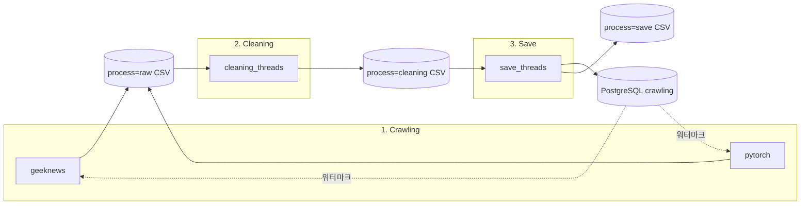
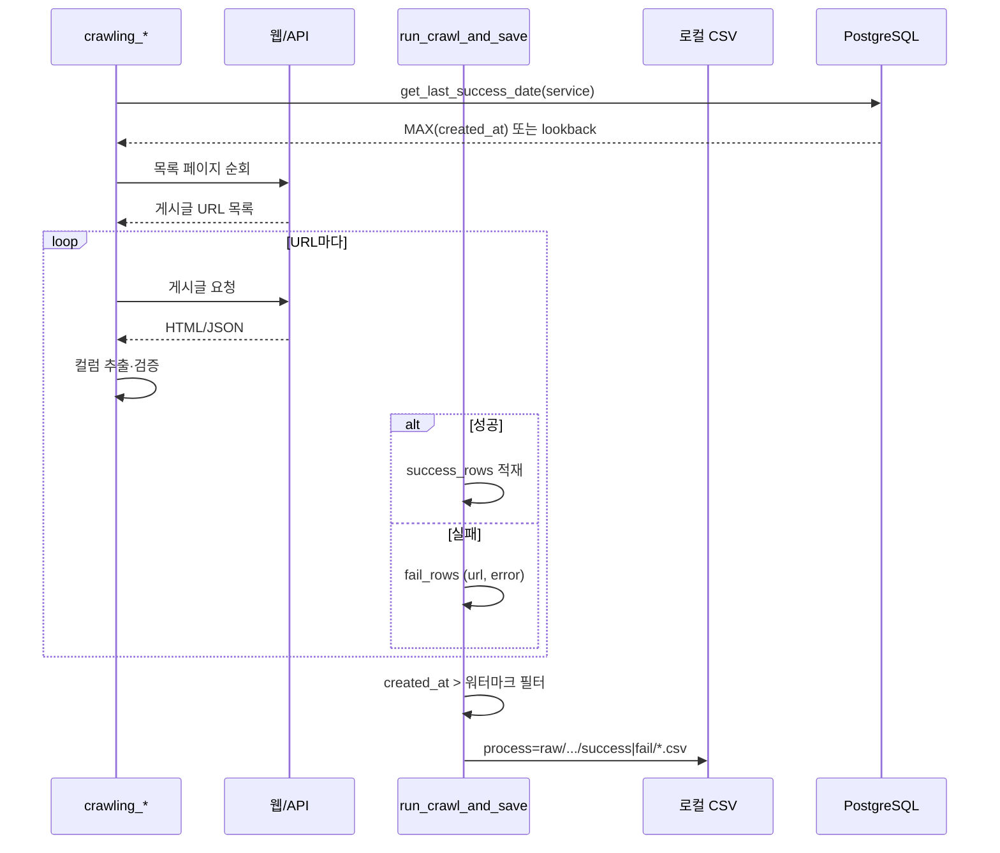
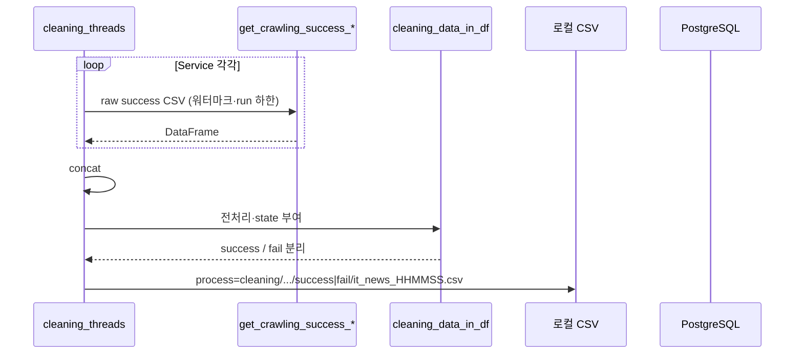
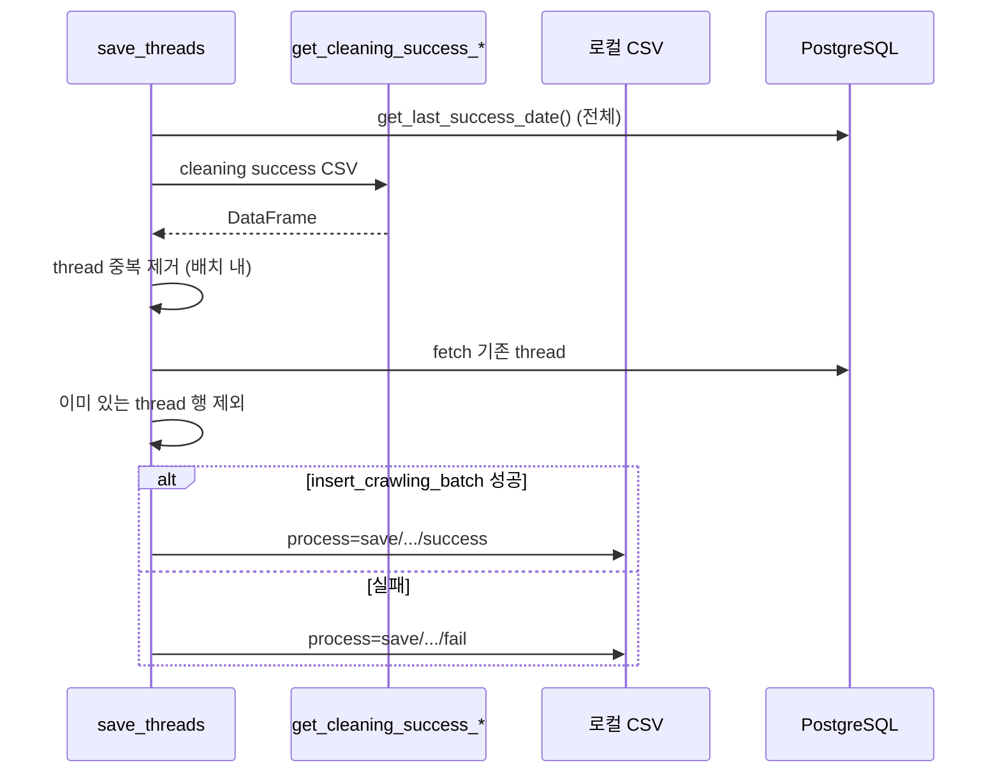

# it_news ETL — 설계·동작

지정된 IT 뉴스·커뮤니티 사이트에서 게시글을 수집하고, 스키마에 맞게 정제한 뒤 PostgreSQL `crawling` 테이블에 반영하는 배치 파이프라인이다.  
LLM 학습·검색·추천 등 백엔드가 쓰는 **제목·본문·URL·메타데이터**를 주기적으로 적재하는 것이 목적이다.

---

## 1. 담당 범위

| 구분 | 내용 |
|------|------|
| **입력** | 웹 게시판·토픽 목록·개별 게시글 HTML/JSON (사이트별 파서) |
| **중간 산출** | 단계별 success/fail CSV (`process=raw` → `cleaning` → `save`) |
| **출력** | DB `crawling` 행 MERGE·INSERT, save 단계 성공/실패 CSV |
| **범위 밖(현재)** | `comments` 테이블 적재, 댓글 본문 2차 크롤, MCP 기반 수집 대체 |

코드·레이어·import 규칙은 [etl-coding-standards.md](./etl-coding-standards.md)를 따른다. 로컬 DB 기동은 [local-database-setup.md](./local-database-setup.md)를 참고한다.

---

## 2. 크롤링 대상 (확장 가능)

| Service | URL (목록·진입) | `thread` 접두 | 비고 |
|---------|-----------------|---------------|------|
| **geeknews** | https://news.hada.io/new | `geeknews_` | 목록 페이지 `?page=` 순회, HTML(BeautifulSoup) |
| **pytorch** | https://discuss.pytorch.kr/c/news/14/l/latest | `pytorch_` | Discourse API·HTML 혼용 |

새 사이트는 `common.constant.Service`와 `crawling/crawling_thread_<site>.py`를 추가하고, `pipeline.py` 오케스트레이션에 단계를 끼워 넣는 형태로 확장한다.

---

## 3. 디렉터리·레이어

```
etl/it_news/
├── pipeline.py              # 전체 오케스트레이션 (F)
├── crawling/                # 사이트별 수집 진입
├── cleaning/                # 클리닝 진입
├── save/                    # DB 적재 진입
├── common/                  # CSV·전처리·HTTP 크롤 루프·에러 문구 (DB 비의존)
└── postgresql/              # 연결·쿼리·워터마크·DB 상수
```

| 레이어 | 역할 |
|--------|------|
| `pipeline.py` | 동일 `run_time`으로 geeknews → pytorch 크롤 후 cleaning → save 순서만 제어 |
| `crawling/` | 목록 URL 수집 → 게시글 파싱 → `run_crawl_and_save`로 CSV 저장 |
| `cleaning/` | raw 성공 CSV 로드·합침 → 전처리 → cleaning CSV |
| `save/` | cleaning 성공 CSV 로드 → 중복 제거 → `insert_crawling_batch` |
| `common/` | 경로·시간·전처리·`EtlErrors` |
| `postgresql/` | DSN(`.env`), `get_last_success_date`, MERGE SQL |

환경 변수: 패키지 루트 `etl/it_news/.env` (`PGUSER`, `PGPASSWORD`, `PGHOST`, `PGPORT`, `PGDATABASE`).

---

## 4. 전체 Flow

### 4.1 파이프라인 순서



`python pipeline.py` 한 번 실행 시:

1. 소스별 `get_last_success_date(Service.*)` 로 워터마크 조회  
2. **geeknews** 크롤 → **pytorch** 크롤 (동일 `run_time` → 같은 일자 run 폴더)  
3. **cleaning** — 등록된 모든 `Service`의 raw success CSV를 로드·전처리  
4. **save** — cleaning success CSV를 DB에 반영  

단계별 단독 실행(개발·디버그): `python -m crawling.crawling_thread_geeknews`, `python cleaning/cleaning.py`, `python save/save.py`, `python -m postgresql`.

### 4.2 워터마크·증분 수집

- 기준 시각: DB `crawling.created_at`의 `MAX` (소스별 크롤 시 `thread` 접두 `^{service}_` 필터).  
- DB가 비어 있으면 `ETL_CRAWL_LOOKBACK_DAYS`(90일) 이전 00:00을 하한으로 사용.  
- 크롤 성공 행은 `created_at > 워터마크`만 CSV에 남긴다.  
- 클리닝·save는 run 폴더 하한·워터마크에 맞춰 **이미 적재된 구간의 CSV는 다시 읽지 않도록** 필터한다 (`common/preprocess`, `common/utils`).

---

## 5. 단계별 동작

### 5.1 크롤링 (`process=raw`)

게시판에서 URL을 모은 뒤 게시글별로 요청·파싱하고, 행 단위로 성공·실패를 나눈다.

**필수 필드**(하나라도 실패 시 해당 URL은 fail CSV, `error` 컬럼): 제목, 본문, 게시글 URL, `thread`(고유 식별), `created_at`.



공통 루프: `common/crawling_http.run_crawl_and_save`. 사이트별 차이는 목록 수집·`parse_article`만 `crawling_thread_*.py`에 둔다.

### 5.2 클리닝 (`process=cleaning`)

`Service` 열거에 대해 `process=raw` … `status=success` CSV를 로드·concat한 뒤 전처리하고, `state`로 success/fail을 구분해 CSV로 쓴다.

| 처리 | 내용 |
|------|------|
| 중복 | `thread` 기준 |
| 이상치 | `title`, `content`, `article_url`, `thread`, `category_cd` 등 검사 → `state=fail` |
| 정규화 | 특수문자·연속 줄바꿈·HTML 엔티티·DB 컬럼 길이·코드값 (`common/preprocess`) |
| 코드 | IT 정보 `information_cd=IC02`, 카테고리 `category_cd=CA07`(기타) 등 `CodeTable` |



### 5.3 저장 (`process=save`)

클리닝 success CSV를 읽어 DB에 없는 `thread`만 남긴 뒤 `crawling`에 MERGE·INSERT한다.



DB 반영: `postgresql/run_query.insert_crawling_batch` — JSON 배열 1회 전달, `ON thread` MERGE(있으면 UPDATE, 없으면 INSERT).

---

## 6. CSV 경로 규칙

루트(`etl/it_news`) 기준 상대 경로:

```
process={raw|cleaning|save}/
  information_cd={IC02 등}/
    year=YYYY/month=MM/day=DD/
      status={success|fail}/
        {service|it_news}_{HHMMSS}.csv
```

- **raw**: `service` = `geeknews`, `pytorch`  
- **cleaning·save**: 파일 prefix 기본 `it_news` (`ItNewsFilePrefix.DEFAULT`)  
- 인코딩: `utf-8` (`CrawlingConstant.CSV_ENCODING`)

---

## 7. 데이터 모델 (요약)

적재 대상 테이블: **`crawling`** (단일). 주요 컬럼은 `common.constant.CrawlingColumn`과 INSERT SQL이 공유한다.

| 컬럼 | 설명 |
|------|------|
| `thread` | 소스 접두 + 사이트 고유 ID (MERGE 키) |
| `title`, `content`, `article_url` | 본문·링크 |
| `created_at` | 게시 시각 (워터마크·증분 기준) |
| `view_count`, `comment_count`, `point` | 메타 (없으면 0) |
| `author`, `map_id` | 작성자·사이트별 ID |
| `category_cd`, `information_cd`, `shop_cd` | 코드 테이블 (`database/data/codeT.csv`) |
| `keywords` | 선택 |

파이프라인 전용 컬럼( DB 미적재 ): 크롤 fail의 `error`, 클리닝 중 `state`, concat 시 `_page_service`.

---

## 8. 실행·검증

작업 디렉터리: **`etl/it_news`**

```bash
python pipeline.py
python -m crawling.crawling_thread_geeknews
python -m crawling.crawling_thread_pytorch
python cleaning/cleaning.py
python save/save.py
python -m postgresql
```

DB 쓰기 배치는 테스트 통과와 별도로, 로컬 DB 기동 후 위 명령으로 확인한다.

---

## 9. 함수 계약·인벤토리

공개 API의 유형(A~F)·안전성(Level 0~3)·docstring `Note:`는 [function-inventory.md](./function-inventory.md)를 따른다.  
테스트 시나리오·가드레일은 [testing.md](./testing.md)를 따른다.
