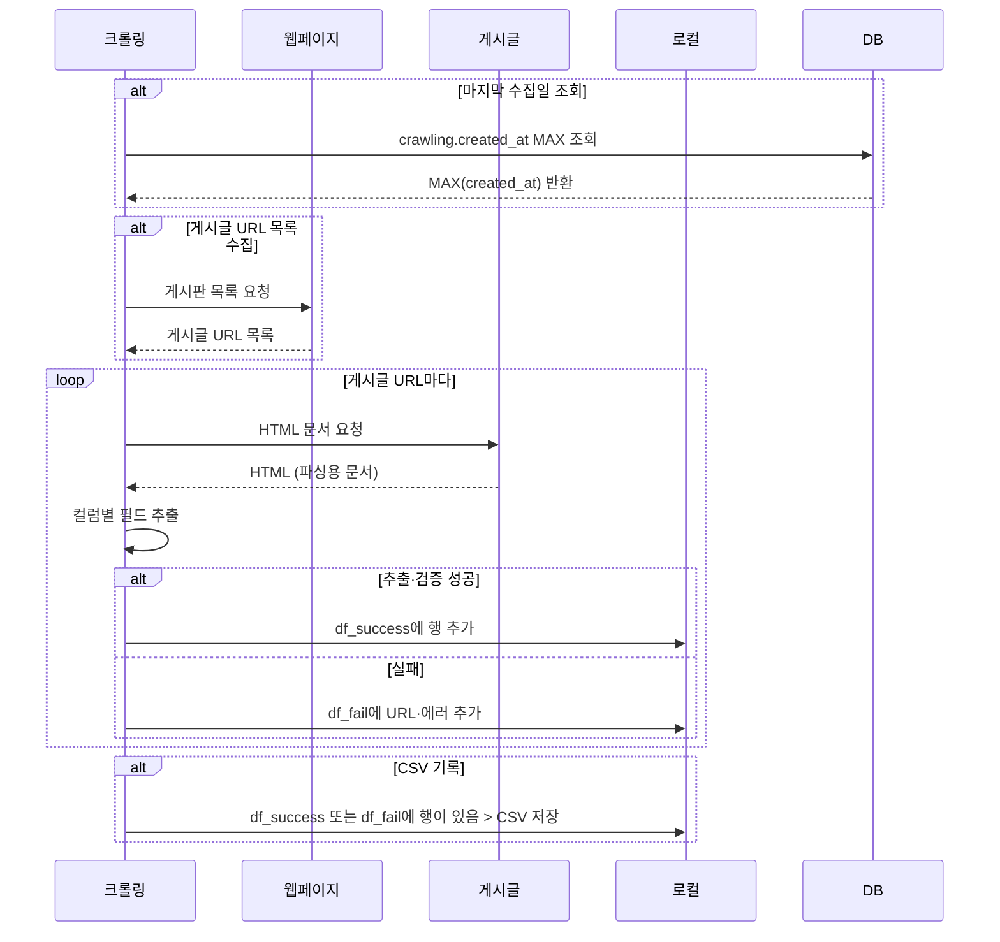
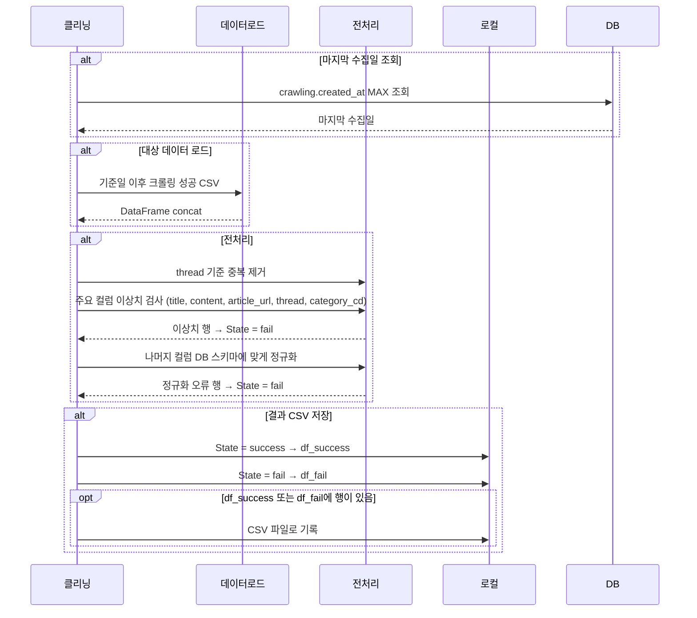
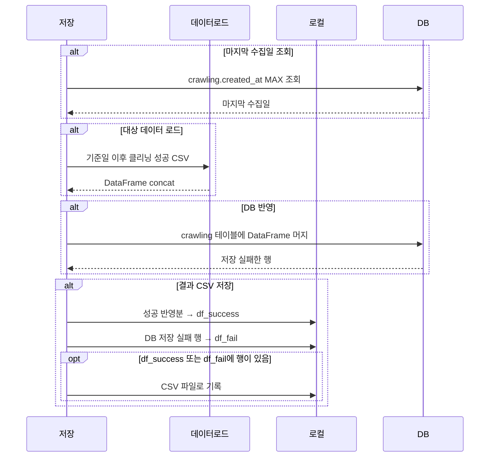

## 1. 크롤링

게시판에서 URL을 모은 뒤 게시글별로 HTML을 받아 파싱하고, 행 단위로 성공·실패를 나눕니다.

---

## 2. 클리닝

같은 기준일로 크롤링 성공 CSV를 합친 뒤 전처리하고, `State`로 성공·실패를 구분해 다시 CSV로 씁니다.

---

## 3. DB 저장

클리닝 성공분을  `crawling` 테이블에 머지하고, 결과를 다시 성공·실패 CSV로 남깁니다.

