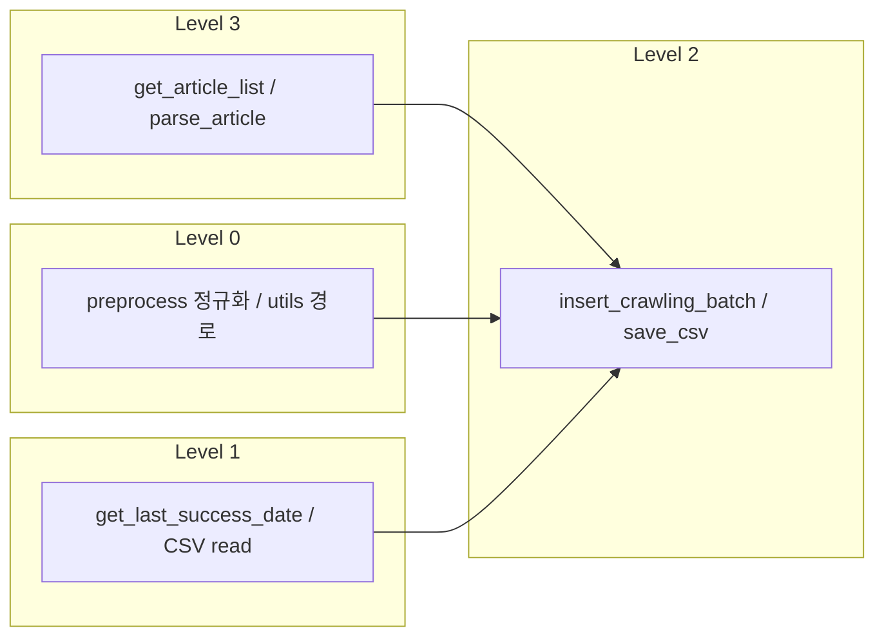

# 함수 인벤토리 및 분류 — it_news

[design.md](./design.md) · Cursor Skill `code-integrity-and-testing` 기준.  
프로덕션 코드 docstring `Note:` 절과 본 표를 동기화한다.

**범위:** `pipeline.py`, `crawling/`, `cleaning/`, `save/`, `common/`, `postgresql/`  
**작성일:** 2026-05-20

---

## 분류 기준

| 코드 | 명칭 | it_news 예 |
|------|------|------------|
| A | 순수 계산 | `format_hhmmss`, `korean_relative_time` |
| B | 데이터 변환 | `cleaning_*`, `build_csv_path`, `EtlErrors.*` |
| C | 검증 | `require_env`, `cleaning_data_in_df` 내 필수 컬럼 검사 |
| D | 저장/조회 | `insert_crawling_batch`, `get_last_success_date` |
| E | 외부 연동 | HTTP 크롤, CSV I/O |
| F | 오케스트레이션 | `run_pipeline`, 단계 진입 `*_threads` |

| 등급 | 의미 | 테스트 |
|------|------|--------|
| 0 | 부작용 없음(메모리·파일·DB·네트워크 없음) | 단위 테스트 자유 |
| 1 | DB/파일 **읽기**만 | fixture·스모크 |
| 2 | DB **쓰기**(MERGE) 또는 CSV **쓰기** | mock·간접 검증, 실 MERGE 금지 |
| 3 | HTTP 외부 요청 | mock `requests` 또는 통합 스킵 |

**모듈 import 부작용:** `postgresql/config.py` — `load_dotenv(etl/it_news/.env)` (인벤토리·테스트 시 명시).

---

## 요약 통계

| 모듈 | 공개 API 수 | L0 | L1 | L2 | L3 |
|------|-------------|----|----|----|-----|
| `pipeline.py` | 1 | 0 | 0 | 0 | 1* |
| `crawling/` (×2 사이트) | 20 | 2 | 0 | 2 | 16 |
| `cleaning/` | 1 | 0 | 0 | 2 | 0 |
| `save/` | 1 | 0 | 1 | 2 | 0 |
| `common/utils.py` | 11 | 7 | 1 | 3 | 0 |
| `common/preprocess.py` | 9 | 4 | 1 | 4 | 0 |
| `common/crawling_http.py` | 2 | 1 | 0 | 2 | 0 |
| `common/errors.py` | 1 클래스 | 11메서드→B/0 | | | |
| `postgresql/` | 9 | 2 | 4 | 2 | 0 |
| **합계(대략)** | **~54** | | | | |

\* `run_pipeline`은 하위 단계가 L2·L3를 호출하므로 통합 실행 시 **최대 L3**까지 전파.

---

## pipeline.py

| 심볼 | 유형 | 안전성 | 책임 | 불변·실패 요약 |
|------|------|--------|------|----------------|
| `run_pipeline` | F | 3(통합) | geeknews→pytorch 크롤→cleaning→save 순서·로깅 | 단계 예외는 전파; `run_time` 공유로 동일 run 폴더 |

---

## cleaning/cleaning.py

| 심볼 | 유형 | 안전성 | 책임 | 불변·실패 요약 |
|------|------|--------|------|----------------|
| `cleaning_threads` | F | 2 | raw success CSV→전처리→cleaning CSV | 입력 0행이면 빈 튜플 반환; fail 행은 별도 CSV |

---

## save/save.py

| 심볼 | 유형 | 안전성 | 책임 | 불변·실패 요약 |
|------|------|--------|------|----------------|
| `save_threads` | F | 2 | cleaning CSV→thread 중복 제거→MERGE→save CSV | DB 예외 시 전체 fail DataFrame; 0행이면 스킵 |

---

## common/crawling_http.py

| 심볼 | 유형 | 안전성 | 책임 | 불변·실패 요약 |
|------|------|--------|------|----------------|
| `user_agent_headers` | A | 0 | 크롤 HTTP 헤더 dict | 상수 기반, 부작용 없음 |
| `run_crawl_and_save` | E+B | 2 | URL 순회·파싱·워터마크 필터·raw CSV | per-URL 예외→fail row; `created_at > threshold`만 success |

---

## common/utils.py

| 심볼 | 유형 | 안전성 | 책임 | 불변·실패 요약 |
|------|------|--------|------|----------------|
| `save_csv` | E | 2 | DataFrame→CSV, 디렉터리 생성 | 경로 규칙은 `build_csv_path`와 쌍 |
| `build_csv_path` | A | 0 | `process=…/information_cd=…/…` 경로 생성 | `service_HHMMSS.csv` 파일명 |
| `information_cd_for_path` | A | 0 | DF에서 경로용 `information_cd` | 없으면 `IC02` 기본 |
| `parse_segment_int` | A | 0 | `year=2026` 세그먼트 파싱 | 실패 시 `None` |
| `collect_crawling_success_datas` | E | 1 | raw success CSV 로드·`_page_service` | 읽기 실패 CSV는 skip |
| `collect_save_stage_success_datas` | E | 1 | cleaning success CSV 전부 로드 | 동일 |
| `get_run_time` | A | 0 | 실행 시각 | `datetime.now()` |
| `format_hhmmss` | A | 0 | `HHMMSS` 문자열 | |
| `korean_relative_time` | A | 0 | 상대 시각 한국어→datetime | 미매칭 시 `None` |
| `default_last_collected_at` | A | 0 | DB 비었을 때 90일 lookback 00:00 | |
| `coalesce_last_created_at` | A | 0 | 워터마크 인자 정규화 | None/NaT→default |

---

## common/preprocess.py

| 심볼 | 유형 | 안전성 | 책임 | 불변·실패 요약 |
|------|------|--------|------|----------------|
| `separate_success_and_fail` | B | 0 | `state`로 success/fail 분리·컬럼 제거 | |
| `cleaning_special_characters` | B | 0 | title/content ZW·제어문자 제거 | |
| `cleaning_continuous_newlines` | B | 0 | 연속 `\n` 축소 | |
| `cleaning_continuous_spaces` | B | 0 | 연속 공백 축소 | |
| `wrap_article_url_as_html_anchor` | B | 0 | `article_url`→`<a>` HTML (varchar 500) | |
| `cleaning_data_in_df` | B+C | 0 | 중복·필수값·텍스트 정규화·`state` | 결측·전처리 예외→fail |
| `get_crawling_success_for_cleaning` | E+D | 1 | 소스별 raw CSV + 워터마크 하한 | 루트/CSV 없으면 빈 DF |
| `get_cleaning_success_for_save` | E+D | 1 | cleaning success CSV 통합 로드 | 동일 |

---

## common/errors.py

| 심볼 | 유형 | 안전성 | 책임 |
|------|------|--------|------|
| `EtlErrors` (+ 중첩 클래스 메서드) | B | 0 | 로그·raise·fail CSV용 메시지 문자열만 반환 |

---

## crawling/ (geeknews · pytorch 공통 패턴)

| 심볼 | 유형 | 안전성 | 책임 |
|------|------|--------|------|
| `get_article_list` | E | 3 | 목록 페이지 HTTP 순회→URL 목록 |
| `parse_article` | E | 3 | 1 URL→`CrawlingColumn` dict; 실패 시 예외 |
| `slicing_*` | E | 0* | 사이트 DOM/API 필드 추출 (*입력은 이미 파싱된 soup/JSON) |
| `crawling_thread_*` | F | 2 | `run_crawl_and_save` 위임·진입 |

사이트별 selector·필드 차이는 각 `crawling_thread_*.py` docstring에 명시.

---

## postgresql/

| 심볼 | 유형 | 안전성 | 책임 |
|------|------|--------|------|
| `require_env` | C | 0 | `.env` 필수 키, 없으면 `ValueError` |
| `build_dsn` | A | 0 | PostgreSQL URI 문자열 |
| `PostgreDB` | D | 2 | 싱글톤 연결·쿼리 실행 |
| `PostgreDB.run_query` / `run_query_lst` | D | 1~2 | SELECT/실행 (호출 SQL에 따름) |
| `PostgreDB.test_conn` | D | 1 | `SELECT 1` 스모크 |
| `get_last_success_date` | D | 1 | `MAX(created_at)` 워터마크 |
| `insert_crawling_batch` | D | 2 | `crawling` MERGE·INSERT 1회 |
| `fetch_crawling_dataframe` | D | 1 | 단일 컬럼 SELECT |
| `main` (`__main__`) | F | 1 | 연결·샘플 조회 CLI |

---

## 파이프라인 위험도 (mermaid)

---

## 테스트

시나리오 ID·상세 케이스·가드레일: [testing.md](./testing.md)  
불변 규칙·완료 조건: [integrity-and-testing-standards.md](./integrity-and-testing-standards.md)

| 우선순위 | 시나리오 (예) |
|----------|----------------|
| P0 | IT-L0-UTIL-003, IT-L0-PRE-006~008, IT-L0-CST-003 |
| P2 | IT-L2-MRG-002, IT-L2-SAVE-002, IT-L2-CRAWL-002 |
| P3 | IT-L3-GEEK-002, IT-L3-PLN-001 |

`tests/` **59건 구현** — [testing.md](./testing.md) §1·§7 참고.
