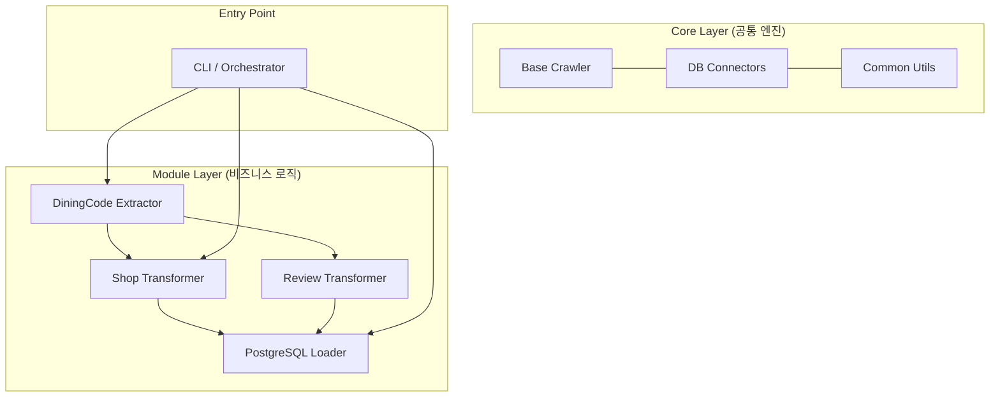

# [PLAN] 프로젝트 모듈화 및 구조 고도화 제안

이 문서는 `project-understanding` 프레임워크를 기반으로 현재 프로젝트 구조를 분석하고, 유지보수성과 확장성을 높이기 위한 모듈화 계획을 제안합니다.

---

## 1. 현황 분석 (Project Understanding)

### 현재 상태 (Current State)
*   **구조**: `meal_detail`, `meal_review` 하위에 `raw`, `clean`, `save`가 반복되는 수직적 구조.
*   **코드 중복**: Playwright 설정, 헤더 관리, anti-bot 대응, 파일 저장 로직 등이 각 스크립트에 산재해 있음.
*   **의존성**: 모든 파일 상단에 `sys.path.append`를 사용한 비표준적 임포트 방식 채택 중.
*   **오케스트레이션**: `run_batch_pipeline.py`가 모든 단계를 하드코딩된 순서와 인자로 실행.

### 운영 맥락 (Operating Context)
*   **Tooling**: Python 3.12, Playwright, Pandas, Psycopg2.
*   **Data Flow**: Crawler(Raw) -> CSV(Hive Style) -> Preprocess(Clean) -> DB(Save).

---

## 2. 모듈화 제안 구조 (Proposed Architecture)

기능별로 계층을 분리하여 **"엔진(Core) - 추출(Extractor) - 변환(Transformer) - 적재(Loader)"** 구조로 개편합니다.



---

## 3. 새로운 폴더 구조 (Visual Directory Map)

제안하는 새로운 프로젝트 레이아웃입니다.

```text
SK-Connect/
└── etl/
    └── meal/
        ├── run.py                 # (New) 통합 실행 엔트리포인트 (CLI)
        ├── config/                # 설정 관리 (env, yaml)
        ├── src/                   # 소스 코드 루트 (패키지화)
        │   ├── __init__.py
        │   ├── core/              # 공통 기반 클래스 및 유틸
        │   │   ├── __init__.py
        │   │   ├── base_crawler.py  # Playwright 브라우저 관리, Anti-bot
        │   │   ├── db_client.py     # Postgres 커넥션 관리
        │   │   └── file_manager.py  # Hive 경로 및 로그 관리 (기존 common_utils)
        │   ├── extractors/        # 수집 로직 (Raw)
        │   │   ├── __init__.py
        │   │   ├── diningcode_links.py
        │   │   └── diningcode_details.py
        │   ├── transformers/      # 데이터 정제 및 변환 (Clean)
        │   │   ├── __init__.py
        │   │   ├── shop_processor.py
        │   │   └── review_processor.py
        │   └── loaders/           # 데이터 저장 로직 (Save)
        │       ├── __init__.py
        │       ├── shop_loader.py
        │       └── review_loader.py
        ├── doc/                   # 문서 (ERROR.MD, PLAN.MD)
        ├── logs/                  # 실행 로그
        └── tests/                 # 단위/통합 테스트
```

---

## 4. 모듈화 기대 효과 (Expected Benefits)

1.  **Anti-bot 대응의 일원화**: `base_crawler.py`만 수정해도 모든 수집기의 차단 회피 로직이 최신화됩니다.
2.  **데이터 무결성 강화**: `transformers` 레이어에서 중앙 집중식 유효성 검사 루틴을 수행합니다.
3.  **표준 패키지 구조**: `sys.path.append`가 제거되어 IDE 지원 및 라이브러리 활용이 용이해집니다.
4.  **확장성**: 새로운 수집 대상(예: 네이버 지도) 추가 시 `extractors` 폴더에 새 모듈만 추가하면 됩니다.

---

## 5. 실행 로드맵 (Roadmap)

### 단계 1: Core 인프라 구축
- `src/core` 하위에 브라우저 관리 및 DB 클라이언트 모듈화.
- 기존 `common_utils.py`를 `core/file_manager.py` 등에 분산 배치.

### 단계 2: 수집기(Extractor) 개편
- `collect_links.py`, `collect_details.py`를 `src/extractors`로 이동 및 `BaseCrawler` 상속 구조로 리팩토링.

### 단계 3: 변환 및 적재 로직 통합
- 산재된 `preprocess.py`와 `upload_to_db.py` 로직을 `transformers`와 `loaders`로 정리.

### 단계 4: 통합 오케스트레이터 구현
- 인자값 기반으로 단계별 실행을 제어하는 `run.py` (또는 CLI) 개발.

---
> [!IMPORTANT]
> 이 구조로 변경하기 위해서는 기존 파일들을 대대적으로 이동하고 임포트 경로를 수정해야 합니다. 
> 우선 **상세 정보 수집(Shop Detail)** 파트부터 시범적으로 모듈화를 진행해 볼까요?