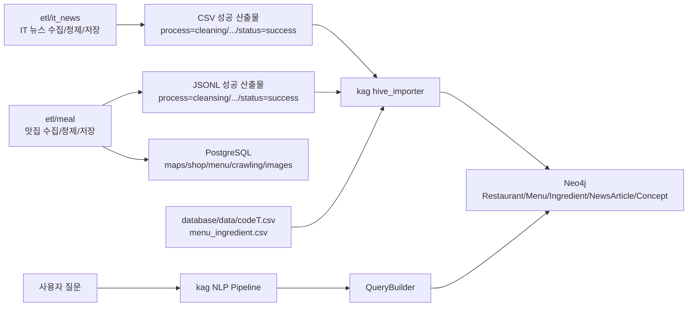
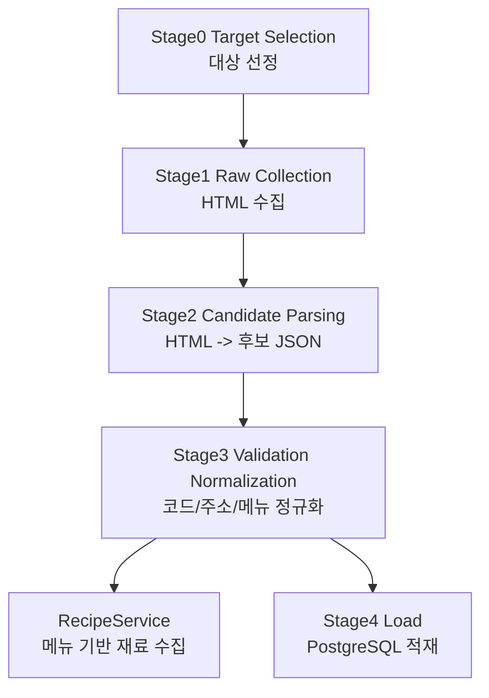
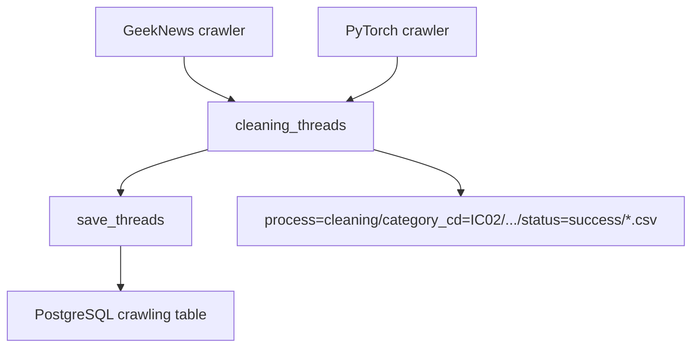
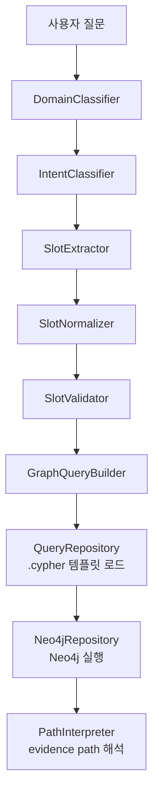

# KAG와 ETL 흐름 및 파일 구조 정리

작성 기준: `C:\dev\Project\SK-Connect` 현재 코드 구조

## 1. 전체 연결 구조

이 프로젝트에서 `etl`은 데이터를 수집, 정제, 저장하는 계층이고, `kag`는 그 결과물을 Neo4j 그래프 DB로 가져와 검색과 질의에 사용하는 계층이다.

두 영역은 직접 함수 호출로 강하게 묶여 있지 않고, 주로 파일 산출물과 DB를 통해 연결된다.



## 2. `etl`의 역할

`etl`은 현재 크게 두 개의 파이프라인으로 나뉜다.

- `etl/meal`: 맛집 데이터 수집, 정제, 레시피/재료 수집, PostgreSQL 적재
- `etl/it_news`: IT 뉴스 수집, 정제, PostgreSQL 적재

## 3. `etl/meal` 구조와 흐름

`etl/meal`은 맛집 데이터 파이프라인이다. 구조가 가장 체계적으로 정리되어 있으며, 전체 흐름은 `crawl -> process -> recipe -> save`이다.

주요 진입점은 다음 파일이다.

```text
etl/meal/local_pipeline_runner.py
```

이 파일에서 순서대로 다음 서비스를 호출한다.

1. `CrawlService.run_crawl`
2. `ProcessService.run_process`
3. `RecipeService.run_recipe`
4. `SaveService.run_save`

### 3.1 주요 폴더 책임

| 폴더 | 역할 |
|---|---|
| `etl/meal/src/projects/crawl` | 수집 대상 선정, 원본 HTML 수집 |
| `etl/meal/src/projects/process` | HTML 파싱, 검증, 정규화 |
| `etl/meal/src/projects/recipe` | 정규화된 메뉴 기반 레시피/재료 수집 |
| `etl/meal/src/projects/save` | 정규화 데이터를 PostgreSQL에 적재 |
| `etl/meal/src/projects/failcheck` | 실패 데이터 분류 및 후속 조치 |
| `etl/meal/src/core` | 설정, 저장 경로, DB 접근, 정책, 모델, 공통 유틸 |
| `etl/meal/src/collectors` | 플랫폼별 수집기 |
| `etl/meal/src/services/parsers` | 플랫폼별 HTML 파서 |
| `etl/meal/tests` | 경로, 메뉴 정규화, 레시피 정책 테스트 |

### 3.2 단계별 흐름



### 3.3 단계별 파일

| 단계 | 파일 | 역할 |
|---|---|---|
| Stage0 | `etl/meal/src/projects/crawl/stage0_target_selection.py` | 수집 대상 선정 |
| Stage1 | `etl/meal/src/projects/crawl/stage1_raw_collection.py` | HTML 원본 수집 |
| Stage2 | `etl/meal/src/projects/process/stage2_candidate_parsing.py` | HTML을 후보 JSON 구조로 파싱 |
| Stage3 | `etl/meal/src/projects/process/stage3_validation_normalization.py` | 주소 코드, 메뉴명, 중복 키, 해시 정규화 |
| Recipe | `etl/meal/src/projects/recipe/recipe_service.py` | 메뉴 기반 레시피/재료 수집 |
| Stage4 | `etl/meal/src/projects/save/stage4_load.py` | PostgreSQL 적재 |

### 3.4 저장 경로 규칙

`etl/meal`의 중간 산출물은 `HivePathBuilder`가 만드는 Hive 스타일 경로에 저장된다.

관련 파일:

```text
etl/meal/src/core/storage/path_builder.py
etl/meal/src/core/storage/jsonl_writer.py
```

중요한 경로 정규화 규칙은 다음과 같다.

| 내부 process 이름 | 실제 저장 폴더 |
|---|---|
| `candidate` | `process=cleansing` |
| `normalized` | `process=cleansing` |
| `load` | `process=save` |
| `retry` | `process=failcheck` |
| `reprocess` | `process=failcheck` |
| `dropped` | `process=failcheck` |
| `warning` | `process=failcheck` |

예상 경로 형태는 다음과 같다.

```text
etl/meal/_temp_lake/
  process=raw/
    category_cd=SC01/year=2026/month=05/day=12/status=success/
      raw_collection_{batch_id}_*.jsonl
      raw_collection_{batch_id}_*.html

  process=cleansing/
    category_cd=SC01/year=2026/month=05/day=12/status=success/
      candidate_parsing_{batch_id}_*.jsonl
      validation_normalization_{batch_id}_*.jsonl

  process=recipe/
    category_cd=SC01/year=2026/month=05/day=12/status=success/
      recipe_collection_*.jsonl

  process=save/
    category_cd=SC01/year=2026/month=05/day=12/save=shop/status=success/
      load_{batch_id}_*.jsonl
```

## 4. `etl/it_news` 구조와 흐름

`etl/it_news`는 IT 뉴스 파이프라인이다. `etl/meal`보다 단순하며 CSV 중심으로 동작한다.

주요 진입점은 다음 파일이다.

```text
etl/it_news/pipeline.py
```

전체 흐름은 다음과 같다.



### 4.1 주요 폴더 책임

| 폴더 | 역할 |
|---|---|
| `etl/it_news/crawling` | GeekNews, PyTorch 뉴스 수집 |
| `etl/it_news/cleaning` | 수집 CSV 정제 |
| `etl/it_news/save` | 정제 결과 DB 저장 |
| `etl/it_news/common` | 경로, 상수, 전처리, DB 공통 코드 |
| `etl/it_news/process=raw` | 원본 수집 산출물 |
| `etl/it_news/process=cleaning` | 정제 성공/실패 산출물 |
| `etl/it_news/process=save` | 저장 성공/실패 산출물 |

## 5. `kag`의 역할

`kag`는 KAG, 즉 그래프 기반 검색 계층이다. 여기서는 LLM이 Cypher를 직접 만들지 않고, 정해진 템플릿과 슬롯을 통해 Neo4j 질의를 만든다.

주요 목표는 다음과 같다.

- 맛집과 IT 뉴스 데이터를 Neo4j 그래프로 구성
- 사용자 질문을 도메인, 의도, 슬롯으로 분석
- 분석 결과에 맞는 Cypher 템플릿 선택
- Neo4j에서 evidence path를 포함한 결과 조회

### 5.1 주요 폴더 책임

| 폴더 | 역할 |
|---|---|
| `kag/src/kag_graph` | KAG 핵심 Python 패키지 |
| `kag/queries/schema` | Neo4j 제약조건, full-text index |
| `kag/queries/seed` | 샘플 그래프 데이터 |
| `kag/queries/restaurant` | 맛집 질의 템플릿 |
| `kag/queries/news` | 뉴스 질의 템플릿 |
| `kag/queries/common` | 공통 Concept bridge 질의 |
| `kag/scripts` | Neo4j 로드, 검증, ETL import 스크립트 |
| `kag/tests` | 분류기, 슬롯, 질의 빌더, Neo4j import 테스트 |

### 5.2 사용자 질문 처리 흐름



### 5.3 핵심 파일

| 파일 | 역할 |
|---|---|
| `kag/src/kag_graph/nlp_pipeline.py` | 도메인/의도/슬롯/정규화/검증 통합 |
| `kag/src/kag_graph/domain_classifier.py` | 맛집/IT뉴스/혼합 도메인 분류 |
| `kag/src/kag_graph/intent_classifier.py` | 도메인별 intent 분류 |
| `kag/src/kag_graph/slot_extractor.py` | 질문에서 Menu, Ingredient, Technology, Event 등 추출 |
| `kag/src/kag_graph/slot_normalizer.py` | 슬롯 값을 그래프 검색 가능한 정규화 값으로 변환 |
| `kag/src/kag_graph/query_builder.py` | intent/slot 기반 Cypher 템플릿 선택 및 파라미터 생성 |
| `kag/src/kag_graph/query_repository.py` | `.cypher` 파일 로드 |
| `kag/src/kag_graph/neo4j_repository.py` | Neo4j 실행 결과를 DTO로 변환 |
| `kag/src/kag_graph/hive_importer.py` | `etl` 산출물을 Neo4j 적재 statement로 변환 |

## 6. `etl`과 `kag`의 실제 연결 지점

가장 중요한 연결 파일은 다음 두 개다.

```text
kag/scripts/import_hive_neo4j.py
kag/src/kag_graph/hive_importer.py
```

`import_hive_neo4j.py`의 기본 입력 경로는 다음과 같다.

```text
meal_root    = C:\dev\Project\SK-Connect\etl\meal\_temp_lake
it_news_root = C:\dev\Project\SK-Connect\etl\it_news
```

`hive_importer.py`가 읽는 성공 산출물은 다음과 같다.

```text
IT 뉴스:
etl/it_news/process=cleaning/category_cd=IC02/year=*/month=*/day=*/status=success/*.csv

맛집 현재 구조:
etl/meal/_temp_lake/process=cleansing/category_cd=*/year=*/month=*/day=*/status=success/validation_normalization_*.jsonl

맛집 레시피:
etl/meal/_temp_lake/process=recipe/category_cd=*/year=*/month=*/day=*/status=success/recipe_collection_*.jsonl
```

## 7. Neo4j 그래프 변환 방식

`hive_importer.py`는 ETL 산출물을 읽어 Neo4j에 넣을 `GraphWriteStatement` 목록으로 변환한다.

| ETL 입력 | Neo4j 변환 |
|---|---|
| 맛집 정규화 JSONL `store` | `Restaurant` |
| 맛집 `menus` | `Menu`, `Restaurant -[:SELLS]-> Menu` |
| 레시피/CSV 재료 | `Ingredient`, `Menu -[:CONTAINS]-> Ingredient` |
| 리뷰 키워드 | `Tag`, `Restaurant -[:HAS_TAG]-> Tag` |
| 주소 코드 | `Area`, `Restaurant -[:LOCATED_IN]-> Area` |
| IT 뉴스 CSV | `NewsArticle` |
| 뉴스 분류 결과 | `Technology`, `Company`, `Event`, `Topic` 관계 |

보조 데이터는 다음 파일에서 가져온다.

```text
database/data/codeT.csv
database/data/menu_ingredient.csv
```

`codeT.csv`는 `address_cd`를 지역명으로 변환하는 데 사용된다.

`menu_ingredient.csv`는 레시피 수집 결과가 없을 때 메뉴와 재료를 연결하는 fallback 데이터로 사용된다.

## 8. DB 관점

이 프로젝트는 DB가 두 개 축으로 나뉜다.

### 8.1 PostgreSQL

PostgreSQL은 `etl`의 운영 저장소다.

`etl/meal`의 Stage4가 다음 계열 테이블에 데이터를 저장한다.

- `maps`
- `shop`
- `menu`
- `images`
- `crawling`

`etl/it_news`도 `crawling` 테이블에 뉴스성 데이터를 저장한다.

### 8.2 Neo4j

Neo4j는 `kag`의 검색 그래프 저장소다.

현재 코드 기준으로는 PostgreSQL에서 직접 읽기보다는, `etl`의 성공 산출물 CSV/JSONL을 읽어서 그래프 statement를 만들고 Neo4j에 적재한다.

정리하면 다음과 같다.

```text
etl 수집/정제 결과 파일
  -> kag hive_importer
  -> Neo4j graph
  -> kag query pipeline
```

PostgreSQL은 서비스 운영 데이터 저장소이고, Neo4j는 질의, 추천, 근거 path 검색용 그래프 저장소다.

## 9. 실행 흐름 관점 요약

### 9.1 맛집 데이터가 KAG에 들어가는 흐름

```text
1. etl/meal/local_pipeline_runner.py 실행
2. CrawlService가 수집 대상 선정 및 HTML 수집
3. ProcessService가 HTML을 파싱하고 정규화
4. RecipeService가 메뉴 기반 재료 데이터 수집
5. SaveService가 PostgreSQL에 적재
6. etl/meal/_temp_lake 아래 성공 JSONL 산출
7. kag/scripts/import_hive_neo4j.py --mode current-hive 실행
8. kag hive_importer가 JSONL을 GraphWriteStatement로 변환
9. Neo4j에 Restaurant, Menu, Ingredient, Tag, Area 관계 생성
10. KAG 질의 파이프라인에서 Neo4j 검색
```

### 9.2 IT 뉴스 데이터가 KAG에 들어가는 흐름

```text
1. etl/it_news/pipeline.py 실행
2. GeekNews, PyTorch crawler가 뉴스 수집
3. cleaning_threads가 CSV 정제
4. save_threads가 PostgreSQL에 저장
5. etl/it_news/process=cleaning 아래 성공 CSV 산출
6. kag/scripts/import_hive_neo4j.py 실행
7. kag hive_importer가 CSV를 GraphWriteStatement로 변환
8. Neo4j에 NewsArticle, Technology, Company, Event, Topic 관계 생성
9. KAG 질의 파이프라인에서 Neo4j 검색
```

## 10. 현재 구조에서 주의할 점

`etl/meal`과 `kag`는 자동으로 이어지는 하나의 파이프라인이 아니다. `etl/meal` 실행 후 `kag/scripts/import_hive_neo4j.py --mode current-hive` 같은 별도 import 단계가 필요하다.

`etl/it_news`는 CSV 기반이고, `etl/meal`은 JSONL/Hive path 기반이라 산출물 포맷이 다르다. `kag/hive_importer.py`가 이 차이를 흡수한다.

문서 일부는 인코딩이 깨져 보이지만, 코드와 테스트 기준으로는 의도가 비교적 명확하다. 특히 `etl/meal`은 `projects -> core -> collectors/parsers` 책임 분리가 되어 있고, `kag`는 `NLP -> QueryBuilder -> Neo4jRepository` 흐름으로 분리되어 있다.

## 11. 핵심 파일 빠른 참조

### ETL Meal

```text
etl/meal/local_pipeline_runner.py
etl/meal/src/projects/crawl/crawl_service.py
etl/meal/src/projects/process/process_service.py
etl/meal/src/projects/recipe/recipe_service.py
etl/meal/src/projects/save/save_service.py
etl/meal/src/core/storage/path_builder.py
etl/meal/src/core/storage/jsonl_writer.py
etl/meal/src/core/registry.py
```

### ETL IT News

```text
etl/it_news/pipeline.py
etl/it_news/crawling/crawling_thread_geeknews.py
etl/it_news/crawling/crawling_thread_pytorch.py
etl/it_news/cleaning/cleaning.py
etl/it_news/save/save.py
etl/it_news/common/utils.py
etl/it_news/common/constant.py
```

### KAG

```text
kag/scripts/import_hive_neo4j.py
kag/scripts/load_neo4j.py
kag/scripts/verify_neo4j.py
kag/src/kag_graph/hive_importer.py
kag/src/kag_graph/nlp_pipeline.py
kag/src/kag_graph/query_builder.py
kag/src/kag_graph/query_repository.py
kag/src/kag_graph/neo4j_repository.py
kag/queries/
```
