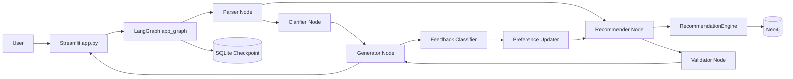
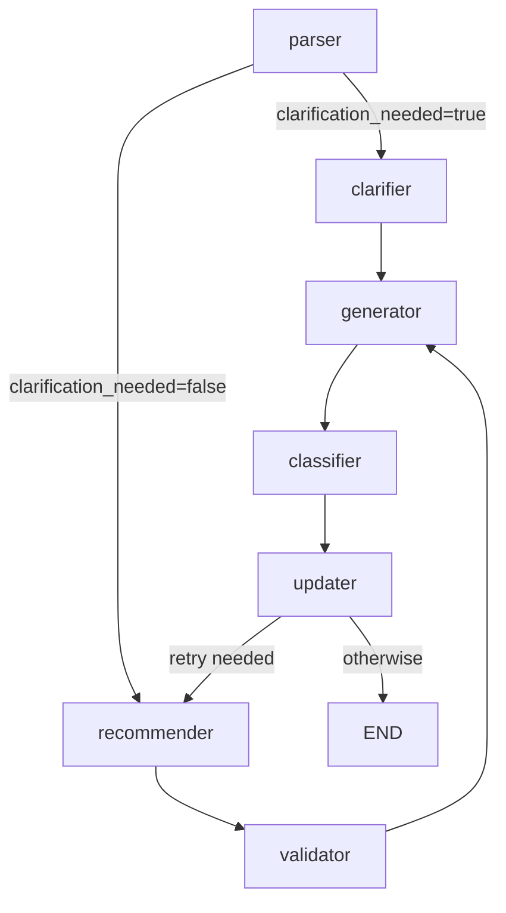

# Design.md

## 1. 프로젝트 개요

이 프로젝트는 사용자의 자연어 요청을 분석해 맛집을 추천하는 대화형 챗봇입니다. Streamlit UI에서 입력을 받고, LangGraph 기반 에이전트 파이프라인이 의도 파싱, 추천 검색, 검증, 응답 생성을 순차적으로 수행합니다. 식당 데이터는 Neo4j 그래프 DB에 저장되며, Ollama 로컬 LLM은 의도 추출과 자연어 응답 생성에 사용됩니다.

핵심 목표는 단순 키워드 검색이 아니라 다음 요구를 함께 만족하는 추천입니다.

- 지역, 음식 카테고리, 메뉴, 분위기, 운영 조건을 분리해서 해석한다.
- 절대 제외 조건과 필수 조건을 추천 결과에 강하게 반영한다.
- 결과가 부족하면 온톨로지 기반 확장과 소프트 완화를 단계적으로 적용한다.
- 사용자가 본 식당을 세션 단위로 기억해 중복 추천을 줄인다.
- 좋아요/싫어요, 재추천, 완화 요청을 후속 상태에 반영할 수 있는 구조를 둔다.

## 2. 기술 스택

| 영역 | 기술 | 주요 파일 |
| --- | --- | --- |
| UI | Streamlit | `app.py` |
| 에이전트 워크플로우 | LangGraph, LangGraph SQLite Checkpoint | `core/graph.py`, `database/memory.py` |
| LLM | Ollama, LangChain Ollama | `core/llm.py` |
| 그래프 DB | Neo4j 5.23, APOC, Graph Data Science | `docker-compose.yml`, `database/neo4j_client.py` |
| 데이터 적재 | pandas, KoNLPy Okt, tqdm, Ollama | `ingestion/ingest_v2.py` |
| 도메인 지식 | 온톨로지, 정책, 룰 엔진 | `knowledge/*` |
| 추천 로직 | Cypher Query Builder, Python 후처리 | `recommendation/*` |
| 테스트 | pytest | `tests/*` |

## 3. 상위 아키텍처



아키텍처는 크게 네 계층으로 나뉩니다.

| 계층 | 책임 |
| --- | --- |
| Presentation | Streamlit 채팅 UI, 추천 상세 표시, 세션 ID와 viewed_ids 관리 |
| Workflow | LangGraph StateGraph 노드 연결, 체크포인팅, 피드백 루프 |
| Domain/Recommendation | 의도 파싱, 온톨로지 매핑, 워터폴 검색, 검증, 스코어링 |
| Persistence | Neo4j 식당 그래프, SQLite 대화 상태 체크포인트, 로그 파일 |

## 4. 실행 진입점과 런타임 흐름

### 4.1 Streamlit 앱 진입점

`app.py`가 사용자-facing 진입점입니다.

1. `st.session_state.session_id`에 UUID를 생성한다.
2. `messages`와 `viewed_ids`를 세션 상태에 저장한다.
3. 사용자 입력을 받으면 LangGraph 초기 상태를 만든다.
4. `app_graph.invoke(initial_state, config={"configurable": {"thread_id": session_id}})`를 호출한다.
5. 반환된 `explanation`을 채팅 메시지로 보여준다.
6. `recommendations`가 있으면 expander 안에 식당명, 평점, 좋아요/싫어요 버튼을 표시한다.

### 4.2 LangGraph 그래프 흐름

`core/graph.py`는 전체 워크플로우를 정의합니다.



노드별 책임은 다음과 같습니다.

| 노드 | 파일 | 책임 |
| --- | --- | --- |
| parser | `core/nodes/parser.py` | 사용자 발화를 구조화된 검색 조건으로 변환 |
| clarifier | `core/nodes/clarifier.py` | 모호한 요청에 대한 재질의 옵션 생성 |
| recommender | `core/nodes/recommender.py` | Neo4j 기반 워터폴 추천 검색 |
| validator | `core/nodes/validator.py` | HARD_NEGATIVE, ABSOLUTE 제약 사후 검증 |
| generator | `core/nodes/generator.py` | 재질의 또는 추천 응답 텍스트 생성 |
| classifier | `core/nodes/feedback.py` | 사용자 피드백 유형 분류 |
| updater | `core/nodes/feedback.py` | 피드백에 따라 검색 상태 업데이트 |

## 5. 상태 모델

공유 상태는 `core/state.py`의 `AgentState`입니다. 모든 노드는 이 TypedDict를 기준으로 상태를 읽고 부분 업데이트를 반환합니다. LangGraph는 반환된 딕셔너리를 현재 상태에 병합합니다.

### 5.1 핵심 상태 영역

| 영역 | 주요 필드 | 설명 |
| --- | --- | --- |
| 세션/입력 | `session_id`, `user_input`, `chat_history` | 사용자 세션, 현재 발화, 누적 대화 이력 |
| 검색 축 | `area`, `category`, `restaurant_name` | 지역, 음식 대분류, 특정 식당명 |
| 제약/선호 | `hard_filters`, `soft_preferences`, `ranking_signals` | 필수 필터, 분위기/상황 선호, 랭킹 부스트 |
| 온톨로지 | `positive_keywords`, `keyword_strengths`, `inferred_categories` | 키워드와 강도, 광의 의도 후보 |
| 제외 조건 | `excluded_categories`, `excluded_names`, `negative_keywords` | 사용자가 명시한 제외 조건 |
| 운영 모드 | `search_mode`, `ui_mode`, `relaxation_depth` | 검색/재질의/완화 상태 |
| 재질의 | `clarification_needed`, `clarification_options` | 추가 질문 필요 여부와 선택지 |
| 추천 결과 | `recommendations`, `validation_report`, `explanation` | 최종 후보와 사용자 응답 |
| 피드백 | `viewed_ids`, `feedback_type`, `target_id` | 중복 방지와 사용자 반응 |

### 5.2 상태 병합 방식

`chat_history`는 `Annotated[List[dict], operator.add]`로 정의되어 노드가 반환한 메시지가 기존 이력에 누적됩니다. 이 설계는 파서와 생성기가 각각 사용자/어시스턴트 메시지를 추가하기 쉽게 만듭니다.

## 6. 의도 파싱 설계

`core/nodes/parser.py`는 LLM 기반 추출과 규칙 기반 감사를 결합합니다.

### 6.1 파싱 단계

1. `RULE.MD`에서 parser용 행동 규칙을 로드한다.
2. `llm_extra`를 사용해 `area`, `category`, `keywords`, `meta` JSON을 추출한다.
3. `sanitize_val`로 placeholder 값을 제거한다.
4. `validate_area_slot`으로 지역 슬롯을 검증하고, 음식/상황 키워드가 area로 잘못 들어오면 keyword로 재분류한다.
5. `_classify_keywords`로 키워드를 `HARD_FILTER`, `SOFT_PREFERENCE`, `RANKING_SIGNAL`, 제외 조건 등으로 나눈다.
6. `_classify_msc`로 Strong, Structural, Weak 신호를 분류한다.
7. Strong 축이 있으면 SEARCH, 없으면 CLARIFICATION으로 라우팅한다.

### 6.2 MSC 분류

| 계층 | 예시 | 의미 |
| --- | --- | --- |
| Strong | 지역, 카테고리, 메뉴, 브랜드 | 검색을 실행할 수 있는 주축 |
| Structural | 주차, 발렛, 비건 등 | 운영/식이 제약 |
| Weak | 데이트, 분위기, 맛집, 유명한 | 점수나 설명에 반영되는 보조 신호 |

이 구조는 “맛집 추천해줘”처럼 너무 넓은 요청을 바로 검색하지 않고 재질의할 수 있게 합니다.

## 7. 도메인 지식과 룰 엔진

`knowledge` 패키지는 LLM 출력의 불안정성을 보완하는 결정론적 지식 계층입니다.

| 파일 | 책임 |
| --- | --- |
| `ontology.py` | 메뉴/음식 키워드 매핑, 광의 의도, 하위어, 유의어, 지명 검증 |
| `priority.py` | HARD_NEGATIVE, ABSOLUTE, STRONG, INFERRED, PREFERENCE 우선순위 |
| `policy.py` | 현재 UI 모드와 완화 깊이에 따른 STRICT/LENIENT 모드 선택 |
| `rules.py` | `RULE.MD`를 섹션별로 로드해 노드별 프롬프트에 삽입 |

### 7.1 온톨로지 예시

| 입력 | 내부 처리 |
| --- | --- |
| `파스타` | `양식`으로 매핑 |
| `라멘` | `일식`으로 매핑 |
| `면요리` | `면`으로 정규화 후 광의 의도 처리 |
| `면` | 한식, 일식, 양식, 아시아음식, 중식 후보로 확장 |
| `강남역` | `역` 제거 후 `강남구`로 보정 |

## 8. 추천 검색 설계

추천 검색은 `core/nodes/recommender.py`와 `recommendation` 패키지가 담당합니다.

### 8.1 워터폴 전략

일반 추천은 3단계로 확장됩니다.

| 단계 | 설명 | 목적 |
| --- | --- | --- |
| Strict | 지역, 카테고리, 키워드를 최대한 엄격하게 적용 | 사용자의 명시 조건 우선 |
| Ontology Expansion | `HYPONYM_MAP`으로 상위어를 하위 메뉴로 확장 | “면” 같은 광의 의도 보완 |
| Soft Relaxation | 키워드를 제거하고 지역/평점 중심으로 재검색 | 결과 부족 시 빈 응답 방지 |

비건 요청은 별도 전략을 사용합니다.

| 단계 | 설명 |
| --- | --- |
| Vegan Strict | `비건전문` 카테고리 검색 |
| Vegan Expanded | `비건`, `채식` 유의어 기반 확장 |
| Vegan Options | `비건옵션` 힌트 추가 검색 |

### 8.2 Neo4j 쿼리 구성

`recommendation/queries.py`는 Cypher 문자열을 절 단위로 조립합니다.

1. `MATCH (r:Restaurant)`로 후보 식당을 찾는다.
2. viewed, excluded name/category/keyword를 WHERE에서 제외한다.
3. area/category/inferred category positive filter를 적용한다.
4. ABSOLUTE keyword는 ALL 조건으로 강제한다.
5. HAS_TAG 매칭으로 키워드/랭킹 시그널 부스트 후보를 수집한다.
6. 평점, 키워드 일치, 안정성, 시그널을 합산해 `quality_score`를 계산한다.
7. 후보를 카테고리 그룹과 점수 기준으로 정렬해 반환한다.

### 8.3 스코어링 공식

Cypher 레벨의 주요 점수 구성은 다음과 같습니다.

```text
quality_score =
    0.5 * normalized_rating
  + 0.3 * keyword_match_score
  + signal_boost
  + stability_boost
```

Python 후처리(`recommendation/scoring.py`)는 다음 순서로 적용됩니다.

1. 카테고리 다양성 패널티 적용
2. ID 기준 중복 제거
3. `final_score`, `cat_group`, `id` 기준 결정론적 정렬
4. limit 적용

## 9. 검증 설계

`core/nodes/validator.py`는 추천 결과가 사용자 제약을 어기지 않는지 사후 검증합니다.

| 검증 | 조건 | 실패 시 |
| --- | --- | --- |
| HARD_NEGATIVE | 제외 카테고리/식당명이 결과 이름 또는 카테고리에 포함됨 | 해당 후보 제거 |
| ABSOLUTE | 필수 키워드가 식당명/카테고리에 없음 | 해당 후보 제거 |

모든 결과가 ABSOLUTE 위반으로 탈락하면 `ui_mode`를 `RELAXATION_PROPOSAL`로 전환하는 설계가 들어 있습니다. 이는 사용자의 양보 불가능 조건을 시스템이 임의로 완화하지 않기 위한 장치입니다.

## 10. 응답 생성 설계

`core/nodes/generator.py`는 두 가지 모드로 동작합니다.

| 모드 | 처리 방식 |
| --- | --- |
| CLARIFICATION | LLM 없이 정적 템플릿으로 재질의 |
| SEARCH | `llm_chat`으로 추천 결과와 적용 필터를 설명 |

지역 정보 없이 전역 검색을 수행한 경우, 응답 앞에 지역 정보 부재에 대한 경고 문구를 붙입니다.

## 11. 피드백 루프 설계

`core/nodes/feedback.py`는 사용자 후속 반응을 처리하기 위한 노드입니다.

| 피드백 유형 | 상태 업데이트 |
| --- | --- |
| `RELAX_KEYWORD` | 키워드 조건 제거, 완화 깊이 증가 |
| `EXPAND_CATEGORY` | 카테고리 해제, 완화 깊이 증가 |
| `EXPAND_RADIUS` | 지역 조건 해제, 전역 검색 전환 |
| `START_OVER` | 주요 조건 초기화 |
| `RETRY` | 재추천 루프 진입 |
| `LIKE`, `DISLIKE` | 현재 구현에서는 분류만 가능하고 Neo4j 선호 저장과 직접 연결되지 않음 |

`RecommendationEngine.update_user_interaction`은 LIKE/DISLIKE를 Neo4j에 저장할 수 있는 메서드를 제공하지만, 현재 LangGraph 피드백 노드에서는 호출되지 않습니다. UI 버튼은 그래프를 다시 invoke하지만, entry point가 parser이기 때문에 실제 피드백 저장 동작은 설계 의도만큼 완결되어 있지 않습니다.

## 12. 데이터 모델

Neo4j 스키마는 `database/schema.cypher`와 ingestion 쿼리에서 확인할 수 있습니다.

### 12.1 노드

| 노드 | 주요 속성 | 설명 |
| --- | --- | --- |
| `Restaurant` | `id`, `name`, `rating`, `bayesian_rating`, `address`, `url`, `latitude`, `longitude` | 식당 엔티티 |
| `Area` | `name` | 주소에서 추출한 지역 |
| `Tag` | `name` | 카테고리, 메뉴, 분위기, 리뷰 특징 |
| `User` | `session_id` | 세션 기반 사용자 |

### 12.2 관계

| 관계 | 방향 | 설명 |
| --- | --- | --- |
| `LOCATED_IN` | Restaurant → Area | 식당 위치 |
| `BELONGS_TO` | Restaurant → Tag | 기본 카테고리 |
| `HAS_TAG` | Restaurant → Tag | 리뷰/LLM/정규화 기반 특징 태그 |
| `INTERACTED` | User → Restaurant/Tag | 좋아요 등 상호작용 |
| `DISLIKES` | User → Restaurant/Tag | 싫어요 또는 제외 선호 |

### 12.3 제약과 인덱스

`database/schema.cypher`는 다음을 정의합니다.

- `Restaurant.id` unique constraint
- `User.session_id` unique constraint
- `Tag.name` unique constraint
- `Area.name` unique constraint
- `Restaurant.name`, `Tag.name`, `Area.name` index

## 13. 데이터 적재 설계

`ingestion/ingest_v2.py`는 CSV 원본을 Neo4j로 적재합니다.

### 13.1 입력 데이터

| 파일 | 용도 |
| --- | --- |
| `data/shop_133312.csv` | 식당 기본 정보 |
| `data/review_133312.csv` | 리뷰 기반 태그 추출 |

### 13.2 적재 단계

1. CSV 인코딩을 `utf-8-sig`, `cp949`, `euc-kr` 순서로 감지한다.
2. 식당을 100개 단위 batch로 적재한다.
3. 주소를 split해 두 번째 토큰을 `Area`로 만든다.
4. `source_category`를 기본 `BELONGS_TO` 태그로 연결한다.
5. 리뷰 전체에서 KoNLPy Okt 명사를 추출해 Fast Tag를 만든다.
6. 최신/고평점 리뷰 샘플을 Ollama LLM에 보내 Deep Tag를 만든다.
7. 일부 태그는 `TAG_NORMALIZATION`으로 표준 태그를 추가 연결한다.

## 14. 설정과 실행

### 14.1 환경 설정

`config/settings.py`는 `.env`와 기본값을 통해 설정을 제공합니다.

| 설정 | 기본값 | 설명 |
| --- | --- | --- |
| `NEO4J_URI` | `bolt://localhost:7687` | Neo4j Bolt URI |
| `NEO4J_USER` | `neo4j` | Neo4j 사용자 |
| `NEO4J_PASSWORD` | `password` | Neo4j 비밀번호 |
| `OLLAMA_MODEL` | `gemma3:4b` | Ollama 모델 |
| `NUM_CTX` | `8192` | LLM 컨텍스트 크기 |
| `RULES_FILE` | `RULE.MD` | 행동 규칙 파일 |
| `LOG_DIR` | `logs` | 앱 로그 디렉터리 |
| `DB_DIR` | `database` | SQLite 체크포인트 디렉터리 |
| `JAVA_HOME` | 빈 값 | KoNLPy 실행용 |

### 14.2 Neo4j 실행

```bash
docker compose up -d
```

`docker-compose.yml`은 Neo4j 5.23.0을 띄우고 다음 포트를 노출합니다.

- Browser: `7474`
- Bolt: `7687`

### 14.3 데이터 적재

```bash
python -m ingestion.ingest_v2 --limit 10
python -m ingestion.ingest_v2 --all
```

### 14.4 앱 실행

```bash
streamlit run app.py
```

### 14.5 테스트

```bash
pytest
```

현재 테스트는 온톨로지, 파서 헬퍼, 스코어링 후처리 중심입니다. Neo4j, LangGraph 전체 실행, Streamlit UI, LLM 호출은 통합 테스트로 커버되어 있지 않습니다.

## 15. 로깅과 영속성

`utils/logger.py`는 모듈별 logger를 제공하고, 로그는 기본적으로 `logs/app.log`에 쌓입니다. Neo4j 드라이버 쿼리 실행 시 쿼리 앞부분과 파라미터를 기록하므로 운영 중 검색 흐름을 추적할 수 있습니다.

LangGraph 체크포인트는 `database/chat_history.db`에 저장되도록 설계되어 있습니다. `thread_id`는 Streamlit 세션 UUID와 동일하게 전달됩니다.

## 16. 테스트 현황

| 테스트 파일 | 검증 대상 |
| --- | --- |
| `tests/test_ontology.py` | 키워드 매핑, 광의 의도, 지명 검증, 인접 카테고리 |
| `tests/test_parser_helpers.py` | 지명 정규화, 슬롯 검증, 값 정제, 키워드 분류 |
| `tests/test_scoring.py` | 다양성 패널티, 중복 제거, 정렬, 후처리 파이프라인 |
| `tests/conftest.py` | 공용 sample state와 추천 후보 fixture |

## 17. 현재 구현상 주의점

아래 항목은 문서 작성 시점의 코드 기준으로 보이는 불일치 또는 리스크입니다.

1. `app.py`의 `initial_state`가 `AgentState`와 완전히 일치하지 않습니다.
   - `hard_constraints`는 존재하지만 `AgentState`에는 `hard_filters`가 정의되어 있습니다.
   - `chat_history`, `hard_filters`, `ranking_signals`, `positive_keywords`, `keyword_strengths`, `negative_keywords`, `meta_intent`, `ui_mode`, `search_mode`, `relaxation_depth`, `rejection_log` 등은 초기값에서 빠져 있습니다.
   - LangGraph 병합과 노드 기본값 덕분에 일부는 동작할 수 있지만, 상태 계약은 명확히 맞추는 편이 안전합니다.

2. `AgentState`와 실제 노드 반환 필드가 일부 어긋납니다.
   - parser/generator는 `payload`를 사용하지만 `AgentState`에는 `payload` 필드가 없습니다.
   - recommender는 내부에서 `keyword_intents`를 만들지만 상태에는 `keyword_intent`로 정의/참조되는 경로가 섞여 있습니다.
   - `dietary_constraints`는 recommender에서 읽지만 parser 반환에는 포함되지 않습니다.

3. validator의 ABSOLUTE 검증이 기대대로 작동하지 않을 가능성이 있습니다.
   - validator는 `state["keyword_intent"]`를 읽지만 parser/recommender 흐름에서는 해당 필드가 일관되게 채워지지 않습니다.
   - 결과적으로 ABSOLUTE 조건은 Neo4j 쿼리 단계에서는 반영될 수 있어도 사후 검증 단계에서는 누락될 수 있습니다.

4. generator는 `state["ui_mode"]`보다 `payload["ui_mode"]`를 우선 사용합니다.
   - validator가 `ui_mode="RELAXATION_PROPOSAL"`로 바꾸어도 `payload.ui_mode`가 SEARCH이면 완화 제안 응답으로 분기하지 않을 수 있습니다.

5. 피드백 저장 경로가 미완성입니다.
   - `RecommendationEngine.update_user_interaction`은 존재하지만 `feedback.py`에서 호출되지 않습니다.
   - Streamlit 좋아요/싫어요 버튼은 그래프를 재호출하지만, parser부터 다시 시작하므로 대상 식당에 대한 선호 저장이 보장되지 않습니다.

6. 대화 초기화 시 `viewed_ids`가 초기화되지 않습니다.
   - `app.py`의 “대화 초기화”는 `messages`와 `session_id`만 갱신합니다.
   - 같은 Streamlit 세션에서 이전 viewed_ids가 남아 새 대화의 추천 후보를 과도하게 제외할 수 있습니다.

7. 데이터 적재는 외부 런타임 의존성이 큽니다.
   - KoNLPy는 Java 환경이 필요합니다.
   - LLM 태그 추출은 Ollama 모델 실행 상태에 의존합니다.
   - Neo4j 연결 실패 시 클라이언트가 빈 결과를 반환하므로, 실패가 조용히 “추천 없음”처럼 보일 수 있습니다.

8. 일부 규칙 문서와 코드가 설계 의도만큼 연결되지 않았을 수 있습니다.
   - `RULE.MD`에는 고급 완화/가드레일 정책이 있으나, 모든 모드가 UI와 generator 응답으로 완전히 노출되지는 않습니다.

## 18. 개선 제안

우선순위가 높은 개선은 상태 계약 정리입니다.

1. `AgentState`와 `app.py` 초기 상태를 동기화한다.
2. `payload`, `keyword_intent`, `dietary_constraints` 필드를 하나의 명명 규칙으로 통일한다.
3. parser가 만든 keyword intent를 상태에 저장하고 validator가 동일 필드를 읽게 한다.
4. RELAXATION_PROPOSAL 모드에 대한 generator 분기를 구현한다.
5. LIKE/DISLIKE 버튼이 `RecommendationEngine.update_user_interaction`으로 연결되도록 피드백 노드를 보강한다.
6. 대화 초기화 시 `viewed_ids`도 함께 초기화한다.
7. Neo4j 미연결, Ollama 미실행, 데이터 미적재 상태를 UI에서 명시적으로 안내한다.
8. LangGraph end-to-end 테스트와 Neo4j 쿼리 빌더 테스트를 추가한다.

## 19. 설계 요약

이 프로젝트는 LLM 단독 추천기가 아니라, LLM을 의도 추출과 응답 생성에 제한적으로 사용하고 실제 추천 결정은 Neo4j, 온톨로지, 제약 검증, 스코어링 후처리로 통제하려는 구조입니다. 설계 방향은 좋습니다. 특히 `Parser → Recommender → Validator → Generator`의 책임 분리는 명확하고, 온톨로지와 워터폴 확장 전략도 맛집 추천 도메인에 잘 맞습니다.

다만 현재 구현은 상태 필드 명세와 실제 노드 간 계약이 몇 군데 어긋나 있습니다. 다음 개발 단계에서는 기능 추가보다 `AgentState` 계약 정리, 피드백 저장 완성, 완화 제안 모드 연결을 먼저 다지는 것이 가장 큰 안정성 개선으로 보입니다.
