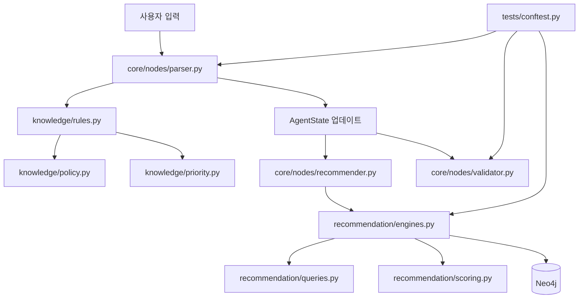

# File Roles And Decision Flow

이 문서는 현재 열어둔 핵심 파일들이 어떤 역할을 맡고, 각 파일의 로직이 어떤 기준으로 다음 동작을 선택하는지 정리한 문서입니다. 전체 관점에서는 `Parser -> Rule/Policy -> RecommendationEngine -> Validator/Generator` 흐름을 이해하기 위한 안내서입니다.

## 1. 전체 결정 흐름 요약



간단히 말하면, 사용자의 말은 먼저 parser에서 구조화됩니다. parser와 generator는 `knowledge/rules.py`를 통해 현재 운영 모드에 맞는 규칙을 가져옵니다. 추천 단계에서는 `recommendation/engines.py`가 Neo4j 쿼리와 후처리를 조율합니다. 테스트에서는 `tests/conftest.py`의 fixture가 이 흐름에 필요한 최소 상태와 추천 결과를 흉내 냅니다.

## 2. 파일별 역할 요약

| 파일 | 핵심 역할 | 직접 선택하는 것 | 주로 의존하는 것 |
| --- | --- | --- | --- |
| `tests/conftest.py` | pytest 공용 fixture 제공 | 테스트에 사용할 기본 `AgentState`, 추천 후보 샘플 | pytest |
| `recommendation/engines.py` | 추천 엔진 오케스트레이션 | 어떤 쿼리를 실행할지, 파라미터를 어떻게 정규화할지, 후처리를 적용할지 | `neo4j_client`, `queries.py`, `scoring.py` |
| `knowledge/rules.py` | RULE.MD 파싱 및 노드별 행동 규칙 조합 | GLOBAL/노드별/STRATEGY 규칙 조합, 운영 모드 라벨 | `PolicySelector`, `PriorityResolver`, `OntologyLayer` |
| `knowledge/priority.py` | 제약 강도 우선순위 숫자화 | 강도 문자열을 우선순위 숫자로 변환 | 없음 |
| `knowledge/policy.py` | 운영 정책 선택 | `STRICT` 또는 `LENIENT` 모드 | `ui_mode`, `relaxation_depth` |

## 3. `tests/conftest.py`

### 역할

`tests/conftest.py`는 테스트 전체에서 재사용할 공용 fixture를 정의합니다. 실제 LangGraph, Neo4j, LLM을 매번 실행하지 않고도 parser, validator, scoring 같은 순수 로직을 검증할 수 있도록 기본 상태와 추천 샘플을 제공합니다.

### 제공하는 fixture

| fixture | 내용 | 사용 목적 |
| --- | --- | --- |
| `sample_state` | 테스트용 최소 `AgentState` 딕셔너리 | 노드/헬퍼 함수가 기대하는 상태 구조를 제공 |
| `sample_recommendations` | 식당 3개짜리 추천 결과 리스트 | validator, generator, scoring 테스트에서 후보 데이터로 사용 |

### 결정으로 보는 역할

`sample_state`는 테스트의 기본 세계관을 선택합니다.

| 필드 | 기본값 | 이 기본값이 의미하는 결정 |
| --- | --- | --- |
| `user_input` | `"강남역 맛집 추천해줘"` | 기본 테스트 발화는 추천 의도다 |
| `search_mode` | `"FILTERED_SEARCH"` | 기본 검색은 필터 기반 검색이다 |
| `ui_mode` | `"SEARCH"` | 기본 UI 흐름은 재질의가 아니라 검색이다 |
| `limit` | `5` | 추천 결과 기본 개수는 5개다 |
| `meta_intent.intent_type` | `"recommend"` | 회상/비교가 아닌 추천 요청으로 본다 |
| `clarification_needed` | `False` | 기본 상태에서는 추가 질문 없이 검색 가능하다고 본다 |
| `relaxation_depth` | `0` | 아직 완화 검색을 적용하지 않았다 |

즉 이 파일은 프로덕션 결정을 내리지는 않지만, 테스트가 어떤 조건에서 코드를 검증할지 결정합니다.

## 4. `recommendation/engines.py`

### 역할

`RecommendationEngine`은 Neo4j 추천 검색의 중심 오케스트레이터입니다. 직접 Cypher 문자열을 길게 만들지는 않고, `recommendation/queries.py`에 쿼리 생성을 맡긴 뒤 Neo4j 실행과 Python 후처리를 연결합니다.

### 주요 메서드

| 메서드 | 역할 |
| --- | --- |
| `get_disliked_tags(session_id)` | 특정 세션 사용자가 싫어한 태그를 Neo4j에서 조회 |
| `_normalize_params(params)` | 쿼리 입력값에서 공백, placeholder, 중복을 제거 |
| `recommend_dual_constraint(...)` | 카테고리 필터와 키워드 랭킹을 결합한 핵심 추천 검색 |
| `recommend_level_3(...)` | 키워드 없이 지역/평점 기반 기본 추천 |
| `get_restaurants_by_ids(ids)` | 식당 ID 목록으로 식당 정보를 조회 |
| `update_user_interaction(...)` | LIKE/DISLIKE 상호작용을 Neo4j에 기록 |

### 결정 지점

#### 4.1 파라미터 정규화 결정

`_normalize_params`는 검색 전에 입력 파라미터를 정리합니다.

| 입력 상태 | 선택/변환 |
| --- | --- |
| 문자열이 `"none"`, `"null"`, `"..."`, 빈 값 | `None` 또는 제외 |
| 리스트에 중복 문자열이 있음 | 첫 값만 유지 |
| `{"value": ...}` 형태의 dict 리스트 | 내부 `value`를 strip하고 placeholder 제거 |

이 단계는 Neo4j 쿼리가 불필요한 값 때문에 오염되지 않도록 하는 방어막입니다.

#### 4.2 추천 쿼리 선택

| 호출 메서드 | 선택되는 검색 방식 |
| --- | --- |
| `recommend_dual_constraint` | `build_dual_constraint_query`로 동적 Cypher 생성 |
| `recommend_level_3` | 미리 정의된 `LEVEL3_QUERY` 사용 |
| `get_restaurants_by_ids` | 미리 정의된 `BY_IDS_QUERY` 사용 |

#### 4.3 ABSOLUTE 키워드 선택

`recommend_dual_constraint`는 `keyword_intents`에서 다음 조건을 만족하는 항목만 필수 키워드로 뽑습니다.

```python
kw.get("strength") == "ABSOLUTE"
```

이렇게 뽑힌 값은 Cypher의 `absolute_keywords`로 전달되어 식당명 또는 태그에 반드시 포함되어야 하는 조건으로 사용됩니다.

#### 4.4 후보 수 선택

최종 limit보다 더 많은 후보를 DB에서 가져옵니다.

```python
top_n_limit = limit * 3
```

그 이유는 DB에서 바로 `limit`개만 가져오면 다양성 패널티, 중복 제거, 정렬 후처리 과정에서 최종 결과가 부족해질 수 있기 때문입니다.

#### 4.5 후처리 선택

Neo4j 결과는 바로 반환되지 않고 항상 다음 후처리를 거칩니다.

```text
Neo4j candidates -> post_process_candidates(candidates, diversity_flag, limit)
```

여기서 `diversity_flag`가 켜져 있으면 카테고리 다양성 패널티가 적용됩니다.

#### 4.6 사용자 상호작용 저장 선택

`update_user_interaction`은 `interaction_type`에 따라 다른 관계를 저장합니다.

| interaction_type | Neo4j 관계 |
| --- | --- |
| `"Like"` | `(u:User)-[:INTERACTED {type: 'Like'}]->(target)` |
| 그 외 | `(u:User)-[:DISLIKES]->(target)` |

현재 코드 기준으로 이 메서드는 존재하지만, Streamlit 좋아요/싫어요 버튼과 피드백 노드에서 완전히 연결되어 있지는 않습니다.

## 5. `knowledge/rules.py`

### 역할

`rules.py`는 `RULE.MD`를 읽어 LLM 노드에 넣을 행동 규칙을 조합합니다. parser와 generator가 LLM을 호출할 때, 이 파일을 통해 현재 모드에 맞는 지침을 가져갑니다.

### 구성 요소

| 클래스 | 역할 |
| --- | --- |
| `RuleLoader` | `RULE.MD`를 읽고 섹션별 텍스트로 분리 |
| `RuleEngine` | 온톨로지, 우선순위, 정책 선택기를 묶고 노드별 규칙을 생성 |

### `RuleLoader`의 결정

#### 5.1 규칙 파일 존재 여부

| 조건 | 선택 |
| --- | --- |
| `RULE.MD`가 존재함 | 파일을 UTF-8로 읽고 섹션 파싱 |
| `RULE.MD`가 없음 | `GLOBAL: Default: Follow common sense.`로 fallback |

#### 5.2 섹션 추출 기준

정규식은 다음 형태의 Markdown 헤더를 찾습니다.

```text
Header: level 2, "1. [GLOBAL] ..."
Header: level 2, "2. [PARSER] ..."
Header: level 2, "3. [STRATEGY] ..."
```

대괄호 안의 키워드를 대문자로 바꿔 `_rules` 딕셔너리의 key로 저장합니다.

### `RuleEngine`의 결정

`get_node_rules(node_name, ui_mode, relaxation_depth)`는 세 종류의 규칙을 합칩니다.

| 순서 | 규칙 |
| --- | --- |
| 1 | `GLOBAL` 규칙 |
| 2 | `node_name.upper()`에 해당하는 노드별 규칙 |
| 3 | `STRATEGY` 규칙 |

그리고 맨 앞에 현재 운영 모드를 붙입니다.

```text
### [BEHAVIORAL RULES - STRICT MODE]
...
```

또는

```text
### [BEHAVIORAL RULES - LENIENT MODE]
...
```

이 운영 모드는 `PolicySelector.get_operational_mode(ui_mode, relaxation_depth)`가 결정합니다.

## 6. `knowledge/priority.py`

### 역할

`priority.py`는 사용자 제약 강도를 숫자 우선순위로 바꿉니다. 숫자가 낮을수록 더 강한 조건입니다.

### 우선순위 표

| 강도 | 숫자 | 의미 |
| --- | ---: | --- |
| `HARD_NEGATIVE` | 1 | 절대 제외. 예: “중식 빼고”, “여기 말고” |
| `ABSOLUTE` | 2 | 양보 불가능한 필수 조건 |
| `STRONG` | 3 | 강한 선호. 승인 또는 완화 상황에서 조정 가능 |
| `INFERRED` | 4 | 문맥에서 추론한 암묵 선호 |
| `PREFERENCE` | 5 | 일반 선호 |
| 알 수 없는 값 | 99 | 정의되지 않은 약한/무효 조건 |

### 결정 지점

`get_priority(strength)`는 입력 문자열을 대문자로 바꾼 뒤 `PRIORITY_MAP`에서 찾습니다.

| 입력 | 반환 |
| --- | --- |
| `"ABSOLUTE"` | `2` |
| `"preference"` | `5` |
| `"unknown"` | `99` |

이 파일 자체는 정렬이나 충돌 해결을 직접 수행하지 않습니다. 대신 다른 노드가 강도 비교를 해야 할 때 사용할 수 있는 기준표를 제공합니다.

## 7. `knowledge/policy.py`

### 역할

`policy.py`는 현재 시스템이 엄격 검색 모드인지, 완화 검색 모드인지 결정합니다.

### 결정 규칙

| 조건 | 선택되는 운영 모드 |
| --- | --- |
| `ui_mode == "RELAXATION_PROPOSAL"` | `LENIENT` |
| `relaxation_depth > 0` | `LENIENT` |
| 그 외 | `STRICT` |

### 의미

| 운영 모드 | 의미 |
| --- | --- |
| `STRICT` | 최초 검색 또는 일반 검색. 지역/카테고리/필수 조건을 엄격히 유지한다는 의미 |
| `LENIENT` | 결과 부족, 완화 제안, 재검색 상황. 조건 완화나 범위 확장을 허용한다는 의미 |

### 실제 연결

`policy.py`는 직접 검색을 바꾸지는 않습니다. 대신 `rules.py`에서 현재 모드 이름을 LLM 규칙 헤더에 넣습니다. 즉 정책 선택은 LLM이 parser/generator 단계에서 어떤 태도로 해석하고 설명해야 하는지에 영향을 줍니다.

## 8. 파일들이 함께 만드는 선택 흐름

### 8.1 parser에서 규칙을 선택하는 흐름

```text
input_parser_node
-> rule_engine.get_node_rules("parser")
-> RuleEngine.get_node_rules
-> PolicySelector.get_operational_mode(ui_mode="SEARCH", relaxation_depth=0)
-> STRICT 모드 규칙 조합
-> LLM 프롬프트에 삽입
```

기본 parser 호출에서는 `ui_mode`와 `relaxation_depth`를 따로 넘기지 않기 때문에 기본값인 `SEARCH`, `0`이 사용됩니다. 따라서 기본 parser 규칙은 `STRICT`로 조합됩니다.

### 8.2 추천에서 검색 방식을 선택하는 흐름

```text
waterfall_recommend_node
-> ui_mode 확인
-> CLARIFICATION이면 검색 우회
-> dietary_constraints에 "비건"이 있으면 비건 전략
-> 아니면 일반 워터폴 전략
-> RecommendationEngine.recommend_dual_constraint
-> Neo4j query
-> post_process_candidates
```

`recommendation/engines.py`는 이 흐름 중 Neo4j 쿼리 실행과 후처리를 담당합니다. “비건 전략인지 일반 전략인지”는 `core/nodes/recommender.py`가 고르고, 선택된 전략의 실제 검색 호출을 `RecommendationEngine`이 수행합니다.

### 8.3 제약 강도가 추천에 반영되는 흐름

```text
parser
-> keyword_strengths 생성
-> recommender
-> keyword_intents 생성
-> RecommendationEngine.recommend_dual_constraint
-> ABSOLUTE keyword 추출
-> build_dual_constraint_query
-> Neo4j WHERE 조건에 반영
```

주의할 점은 `priority.py`의 `PriorityResolver`가 현재 모든 경로에서 적극적으로 호출되는 것은 아니라는 점입니다. 코드에 우선순위 기준표는 존재하지만, 실제 검색 쿼리에서는 `keyword_intents`의 `strength == "ABSOLUTE"` 같은 직접 조건이 더 많이 쓰입니다.

### 8.4 테스트에서 결정 흐름을 고정하는 방식

```text
sample_state
-> ui_mode = SEARCH
-> search_mode = FILTERED_SEARCH
-> relaxation_depth = 0
-> clarification_needed = False
```

이 기본값 때문에 테스트는 대체로 “정상 추천 검색 가능한 기본 상태”를 기준으로 시작합니다. 재질의, 완화, 피드백 루프를 테스트하려면 fixture를 복사한 뒤 해당 필드를 바꿔야 합니다.

## 9. 결정 책임 분리

| 결정 질문 | 담당 파일 |
| --- | --- |
| 테스트는 어떤 기본 상태에서 시작할까? | `tests/conftest.py` |
| RULE.MD에서 어떤 섹션을 LLM에 줄까? | `knowledge/rules.py` |
| 지금 STRICT인가 LENIENT인가? | `knowledge/policy.py` |
| HARD_NEGATIVE와 PREFERENCE 중 무엇이 더 강한가? | `knowledge/priority.py` |
| 추천 파라미터를 어떻게 정제할까? | `recommendation/engines.py` |
| dual constraint 쿼리와 level3 쿼리 중 무엇을 실행할까? | `recommendation/engines.py`를 호출하는 상위 recommender |
| DB 후보를 최종 몇 개로 줄일까? | `recommendation/engines.py` + `recommendation/scoring.py` |
| LIKE/DISLIKE를 어떤 관계로 저장할까? | `recommendation/engines.py` |

## 10. 현재 코드 기준 주의점

1. `PriorityResolver`는 중요한 기준표지만, 현재 검색 경로에서 광범위하게 사용되지는 않습니다.
2. `PolicySelector`가 고른 STRICT/LENIENT는 실제 Cypher 조건을 직접 바꾸기보다는 LLM 규칙 문구에 반영됩니다.
3. `RecommendationEngine.update_user_interaction`은 존재하지만, 현재 UI와 피드백 노드에서 완전히 연결되어 있지 않습니다.
4. `tests/conftest.py`의 `sample_state`는 실제 `AgentState`와 유사하지만, 프로덕션 초기 상태와 완전히 동일한 계약이라고 보기는 어렵습니다.
5. validator는 `keyword_intent`를 읽지만, recommender 쪽은 `keyword_intents`를 지역 변수로 구성합니다. 필드 이름이 섞여 있어 ABSOLUTE 사후 검증 경로는 점검이 필요합니다.

## 11. 한 줄 요약

`rules.py`는 LLM이 따를 규칙을 고르고, `policy.py`는 그 규칙의 운영 모드를 고르며, `priority.py`는 제약 강도의 기준표를 제공합니다. `engines.py`는 정리된 검색 조건을 Neo4j 쿼리와 후처리로 연결하고, `conftest.py`는 이 흐름을 테스트할 수 있는 기본 상태를 고정합니다.
