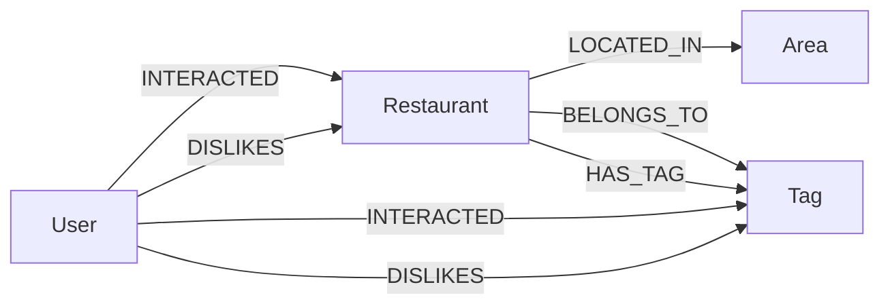
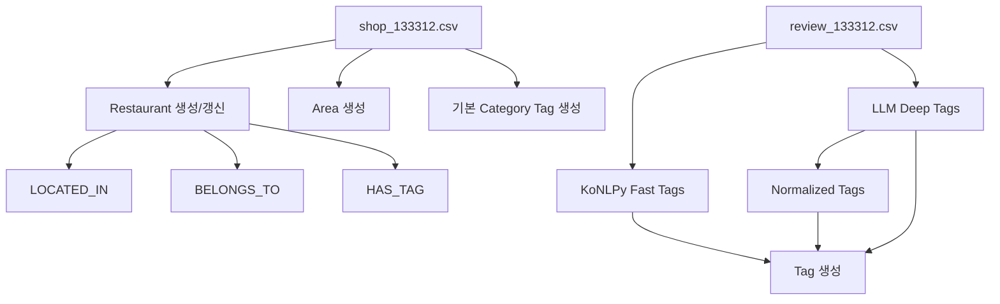

# Graph DB Nodes And Edges

이 문서는 프로젝트 코드 기준으로 Neo4j 그래프 DB에 사용되는 모든 노드 라벨, 관계 타입, 속성, 생성/조회 위치를 정리합니다. 실제 실행 중인 Neo4j 인스턴스를 질의한 결과가 아니라, `database/schema.cypher`, `ingestion/ingest_v2.py`, `recommendation/queries.py`, `recommendation/engines.py`에 정의된 Cypher와 코드 흐름을 기준으로 작성했습니다.

## 1. 전체 그래프 구조



핵심 구조는 `Restaurant`를 중심으로 지역(`Area`)과 의미 태그(`Tag`)를 연결하고, 사용자 세션(`User`)이 좋아요/싫어요 관계를 통해 식당 또는 태그에 연결되는 형태입니다.

## 2. 노드 라벨 전체 목록

| 노드 라벨 | 의미 | 생성 위치 | 조회 위치 | 주요 용도 |
| --- | --- | --- | --- | --- |
| `Restaurant` | 식당 엔티티 | `ingestion/ingest_v2.py` | `recommendation/queries.py`, `recommendation/engines.py` | 추천 후보 검색의 중심 노드 |
| `Area` | 식당이 위치한 지역 | `ingestion/ingest_v2.py` | `recommendation/queries.py` | 지역 필터 |
| `Tag` | 카테고리, 메뉴, 리뷰 특징, 분위기 태그 | `ingestion/ingest_v2.py` | `recommendation/queries.py`, `recommendation/engines.py` | 카테고리 필터, 키워드 매칭, 제외 조건, 점수 부스트 |
| `User` | 세션 기반 사용자 | `recommendation/engines.py` | `recommendation/engines.py` | 좋아요/싫어요 선호 기록 |

## 3. 노드별 상세

### 3.1 `Restaurant`

식당을 나타내는 중심 노드입니다.

#### 생성 코드

`ingestion/ingest_v2.py`에서 CSV의 식당 데이터를 읽어 생성합니다.

```cypher
MERGE (r:Restaurant {id: row.rid})
SET r.name = row.store_name,
    r.rating = toFloat(row.store_rating),
    r.address = row.store_address,
    r.url = row.store_url,
    r.latitude = toFloat(row.latitude),
    r.longitude = toFloat(row.longitude)
```

#### 속성

| 속성 | 타입/형태 | 출처 | 설명 |
| --- | --- | --- | --- |
| `id` | string | `rid` | 식당 고유 ID. Neo4j unique constraint 대상 |
| `name` | string | `store_name` | 식당명 |
| `rating` | float | `store_rating` | 원본 평점 |
| `bayesian_rating` | float | 별도 계산값으로 가정 | 추천 쿼리에서 `rating`보다 우선 사용하지만 ingestion에서는 직접 설정하지 않음 |
| `address` | string | `store_address` | 식당 주소 |
| `url` | string | `store_url` | 원본 식당 URL |
| `latitude` | float | `latitude` | 위도 |
| `longitude` | float | `longitude` | 경도 |

#### 사용 방식

- `MATCH (r:Restaurant)`로 추천 후보 전체를 검색합니다.
- `r.id`는 중복 추천 방지와 ID 기반 조회에 사용됩니다.
- `r.name`은 키워드 포함 여부, 제외 식당명, ranking signal 점수에 사용됩니다.
- `coalesce(r.bayesian_rating, r.rating, 3.5)`로 추천 점수의 평점 축을 계산합니다.

### 3.2 `Area`

식당이 속한 지역을 나타냅니다.

#### 생성 코드

```cypher
WITH row, split(row.store_address, ' ') as addr_parts
MERGE (a:Area {name: coalesce(addr_parts[1], '기타')})
MERGE (r)-[:LOCATED_IN]->(a)
```

#### 속성

| 속성 | 타입/형태 | 설명 |
| --- | --- | --- |
| `name` | string | 주소를 공백으로 나눈 두 번째 토큰. 없으면 `기타` |

#### 사용 방식

지역 검색 조건이 있을 때 다음 패턴으로 필터링합니다.

```cypher
(r)-[:LOCATED_IN]->(:Area {name: $area_name})
```

### 3.3 `Tag`

식당의 카테고리, 리뷰 특징, 메뉴/분위기/정규화 태그를 모두 담는 의미 노드입니다. 이 프로젝트의 검색 품질은 대부분 `Tag` 연결의 품질에 좌우됩니다.

#### 생성 경로

| 생성 경로 | 코드 | 의미 |
| --- | --- | --- |
| 기본 카테고리 | `MERGE (t:Tag {name: row.source_category})` | CSV의 식당 카테고리 |
| Fast Tags | KoNLPy Okt 명사 추출 | 리뷰 전체에서 추출한 빈도 높은 명사 |
| Deep Tags | Ollama LLM 태그 추출 | 리뷰 샘플을 요약한 의미 태그 |
| Normalized Tags | `TAG_NORMALIZATION` | LLM 태그를 표준 표현으로 변환한 태그 |

#### 속성

| 속성 | 타입/형태 | 설명 |
| --- | --- | --- |
| `name` | string | 태그명. Neo4j unique constraint 대상 |

#### 사용 방식

`Tag`는 두 관계를 통해 사용됩니다.

- `BELONGS_TO`: 기본 카테고리
- `HAS_TAG`: 리뷰/LLM/정규화 기반 특징 태그

검색에서는 두 관계가 함께 쓰이는 경우가 많습니다.

```cypher
(r)-[:BELONGS_TO|HAS_TAG]->(:Tag {name: $category_name})
```

### 3.4 `User`

Streamlit 세션 또는 LangGraph 세션을 기반으로 한 사용자 노드입니다.

#### 생성 코드

좋아요/싫어요 저장 시 생성됩니다.

```cypher
MERGE (u:User {session_id: $session_id})
```

#### 속성

| 속성 | 타입/형태 | 설명 |
| --- | --- | --- |
| `session_id` | string | 사용자 세션 ID. Neo4j unique constraint 대상 |

#### 사용 방식

- `DISLIKES` 관계를 통해 싫어한 태그를 조회할 수 있습니다.
- `INTERACTED`, `DISLIKES` 관계로 선호/비선호를 저장하는 구조가 있습니다.
- 현재 코드 기준으로 저장 메서드는 있지만, UI 피드백 루프와 완전히 연결된 상태는 아닙니다.

## 4. 관계 타입 전체 목록

| 관계 타입 | 방향 | 생성 위치 | 조회 위치 | 의미 |
| --- | --- | --- | --- | --- |
| `LOCATED_IN` | `Restaurant -> Area` | `ingestion/ingest_v2.py` | `recommendation/queries.py` | 식당의 지역 |
| `BELONGS_TO` | `Restaurant -> Tag` | `ingestion/ingest_v2.py` | `recommendation/queries.py` | 식당의 기본 카테고리 |
| `HAS_TAG` | `Restaurant -> Tag` | `ingestion/ingest_v2.py` | `recommendation/queries.py` | 리뷰/LLM 기반 특징 태그 |
| `INTERACTED` | `User -> target` | `recommendation/engines.py` | 현재 직접 조회 없음 | 좋아요 등 사용자 상호작용 |
| `DISLIKES` | `User -> target` | `recommendation/engines.py` | `recommendation/engines.py` | 사용자 비선호 |

## 5. 관계별 상세

### 5.1 `LOCATED_IN`

```text
(:Restaurant)-[:LOCATED_IN]->(:Area)
```

식당과 지역을 연결합니다.

#### 생성

```cypher
MERGE (r)-[:LOCATED_IN]->(a)
```

#### 조회

```cypher
(r)-[:LOCATED_IN]->(:Area {name: $area_name})
```

#### 선택/결정에 쓰이는 곳

지역 기반 추천에서 `area_name`이 있으면 지역 필터로 사용됩니다. `area_name`이 `None`인 경우 Level 3 쿼리는 전역 검색을 허용합니다.

### 5.2 `BELONGS_TO`

```text
(:Restaurant)-[:BELONGS_TO]->(:Tag)
```

식당의 기본 카테고리를 연결합니다.

#### 생성

```cypher
MERGE (t:Tag {name: row.source_category})
MERGE (r)-[:BELONGS_TO]->(t)
```

#### 조회

추천 쿼리에서는 카테고리 필터, 제외 카테고리, 결과 그룹핑에 사용됩니다.

```cypher
(r)-[:BELONGS_TO|HAS_TAG]->(:Tag {name: $category_name})
OPTIONAL MATCH (r)-[:BELONGS_TO]->(bt:Tag)
```

#### 선택/결정에 쓰이는 곳

- `category_name`이 있으면 해당 태그를 가진 식당만 후보로 남깁니다.
- 결과 반환 시 `BELONGS_TO` 태그를 모아 `cat_group`을 결정합니다.

### 5.3 `HAS_TAG`

```text
(:Restaurant)-[:HAS_TAG {source, weight}]->(:Tag)
```

식당의 리뷰 기반 특징을 연결합니다.

#### 생성

Fast Tag:

```cypher
MERGE (r)-[rel:HAS_TAG]->(t)
SET rel.source = 'Fast', rel.weight = 1.0
```

Deep Tag:

```cypher
MERGE (r)-[rel:HAS_TAG]->(t)
SET rel.source = 'Deep', rel.weight = 2.0
```

Normalized Tag:

```cypher
MERGE (r)-[rel:HAS_TAG]->(t)
SET rel.source = 'Normalized', rel.weight = 1.5
```

#### 관계 속성

| 속성 | 값 | 의미 |
| --- | --- | --- |
| `source` | `Fast` | KoNLPy 형태소 분석 기반 |
| `source` | `Deep` | LLM 리뷰 요약 기반 |
| `source` | `Normalized` | 정규화 테이블 기반 |
| `weight` | `1.0` | Fast Tag 가중치 |
| `weight` | `2.0` | Deep Tag 가중치 |
| `weight` | `1.5` | Normalized Tag 가중치 |

#### 조회

키워드, 제외 키워드, 태그 부스트에 사용됩니다.

```cypher
OPTIONAL MATCH (r)-[:HAS_TAG]->(t_boost:Tag)
WHERE any(kw IN $keyword_values WHERE t_boost.name CONTAINS kw)
   OR any(sig IN $ranking_signals WHERE t_boost.name CONTAINS sig)
```

#### 선택/결정에 쓰이는 곳

- 키워드가 태그명에 포함되면 `matched_tags`로 수집됩니다.
- `size(matched_tags) * 0.1`이 `keyword_match_score`에 반영됩니다.
- 제외 키워드가 `HAS_TAG` 태그명에 포함되면 후보에서 제외됩니다.
- 카테고리 필터에서도 `BELONGS_TO|HAS_TAG`가 함께 사용되어, 기본 카테고리뿐 아니라 특징 태그도 검색 축이 될 수 있습니다.

### 5.4 `INTERACTED`

```text
(:User)-[:INTERACTED {type: "Like"}]->(target)
```

사용자가 특정 대상을 좋아요 했다는 기록입니다.

#### 생성

```cypher
MERGE (u:User {session_id: $session_id})
WITH u
MATCH (target) WHERE target.id = $target_id OR target.name = $target_id
MERGE (u)-[:INTERACTED {type: 'Like'}]->(target)
```

#### 대상 노드

코드는 target에 라벨을 제한하지 않습니다.

```cypher
MATCH (target) WHERE target.id = $target_id OR target.name = $target_id
```

따라서 현재 그래프 모델 기준으로는 다음이 대상이 될 수 있습니다.

- `Restaurant`: `id` 또는 `name`으로 매칭
- `Tag`: `name`으로 매칭 가능
- `Area`: `name`으로 매칭 가능하지만 의도된 대상은 아닐 가능성이 큼

실제 UI에서는 식당 추천 카드의 `id` 또는 `name`을 넘기므로, 의도된 주 대상은 `Restaurant`입니다.

#### 주의점

현재 코드 기준으로 `INTERACTED`를 저장하는 메서드는 있지만, 추천 쿼리에서 이 관계를 활용해 점수를 올리는 로직은 아직 보이지 않습니다.

### 5.5 `DISLIKES`

```text
(:User)-[:DISLIKES]->(target)
```

사용자가 특정 대상 또는 태그를 싫어한다는 기록입니다.

#### 생성

```cypher
MERGE (u:User {session_id: $session_id})
WITH u
MATCH (target) WHERE target.id = $target_id OR target.name = $target_id
MERGE (u)-[:DISLIKES]->(target)
```

#### 조회

싫어한 태그 조회는 `Tag` 대상만 봅니다.

```cypher
MATCH (u:User {session_id: $session_id})-[:DISLIKES]->(t:Tag)
RETURN t.name AS tag
```

#### 대상 노드

생성 쿼리는 라벨 제한이 없지만, 조회 메서드는 `Tag`만 대상으로 합니다. UI에서 식당 ID를 넘기면 `Restaurant`에 `DISLIKES`가 생길 수 있고, `get_disliked_tags`에서는 이 관계가 조회되지 않습니다.

#### 주의점

싫어요를 추천 제외 조건으로 완전히 활용하려면 다음 중 하나를 명확히 해야 합니다.

- 식당 싫어요: `(:User)-[:DISLIKES]->(:Restaurant)`로 저장하고 식당 ID를 제외한다.
- 태그 싫어요: `(:User)-[:DISLIKES]->(:Tag)`로 저장하고 `get_disliked_tags`로 제외 태그를 가져온다.
- 둘 다 허용: 관계 대상 라벨별로 조회/적용 로직을 분리한다.

## 6. 제약조건과 인덱스

`database/schema.cypher` 기준입니다.

### 6.1 Unique Constraints

| 이름 | 대상 | 의미 |
| --- | --- | --- |
| `restaurant_id_unique` | `Restaurant.id` | 식당 ID 중복 방지 |
| `user_session_id_unique` | `User.session_id` | 세션 사용자 중복 방지 |
| `tag_name_unique` | `Tag.name` | 같은 태그명 중복 방지 |
| `area_name_unique` | `Area.name` | 같은 지역명 중복 방지 |

### 6.2 Indexes

| 이름 | 대상 | 의미 |
| --- | --- | --- |
| `restaurant_name_index` | `Restaurant.name` | 식당명 검색 보조 |
| `tag_name_index` | `Tag.name` | 태그명 검색 보조 |
| `area_name_index` | `Area.name` | 지역명 검색 보조 |

## 7. 추천 쿼리에서의 그래프 사용

### 7.1 지역 필터

```cypher
(r)-[:LOCATED_IN]->(:Area {name: $area_name})
```

지역이 지정되면 해당 지역에 연결된 식당만 추천 후보가 됩니다.

### 7.2 카테고리/태그 필터

```cypher
(r)-[:BELONGS_TO|HAS_TAG]->(:Tag {name: $category_name})
```

기본 카테고리와 특징 태그를 모두 검색 축으로 사용합니다.

### 7.3 제외 카테고리

```cypher
NOT any(ex_cat IN $excluded_categories WHERE
  EXISTS { (r)-[:BELONGS_TO|HAS_TAG]->(:Tag {name: ex_cat}) }
)
```

사용자가 제외한 카테고리나 태그가 있으면 후보에서 제거합니다.

### 7.4 제외 키워드

```cypher
NOT any(ex_kw IN $negative_keywords WHERE
  EXISTS { (r)-[:HAS_TAG]->(t:Tag) WHERE t.name CONTAINS ex_kw }
  OR r.name CONTAINS ex_kw
)
```

태그명 또는 식당명에 부정 키워드가 포함되면 제외됩니다.

### 7.5 ABSOLUTE 키워드

```cypher
ALL(abs_kw IN $absolute_keywords WHERE
  EXISTS { (r)-[:BELONGS_TO|HAS_TAG]->(t:Tag) WHERE t.name CONTAINS abs_kw }
  OR r.name CONTAINS abs_kw
)
```

필수 키워드는 식당명 또는 태그에 반드시 포함되어야 합니다.

## 8. 데이터 적재 흐름



## 9. 현재 모델 기준 주의점

1. `HAS_TAG.weight`는 적재 시 설정되지만, 현재 추천 쿼리의 점수 계산에서는 관계의 `weight` 값을 직접 사용하지 않습니다.
2. `INTERACTED`는 저장할 수 있지만 현재 추천 점수에 반영되는 쿼리는 보이지 않습니다.
3. `DISLIKES`는 생성 시 target 라벨을 제한하지 않지만, 조회는 `Tag`만 대상으로 합니다.
4. `bayesian_rating`은 추천 쿼리에서 사용되지만 ingestion 코드에서는 설정하지 않습니다. 별도 계산/적재 경로가 없다면 `rating`으로 fallback됩니다.
5. `Area.name`은 주소의 두 번째 토큰으로 만들어지므로, 사용자가 입력한 지역명 정규화 결과와 실제 DB 지역명이 일치해야 지역 검색이 잘 동작합니다.

## 10. 전체 목록 한눈에 보기

### Nodes

```text
(:Restaurant)
(:Area)
(:Tag)
(:User)
```

### Edges

```text
(:Restaurant)-[:LOCATED_IN]->(:Area)
(:Restaurant)-[:BELONGS_TO]->(:Tag)
(:Restaurant)-[:HAS_TAG {source, weight}]->(:Tag)
(:User)-[:INTERACTED {type}]->(:Restaurant | :Tag | other target with id/name)
(:User)-[:DISLIKES]->(:Restaurant | :Tag | other target with id/name)
```
